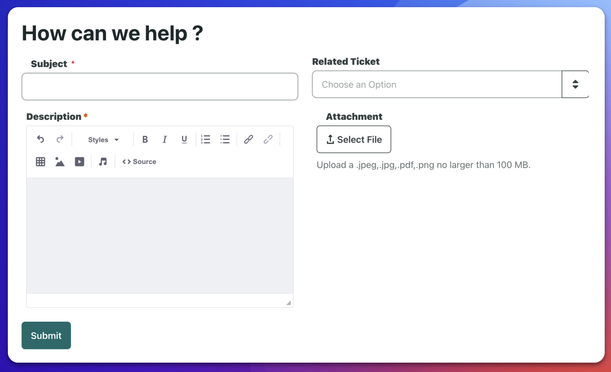
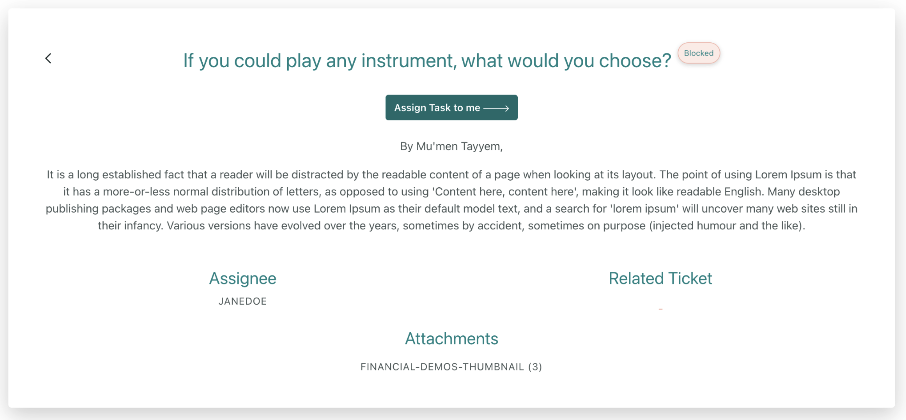

# Example Liferay Object Demo

**At a Glance**

* Always demonstrate using an example that the prospect can relate to
* A simple Ticketing application is easily understood by almost all audiences
* Alternatively, build a simple example Object application aligned to the prospect’s specific requirements

## Example Business Application

For the purposes of this module a simple _Ticketing_ application is used. This application usually resonates with prospects because almost everyone has used a ticketing type of application at some point in life in general, and in business circumstances. This means that the topic can be introduced without much discussion about the concept - tickets are created, assigned, managed and ultimately resolved. 

Ticketing might not always be appropriate for every prospect, in which case look for another example which can be easily understood by the prospect and ideally exists in their industry and/or in the solution they are looking to implement.

### Creating a Ticket

With the ticketing application start by showcasing the application itself by creating a new ticket. Fill in the details, making sure to explain that Objects support all of the typical data types that are needed for business applications, and indicate that once the ticket is submitted it goes into a workflow for processing.

### Displaying a submitted Ticket

In most parts of the demo up to this stage all of the elements are already fully in place. While it is sensible to have a completed display page for the object, creating one from scratch is one of the areas where the “magic” can come to the fore. It is important though to have a complete object already published, and a number of object entries (in this case Tickets) added, because otherwise the demo will not look compelling.

To create the display page is essentially as simple as mapping the page to the required object, and then dragging and dropping fragments and mapping them to the object fields. If there are specific requirements that are not met using the out-of-the-box fragments, have any custom fragments built in advance, and then use them in exactly the same way as the default ones.

Even if there is limited time available for the demo, it is still worthwhile completing this step as it does not take long at all, and provides a very compelling way of showing how quickly it is possible to construct business applications in Liferay. 

More information on creating display pages for Objects is available [here](https://learn.liferay.com/web/guest/w/dxp/building-applications/objects/displaying-object-entries#creating-display-page-templates-for-objects).

## Optional demo steps

The steps shown above will be typically sufficient for a short, business-focused demo. If there is more time, and more interest, take the opportunity to show how Objects are created. 

The rest of the module covers these additional steps, mainly as a guide to Sales Engineers learning how to use and create Objects, but the information can also be used for more detailed demo scenarios.

Be careful here though. Much of the demonstration value of Objects is the ease-of-use, the drag-and-drop features, that can be used by non-developer users. The further that a demo goes into the creation of an object from scratch, the more technical the conversation is likely to be. If the audience is mixed, perhaps spend just a few minutes talking about some of the creation steps, and schedule a follow-up demo for a more technical audience to get into the details.

Documentation on creating objects is available [here](https://learn.liferay.com/web/guest/w/dxp/building-applications/objects/creating-and-managing-objects/creating-objects).

Next, learn more about how to [create a Liferay Object](./creating-objects.md) for learning purposes, and for more detailed technical demos.
