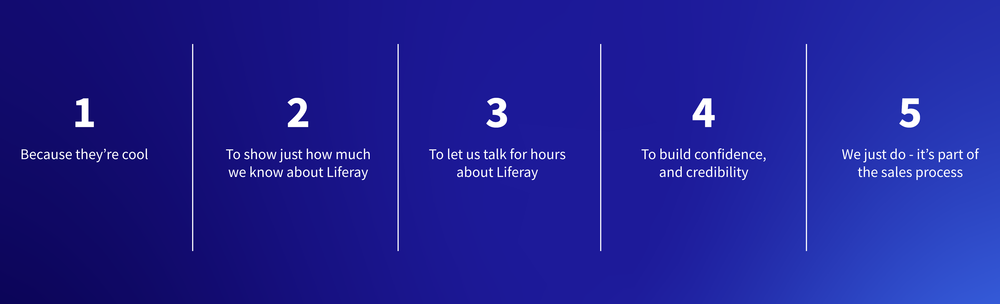

---
toc:
  - ./demo-ethics/when-to-demo.md
  - ./demo-ethics/what-to-demo.md
  - ./demo-ethics/how-to-demo.md
  - ./demo-ethics/demo-preparation.md
uuid: 2279c4a7-75df-46e5-8303-b1e6fff61a07
visibility: 
- Employee
- Partner
---

# Demo Ethics

**At a Glance**

* Demos are a vital part of the sales process, and all Sales Engineers should be prepared to deliver demos to prospects.
* Demos should always resonate with the prospect and be as aligned to their requirements as possible.
* Learning why demos are done, when they should be done, what they should include, and how they should be delivered will ensure that Sales Engineers can run effective demos that move the sales process forward.

## Background

Demonstrations of Liferay DXP are a common, if not mandatory part of the sales process. It is important to remember that there are good and bad ways to deliver a demo as well as good and bad times to run a demo.

This module provides guidance to Sales Engineers, and anyone else required to deliver demos, on:

* Why demos are done
* When demos should be done
* What a demo should contain
* How a demo should be run

It also covers what should _not_ be included, presented, or covered during a demo, how to prepare for a demo, and other general hints and tips to ensure that demos are effective and help to drive opportunities forward.

Each section is presented with a series of possible answers to the main question. It should not be difficult to select the right answer, but the wrong answers should also help Sales Engineers to work more effectively to ensure that demos are valuable to the prospect.

```{note}
* View the [recording](https://learn.liferay.com/web/guest/d/se1-10-demo-ethics) from the live workshop of this module.
* Download the [PDF](https://learn.liferay.com/documents/d/guest/se1-10-demo-ethics-pdf) of the presentation used in the live workshop.
```

## Why Are Demos Done?



Demonstrating software is a common, if not required, part of most enterprise software sales processes, and it is no different for Liferay. It is important however to think about why demos are given. Here are five possible reasons for giving a demo to a prospective customer:

1. Maybe they are done because demos are cool?
1. Maybe to allow the Sales Engineer to show how much they know about Liferay DXP?
1. Maybe to provide an opportunity to talk for hours about Liferay?
1. Maybe to build confidence and credibility?
1. Or maybe just because they always are, because every sales opportunity needs a demo?

The answer here should be pretty clear to most people - demos are done to build confidence and credibility. This is essentially the single key reason for doing demos at all. The prospective customer needs to feel confident that their business problem can be addressed with a Liferay solution. Building credibility that Liferay is the right solution is something that is done throughout the sales process, and an effective demonstration is an important part of that.

Another really important aspect of doing a demo is to present something that the audience can _relate_ to. The best outcome of all is to show a demo that directly addresses the particular business problem the prospect is looking to solve. Ideally, if the customer is looking for an intranet, then a demo of an intranet should be shown, if their requirements are for Customer Self-Service then the demo should be a self-service portal.

But, this won’t always be possible, because the available demos may not perfectly fit the requirements. Remember that for this learning path the goal is to present a 30 minute demo of a pre-existing demo - not to build a new demo from scratch. Even with more product knowledge and sales experience it is often not possible, or an efficient use of time, to build a new demo from scratch for each opportunity, so in many cases the demo used needs to be a good fit, even if it is not a perfect fit.

Because of this, having a demo that the prospect can at least relate to in some way is really important. For example, a Home Insurance related demo could be shown to almost anyone - because everyone has a home, and most people have home insurance, and so can be related to by almost anyone.

## Story Telling

A good way of thinking about a demo is to consider it to be a picture to tell a story about. It is important to remember that it is not about showing features - it is about showing a solution that could be implemented for the prospect.

The audience most likely has never seen Liferay before, and may not have ever seen a Digital Experience Platform either. Telling a story about a solution to a business problem helps to show the features, but in a way that can be understood by a non-technical audience.

The key to demos in solution selling is doing them in context with the problem the customer is trying to solve, because it:

* Shows that their challenges are understand
* Builds confidence that Liferay can solve those problems
* When supplemented with case studies helps to _prove_ that the problems can be solved

All of this helps to stop being seen as “just a salesperson” to being seen as someone who can be trusted to help them solve their problems - in other words to being a trusted advisor.

Next, learn [when to demo](./demo-ethics/when-to-demo.md) during the sales process.
