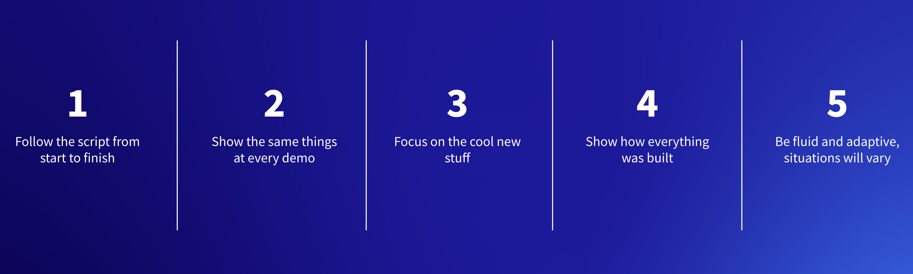

# Demo Ethics - How to Demo

**At a Glance**

* Demos should be scripted, but Sales Engineers should be prepared to deviate from the script as needed.
* Different audiences have different requirements: some audiences want to see how the demo was built but others will not.
* Be careful with persona-based demos because switching from one role to another during the demo can be confusing for prospects.

## How Should Demos Be Done?

The next step is to understand how a live demo with a prospect should be run. Five possible approaches are:

1. Should the demo script be followed from start to finish, to make sure every part of the story is covered?
2. Maybe the same things that are always shown, should be shown?
3. Or, maybe focus on the cool new features?
4. Perhaps show how everything was built, in addition to showing the end result?
5. Or be adaptive, because not all demos will be the same?

The correct answer should be reasonably obvious: Not all demos are the same and so the Sales Engineer needs to be adaptive.

## Demo Script

The first thing here is that there should _always_ be a script for your demo. The demo needs to have a flow that makes sense, that provides the opportunity to showcase how effectively Liferay could solve the prospect’s business challenges. It is really important to have a script because without one then the whole demo could look like a jumble of random features.

It is critical however to not just follow that script blindly from start to finish, because of the need to be adaptive. Sales Engineers need to learn to read the room, to observe the body language of the audience, to see who is paying attention or not, and to adapt if the demo is not keeping people’s attention.

A big part of this is knowing who is in the room, what their roles are, what they are interested in. The same thing applies if it is a remote demo over Zoom, or Google Meet. If the room is full of marketing people then the demo should not include how the site was built or how permissions are assigned to users. In this case the demo should focus on the capabilities, in the context of the business scenario of course, that are going to meet the prospect’s needs.

Often a script will feature multiple personas to showcase different types of users with different needs. These can be important because they provide an opportunity to show how the system is used by Administrators, by Marketing users, by end users and so on, but unless the changes from one persona to the next are done carefully it can be jarring and difficult to follow for the audience

Remember that it is usually only one person doing the demo, so it can be hard to follow if that one person very abruptly changes persona by saying something like “now I’m going to login as Janet the Development Manager”, and then “now I’m going to login as Julio from Marketing”.

It’s hard for the audience to see the same person in every role, so try and focus on a couple of personas that add value the most. It is also important to have in mind the duration of the demo. There will not be enough time to show everything, and even if the demo takes hours, which it should never do, no one will remember all of it. So the demo needs to be focused, with the most important elements preselected to be shown.

## Using the Same Demo Every Time

Another key thing is to not just do the same demo every time, to every prospect. Always remember to focus on what matters to this particular prospect.

## Focusing on the Cool New Stuff

As has already been mentioned, just because something is new, and seems to be cool does not mean that it matters to the prospect!

## Showing How the Site was Built

The next one is kind of interesting because it will vary. Sometimes the demo has to include how something was built, but unless the audience is very technically focused, in general the demo should not include showing how the entire demo was built.

There’s a little bit of “magic” in a demo, a bit like how a finished movie looks incredible, but the behind the scenes stuff can dilute that magic.

Remember that it does vary, and this is another reason why knowing the audience is key. When it is important to show how elements of the demo were built, it is important to have a good approach where _part_ of how something was built is shown, but not _all_ of it.

For example, putting a page together in Liferay is really easy, but most pages will include a lot of things: lots of fragments, containers and grids with those fragments in, widgets, images, web content, menus, and so on.

A good approach is to use the “cooking show” model where a couple of items are added to a new page, but instead of completing the page switch to one that “was prepared earlier” and show _that_ page in edit mode.

The same approach can be used building a form. For example, a Credit Card application form. Everyone knows from personal experience that these types of forms ask for a lot of info, across multiple steps.

A good way of approaching this would be to build a simple form that asks for Name, Date of Birth, and a Credit Limit, just as a way of explaining how the process works, and then show the finished form. Building the whole thing, with dozens of fields, across multiple steps, is going to take too long and is just not going to be that interesting to watch.

## Being fluid and adaptive

In many ways running a live demo is a bit like tap dancing! The Sales Engineer needs to be constantly aware of what is going on, going through the planned demo script flow, but adapting as the situation demands.

If showing something in “edit mode” was not in the plan but the prospect asks how it was built then it is OK to break from the flow and show it quickly, then get back to the story. If one part of the demo does not seem to be engaging the audience, consider moving on more quickly. Some of this will only come from experience, but if there is an opportunity to sit in on someone who already has experience and watch how they demo, this cycle can be shortened.

Next, [preparing to demo](./demo-preparation.md).
