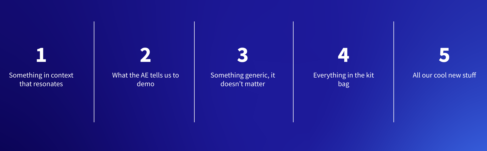

# Demo Ethics - What to Demo

**At a Glance**

* Demos are a vital part of the sales process, and all Sales Engineers should be prepared to deliver demos to prospects.
* Demos should always resonate with the prospect and be as aligned to their requirements as possible.
* Learning what and what not to include in a demo is a vital part of learning to be an effective Sales Engineer.

## What Should a Demo Contain?

The next thing to consider is what should be in the demo in the first place. The possible options here are:

1. Show something that is in context and that resonates with the audience?
1. Show whatever the AE has asked to be demonstrated?
1. Maybe just show something generic, the same demo that is always used?
1. Show everything that DXP has to offer?
1. Or just focus on showing the cool, new stuff?

The correct answer here to show something in context that resonates.

The key thing with any demo is to engage with the audience. The best way to do that is to show something that they can relate to, that is in context with their business, or their required solution.

There are a couple of tricks that can be used, even with a pre-existing demo, to make this work more effectively. Although it sounds trivial, showing a demo that uses the prospect’s colors and logo immediately helps the audience because they start to imagine that they are seeing their application and not an unknown product from a software vendor they don’t know well.

As before, understanding why the other answers are incorrect is also important.

## Demonstrating What the AE Asks For

At no point should the Account Executive determine when to do a demo and what to include in the demo. This isn’t meant to be confrontational; it is important that the Sales Engineer should have had an opportunity to interact with the prospect. Sales Engineers should know the platform better, in terms of the capabilities it has, than business Sales people like the Account Executive, and should therefore be more able to determine what parts of an existing demo will hit the mark.

The demo approach should be a collaborative exercise with the rest of the Sales Team. The key point is that the Sales Engineer needs to have been directly involved.

## Using a Standard, Generic Demo

Sometimes it might seem like having a “go to” generic demo would be a great thing to do. The reality is that it is not. It might save some time but it will never engage with the prospect.

This may not seem to be that important, but every step of the sale needs to be meaningful for it to ultimately be successful. If something generic is shown that is not in context, and that does not resonate, _and_ then the competition shows something that the customer really needs then this could well be the last meeting with this particular prospect!

## Demonstrating Everything in the Platform

Similarly, don’t ever do a “show up and throw up”. Just because Liferay is full of out-of-the-box features does not mean that they are things that the potential customer needs. Ultimately it is just not going to be interesting to the prospect, which means it is not going to be meaningful.

## Demonstrating the Cool New Stuff

And finally, the shiny new stuff might seem to be super cool, but if it is not something that fits with requirements that the prospect has then it should not just be shown because it’s cool. If on the other hand the shiny new thing is exactly what the prospect needs then it should definitely be incorporated into the demo flow!

Next, learn [how to demo](./how-to-demo.md).
