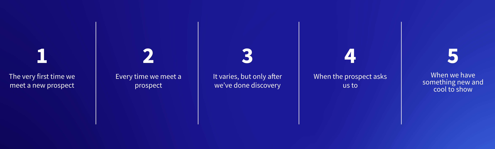

# Demo Ethics - When to Demo

**At a Glance**

* Pressure can often be placed on Sales Engineers to demo when the time is not right.
* It is important to learn the right time in the sales process to run a demo.
* It is also important to be able to explain to Account Executives and to Prospects when it might not be appropriate to run a demo.

## When Should Demos be Done?

The next thing to understand is when to do a demo. Again, this should not be hard to get right, but five possible options are:

1. Should a demo be done during the first meeting with a new prospect?
1. Or, perhaps, at every meeting with a prospect?
1. Maybe the right time varies, but should always be after discovery has been done?
1. Perhaps it is done whenever the prospect asks for a demo?
1. Or, when there is something new and cool to be shown?

The correct answer is that the right time to demo varies for each opportunity, and can be at different times in the sales process. It is important to also understand in a bit more detail why the other options are _not_ right.

Another important thing to be aware of is that some of these options may specifically be asked for by the Account Executive, or by the prospect themselves. The key thing here is knowing that it is OK to _not_ demo - and being comfortable with saying so.

Sometimes it is necessary to push back and to not necessarily be the good guy in doing so. Pushing back is only possible if the reasons for pushing back can be explained.

## Demos During the First Meeting

Firstly, why should demos not be done during the first meeting with a new prospect? This is one that can - and will - be proposed by an AE. Sometimes the AE thinks that doing a demo is “ticking a box” and therefore it should be the first thing that a Sales Engineer does.

The logic here from the AE is that the customer is buying software, so obviously they want to see that software.

While that might be the case with packaged applications, Liferay DXP can solve thousands of different problems in different ways, so what exactly could be shown in this first meeting?

The key word is DISCOVERY - and that needs to be done before doing a demo. The reason for this is that it is vital to understand the business problem that the customer is trying to solve, because any demo given needs to be something that resonates with the prospect’s needs.

Later Learning Paths will cover building demos, sometimes from scratch, but Level 1 is based around using an existing demo - perhaps with some tweaks as covered in earlier modules - like changing the logo, or building a simple business app with Objects.

Even with an existing demo the subject needs to be something that the prospect can relate to. Ideally this should be something that addresses their actual need, but at the very least it should be a demo that shows some of the things they are looking for. If it fits their solution needs, that is good. For example showing a Customer Self-Service demo to a prospect looking for a Customer Portal. If it fits their industry, but maybe not the actual solution, that is OK too.

But, until the discovery is done, it is impossible to know what to show. Even if some information has been shared prior to the meeting it is still better to do more face-to-face discovery with them. The more that is known about what they want, the more likely the demo will include something that helps to build confidence that Liferay can be used to solve their problems.

## Demos at Every Meeting

What about providing a demo at every meeting with a prospect? This is overkill, but remember that it may be needed to demo multiple times during the sales process. There will be different audiences with different objectives:

* A group of business users that want to see how the application might work, but do not need to see how it is put together.
* A group of developers who want to see how pages are built, or how to create custom fragments.
* A group of marketing users who want to see how to publish content.
* Etc.

Sometimes the demo needs to be to all of these people at the same time - in which case the Sales Engineer must try to manage all of the different expectations that different audiences have. In other cases there may be the luxury of being able to do more tailored demos to each audience.

## Demos Because the Prospect Asked

What about just doing a demo because the prospect asked for one? This is another time when pushing back might be a good idea. Explain that the outcome will be better for them if more is able to be understood about their requirements before doing the first demo.

It is very reasonable to say that a demo that isn’t going to hit the mark is going to be a waste of time for them. That by understanding more about the objectives the value to them will be much higher when the demo is eventually provided. Of course the value to the sales team is much higher here too because the chance of ultimately closing the deal improves as well!

## Demos of New and Cool Stuff

If there are new features in the product it is often tempting to want to demonstrate them. But, a demo to a prospect should never be just an opportunity to show off cool new stuff. The coolest thing on the planet is of no use to someone if it doesn’t provide them with something they need!

Next, learn [what demos should contain](./what-to-demo.md).
