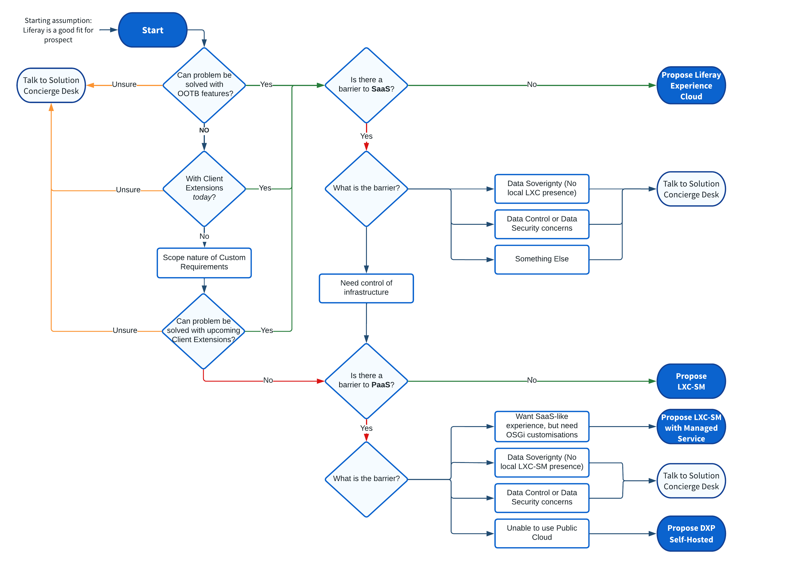
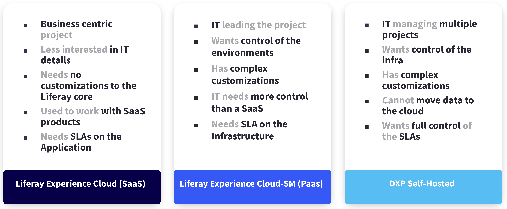

# Choosing the Right Deployment Strategy

**At a Glance**

* Liferay’s preferred approach is SaaS first.
* Each prospect’s unique requirements and circumstances may be more appropriately implemented with Liferay PaaS, or with DXP Self-Hosted.
* Liferay has identified key considerations that will lead to SaaS, as well as others that will identify when it will not be SaaS.
* Deployment strategies are not generally discussed during demos, or early-stage sales meetings, but the information learned during these sessions will help to guide the opportunity to one deployment approach or another.

```{note}
* View the [recording](https://learn.liferay.com/documents/d/guest/se1-8-deployment-strategies) from the live workshop of this module.
* Download the [PDF](https://learn.liferay.com/documents/d/guest/se1-8-deployment-strategies-pdf) of the presentation used in the live workshop.
```

## SaaS, PaaS, or Self-Hosted?

After reviewing the deployment options covered above, it has become clear that, for LifeBank, the right option is the SaaS approach because it allows them to focus their efforts on building the application they need to address their business problems.

In this case, Liferay SaaS was the logical and obvious choice. In a real-world scenario things might not be so obvious.

In demos and discussions it is important to not go through the specifics of every deployment approach with a prospect.

Instead opportunities like Demos should be used to listen to what the prospect is saying, to learn about the sorts of things that are important to them - to help inform us of the right approach to propose.

That’s really the point of this session in the context of a demo - it’s about listening to the prospect and hearing what they are saying. Which of course is one of the key parts of selling in general - even when talking, or driving a demo, it is important to be listening and learning, and doing more discovery.

As more work is done with prospects, the approach that is most appropriate should become clear - but there is also more information to guide the opportunity in the right direction.

## Choosing the Right Deployment Strategy

> All deployment options are possible, but Liferay’s approach is SaaS First.

The reason behind this approach is simple - customers need to focus on solving their business problems and that relies on the Liferay DXP application and not on the infrastructure nor on the platform software. 

Exploring the out-of-the-box capabilities and the extension possibilities will help to determine whether Liferay is a good fit for a prospect in general.

### Building Tailored Solutions

One of the most recent changes is the preferred way of extending Liferay DXP - though what are known as [Client Extensions](https://learn.liferay.com/w/dxp/building-applications/client-extensions).

Almost all customers will need features unique to them, and the new approach provides a loosely-coupled model where all custom code is running outside of Liferay’s core.

This doesn’t change one of Liferay’s traditional key strengths - the ability to extend and customize to fit specific needs - just the approach used to doing it.

In most cases the new approaches will fit - which will be one part of the decision making process leading a prospect towards Liferay SaaS.

But, there may be some particular use cases that can only be achieved with alternative approaches. It is still possible to customize using the traditional approach of building custom Java OSGi modules, if this approach is needed that is one of the considerations that may direct a prospect towards a deployment approach _other_ than Liferay SaaS.

## When Liferay SaaS is the right approach

As already noted, the _preferred_ deployment approach for Liferay DXP is Liferay SaaS, and there are three main questions that can be asked to support this:

1. Can the problem be solved with OOTB Liferay features?
2. Can customization requirements be solved with the preferred approach to extensions?
3. Can it be solved with an upcoming feature (roadmap or requested)?

If the above are true, and the prospect is comfortable with a SaaS approach in the first place, the recommended deployment approach is Liferay SaaS.

## When Liferay SaaS might not be the right approach

There are also some considerations that might guide a prospect to an deployment approach other than SaaS.

At a high level these considerations are:

* SaaS is not simply not an option - this might be due to legal reasons, or related to prospect preferences. There simply might be a strong objection to SaaS in general. 
* Customizations may require traditional Java (OSGi) development.
* There may be Data Sovereignty concerns - for example where there is currently no local data centre.
* There may be other Data Security or Data Control issues

If any of these considerations are present, SaaS _might_ not be the approach. In these cases Liferay PaaS (if it's acceptable) or DXP Self-Hosted could be considered.

It is important though that these considerations or objections are not simply taken at face value, but are qualified hard and if needed validated with Liferay’s Solution Concierge Desk.

Additionally, these cases should progressively reduce as the product and market evolve, and there is more acceptance of SaaS.

## New Customer and New Project Sales Decision Flow

Liferay has developed a sales decision flow to use with new customers and for new projects with existing customers. Partners can use this flow to help determine the optimal approach for each customer or project. This provides guidance on which deployment approach is right for an opportunity, covering key decision steps that will guide you towards SaaS, PaaS, PaaS with Managed Services, or Self-Hosted - and to guide you to the Solution Concierge Desk for outliers.



## Additional Qualifiers

In addition to the above mentioned qualifiers, there are additional signs to look for during the sales process that might determine which deployment approach is the best fit for a given prospect.



It’s important to note that these are not designed to be shared directly with the prospect, but they are useful topics to be aware of, and to try to uncover while working with a prospect.

## Summary

When running through a demo, a discovery meeting, follow-up meetings and so on it is important to have all of the possible deployment options in mind, and not to guide a prospect in a direction based on what has been done in the past.

While it is easy to use pre-existing knowledge, whether that is using a particular technology for customizations, or taking a particular approach to UI development - but always bear in mind that old approaches may not deliver the best outcome for the prospect.

During any demo, learn from the feedback and the questions asked. This will help inform the decision making process when proposing the best deployment approach for a prospect.

Congratulations, that’s the end of this module. Next, learn about how to analyze Liferay [Success Stories](../success-stories-analysis.md) to deliver focused demos.
