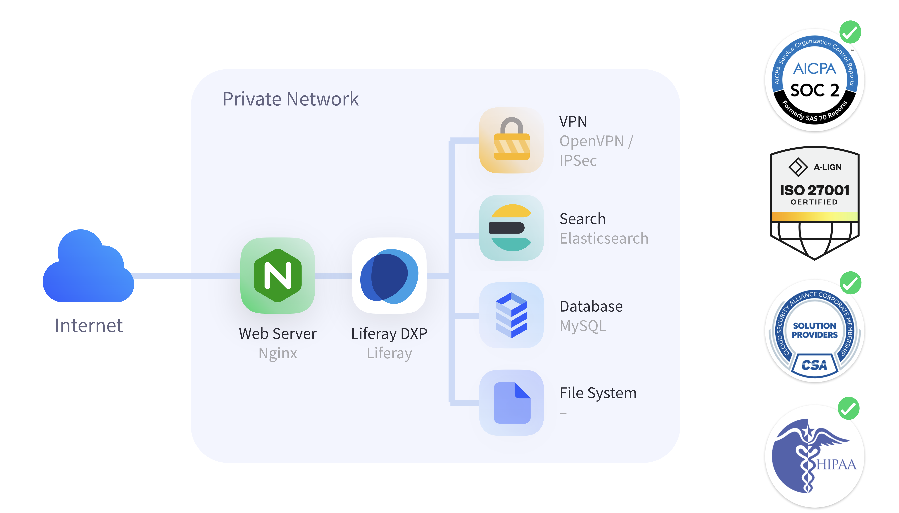

# Deployment Strategies Explained

**At a Glance**

* Liferay DXP Self-Hosted allows a customer to choose exactly how and where they host their Liferay DXP implementation, providing them maximum flexibility but putting more responsibilities on them as well.
* Liferay PaaS provides a platform-as-a-service offering tailored for the Liferay platform.
* Liferay SaaS provides the full benefit of Liferay DXP without having to worry about infrastructure and upgrade related issues. Customers can focus on building solutions to solve business problems.

## Comparing the Deployment Strategies

Now that the application is set (Liferay DXP) and the context of hosting an application are informed, let's walk through the Deployment Strategies available, which are in fact what Liferay sells.

### Liferay DXP Self-Hosted

With Liferay DXP Self-Hosted, Liferay provides just the DXP software itself - the Customer is responsible for everything else. Customers can deploy DXP Self-Hosted where they wish - in public cloud, private cloud, or in their own data-center.

**Low Value Activities**

| Responsibility | Liferay | Customer |
| --- | --- | --- |
| Products | &#10004; |  |
| Subscription (Support, Warranty, Indemnity, etc) | &#10004; | |
| Infrastructure (Uptime w/ SLA) |  | &#10004; |
| Application Uptime SLA |  | &#10004; |
| Platform Services (Database, Search, etc) |  | &#10004; |
| Architecture and High Availability |  | &#10004; |
| Upgrades |  | &#10004; |
| Updates |  | &#10004; |
| Patches, Security Hotfixes |  | &#10004; |
| Software Troubleshooting |  | &#10004; |
| Security Scanning / SAST / DAST |  | &#10004; |

**High Value Activities**

| Responsibility | Liferay | Customer |
| --- | --- | --- |
| Application Delivery |  | &#10004; |

With this approach LifeBank needs to provide the platform infrastructure and software - a Database Server, a Search Engine Server, storage option etc.

Because this is going to be a mission critical application, they need to implement high-availability, replication on the database, and a load-balancer - perhaps a cluster of web servers - and design and maintain the architecture to support this.

In this model, Liferay is only responsible for the Software and the Subscription (Support, Warranty, Legal Indemnification and so on).

Meanwhile LifeBank is responsible for everything else. And most of these activities are low-value - in that they don’t actually solve the business problem - but they are usually time-consuming, and potentially expensive to implement and maintain. 

In addition to all the initial setup and decisions to host the Application, there are the maintenance activities such as upgrades, updates, backup routines etc. that must be considered.

Only when all of this has been taken into account can the part of creating the solutions to meet business needs actually begin!

It is important to remember though that this approach comes with complete flexibility to select exactly the platform software and hosting environment a customer might want or need. So, while there is more work to be done by the customer, there is more flexibility too.

For LifeBank however, this flexibility is not needed, so they consider other options. LifeBank wants to focus more on what really matters to them - which is to develop the end user experience. With constant change in their industry, they need to deploy new assets and functionality - to evolve faster - to remain competitive.

And, they want to be able to be confident that when they evolve they will not run into issues.

### Liferay PaaS

The next offering they can consider is Liferay PaaS. With Liferay PaaS, Liferay provides the Software and a tailored infrastructure, with all of the Platform Services, and more.

In this model, Liferay has determined the optimal Platform Software to support Liferay DXP, and provides additional capabilities such as Backups, DevOps / CICD, VPN connections for integration to core systems and so on.

And, further than that, auto-scaling and High-Availability are available out-of-the-box as well, so peaks in utilization can be automatically accommodated.

**Low Value Activities**

| Responsibility | Liferay | Customer |
| --- | --- | --- |
| Products | &#10004; |  |
| Subscription (Support, Warranty, Indemnity, etc) | &#10004; |  |
| Infrastructure (Uptime w/ SLA) | &#10004; |  |
| Application Uptime SLA |  | &#10004; |
| Platform Services (Database, Search, etc) | &#10004; |  |
| Architecture and High Availability | &#10004; |  |
| Upgrades |  | &#10004; |
| Updates |  | &#10004; |
| Patches, Security Hotfixes |  | &#10004; |
| Software Troubleshooting |  | &#10004; |
| Security Scanning / SAST / DAST |  | &#10004; |

**High Value Activities**

| Responsibility | Liferay | Customer |
| --- | --- | --- |
| Application Delivery |  | &#10004; |

With Liferay PaaS, Liferay assumes responsibility for a number of the low-value activities. In addition to Infrastructure, Software Platforms etc., Liferay provides failure detection, self-healing capabilities and a 24x7 Monitoring team.

Liferay also provides an uptime SLA of 99.95% for the infrastructure, along with the full DevSecOps CI/CD pipeline with build management and so on.

But, there are still some time-consuming and relatively low-value activities that are the Customer’s responsibility - like Updates, Patches, Upgrades. And finally there’s the high-value Application Delivery work.

Liferay PaaS is a scalable cloud platform, which provides the main Platform software necessary for the Liferay DXP application to serve its purposes.

All of the components are securely connected and the platform has been certified for important Security Standards such as SOC2, ISO and HIPAA.

Liferay PaaS includes a management console so that customers can manage their application from a single place:

* The console provides access to Logs, Monitoring Capabilities and a CI/CD mechanism, providing a full PaaS experience.
* Autoscaling features can be enabled to give the flexibility of scaling up or down.
* Backups can be taken manually at any time, and are automatically taken on a configurable schedule.
* The console is integrated with Code Repositories like GitHub, GitLab and Bitbucket, so Developers can generate builds directly to the Platform, while having multiple environments provides the appropriate way to test before publishing.

**Liferay PaaS - Business Value**

With this approach, customers gain a lot of business value, by accelerating time-to-Market: 

* Improve Development Productivity
* Robust CI/CD Pipeline
* Delivery new Features when needed

They can modernize IT Operations:

* Increase uptime status percentage
* Reduce total cost of ownership
* Improve application scalability

And they can ensure business continuity by:

* Reducing downtime occurrences
* Improving time to restore
* Preventing data loss

Even with all of these benefits, LifeBank are aware that there are still low-value activities that consume time, resources, and money that could be focused on solving their business problems.

In many cases, and in increasing cases - even in traditionally conservative sectors like the one LifeBank is in - Financial Services - there is a push for customers to only pay for what they need and use - which is common with SaaS and other cloud-hosted capabilities.

Secondly there’s a desire for application-level SLAs - where they can be confident not only that the infrastructure is available, but that the application itself is available for defined and guaranteed periods.

And then, finally, coupled with the previous point is a desire to reduce the burden on their IT teams - to not have to be concerned about even applying patches or doing software troubleshooting, but to have that managed by the vendor.

### Liferay SaaS

With Liferay SaaS, the Customer can focus on what really matters - creating and launching their business applications.

**Low Value Activities**

| Responsibility | Liferay | Customer |
| --- | --- | --- |
| Products | &#10004; |  |
| Subscription (Support, Warranty, Indemnity, etc) | &#10004; |  |
| Infrastructure (Uptime w/ SLA) | &#10004; |  |
| Application Uptime SLA | &#10004; |  |
| Platform Services (Database, Search, etc) | &#10004; |  |
| Architecture and High Availability | &#10004; |  |
| Upgrades | &#10004; |  |
| Quarterly Updates | &#10004; |  |
| Patches, Security Hotfixes | &#10004; |  |
| Software Troubleshooting | &#10004; |  |
| Security Scanning / SAST / DAST | &#10004; |  |

**High Value Activities**

| Responsibility | Liferay | Customer |
| --- | --- | --- |
| Application Delivery |  | &#10004; |

With Liferay SaaS, Liferay has taken on responsibility for all of the low-value activities and is doing them all the time:

* DXP software is updated on a quarterly basis, tested against an updated backup copy, and is tested with a customized test suite to make sure that nothing will break when patches and software updates are applied.
* Liferay performs software and infrastructure troubleshooting, security scanning, and so on.

All of this means that customers like LifeBank can focus entirely on solving their business problems.

It is important to remember that although this is a SaaS offering, it is really a DXP-as-a-service. It is still the full Liferay Digital Experience Platform, with all of the ability to tailor and extend, but being offered via a SaaS deployment model.

It is not a turnkey application - there’s still the need to build and launch the specific application that customers need.

With this offering, customers can benefit from all of Liferay’s out-of-the-box capabilities including analytics and commerce, with a Cloud Environment to host their custom capabilities via Client Extensions, with the benefit of all the security layers extended to those customizations as well.

Liferay takes Security very seriously - and is certified for key security standards like ISO 27001, ISO 27017, ISO 27018, SOC 2, as well as HIPAA.

Liferay SaaS also has backup routines and disaster recovery plans to guarantee the safety of customer's data, along with AI-based tools to defeat cyber threats and attacks in different layers.

**Liferay SaaS - Business Value**

To summarize, Liferay SaaS can provides the following business value:

* **Flexible and Extensible** - Many integration options are available along with ways of extending the platform. Auto-scaling is included and managed by Liferay. 
* **Resilient at the core** - Customizations are detached from the Liferay core which makes upgrades simpler and quicker.
* **Always up-to-date** - Liferay keeps the Infrastructure up to date and applies updates to Liferay DXP regularly.
* **More Solution Focus** - Customers can use out-of-the-box functionality to solve their business problems.

Next, how to [decide which deployment strategy](./choosing-the-right-deployment-strategy.md) is right for a prospect.
