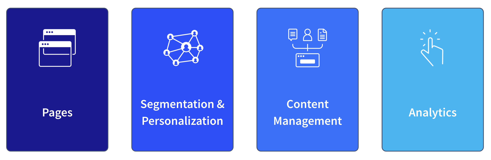
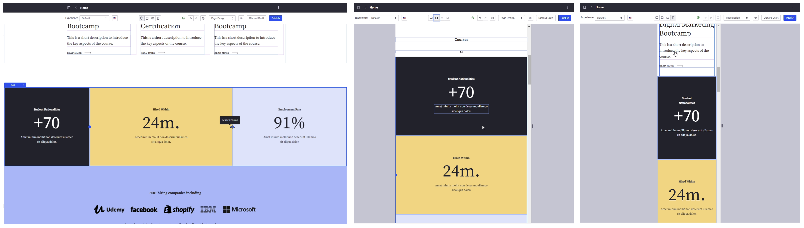

---
toc:
  - ./experience-management/segmentation-personalization.md
  - ./experience-management/content-management-analytics.md
uuid: 2233883a-c24c-40f0-a7f2-6df5d518f28c
visibility: 
- Employee
- Partner
---

# Experience Management

**At a Glance**

* Once logged in as an administrator it is possible to demonstrate how pages are constructed.
* The basics of demonstrating Liferay’s experience management capabilities include:
  * Pages
  * Segmentation and Personalization
  * Content Management
  * Analytics
* Pages provide the primary way that any information in Liferay is presented to site users.

```{note}
* View the [recording](https://learn.liferay.com/web/guest/d/se1-4-experience-management) from the live workshop of this module.
* Download the [PDF](https://learn.liferay.com/documents/d/guest/se1-4-experience-management-pdf) of the presentation used in the live workshop.
```

## Background

Having demonstrated [public pages](./public-pages-experience.md) and talked about the capabilities provided by Liferay to enable users to be [authenticated and authorized](./liferay-authentication.md) the next stage of a demo is to showcase the capabilities that are available once a user is logged in. 

Most of this module includes showing the experience management capabilities from the point of view of the page author or administrator - since showing the pages themselves has already been covered in the first module on public pages.



In-order to better understand the different aspects of experience management, this module is broken into four main sections:

* Pages
* Segmentation and Personalization
* Content Management
* Analytics

## Pages

Demonstrating [pages](https://learn.liferay.com/w/dxp/site-building/creating-pages/understanding-pages) and how they are constructed is the logical place to start this section of a demo because pages are the primary method that is used in Liferay DXP to display content and applications to users. 

Before starting the demo, introduce what the prospect is going to see, for example personas, user journeys, etc. With more context, the audience can better understand what is being shown to them when the demo begins. Tips for this include:

* Introduce the personas and user journeys to be demonstrated.
* Highlight the simplicity provided by Liferay and the low effort required to build pages.
* Don’t use a vanilla environment, use a pre-built demo.
* Prepare meaningful and relevant content in advance. 

Following these tips provides the opportunity to highlight and show how simple managing pages with Liferay is. Even without any technical knowledge, editors can edit a page in-line, they can change the page design, and add or change page content.

Starting from a prebuilt demo or from a site built using a site initializer is much more effective than using a vanilla Liferay environment. When content, or when uploading images, in the demo itself, be sure to have relevant content prepared. It is much more effective to use images related to the Prospect’s brand or industry because it is much easier for them to associate what they are seeing with their business, instead of trying to understand what they are seeing with generic information or images.

### Example Page Editing Walkthrough

**Landing Page**


As an example of walking through page construction in this case the Masterclass site initializer template is being used. However, if this is not appropriate to the individual prospect, it is much better to use a different Site Initializer or pre-built demo that best matches the needs and industry of the prospect.

**Editing the Page**


To start showing the editing mode, click the pencil icon in the toolbar. Show how easy it is to change the text and have an immediate preview of how the effect these changes make. 

Scrolling down, show how the page structure can be changed, for example changing the width for each element inside this grid. 

**Device Preview**



Show how editors can have a preview of the page on different devices. For example by changing the way the grid should be shown on tablets or mobiles it is easy to show how to control responsiveness of the page.

**Adding Images**


Also show how to change an image or add components on the page by dragging and dropping components.

**Page Translation**


If the need to localize a Liferay application into other languages is important, show how easily [page translations](https://learn.liferay.com/web/guest/w/dxp/content-authoring-and-management/translating-pages-and-content/translating-content-pages) can be added directly from the icon on the topbar. Also mention that there is a dedicated tool that can [auto-translate page content](https://learn.liferay.com/web/guest/w/dxp/content-authoring-and-management/translating-pages-and-content/using-third-parties-for-translation) using ML-based auto-translation services.

Finally click the Publish button to make the changes made to the page public. 

More information on pages and how they are constructed is available elsewhere on this site:

* [Using Content Pages](https://learn.liferay.com/w/dxp/site-building/creating-pages/using-content-pages)
* [Content Page Editor UI Reference](https://learn.liferay.com/w/dxp/site-building/creating-pages/using-content-pages/content-page-editor-ui-reference)
* [Using Fragments](https://learn.liferay.com/w/dxp/site-building/creating-pages/page-fragments-and-widgets/using-fragments)

### Additional Topics to Cover

Some useful topics to address at this point in the demo are:

* [Publication](https://learn.liferay.com/web/guest/w/dxp/site-building/publishing-tools/publications) workflow
* [Page Templates](https://learn.liferay.com/w/dxp/site-building/creating-pages/adding-pages/creating-a-page-template)
* Look and feel

**Publication Workflow**

When publishing a page, introduce the concept that publication workflows can be enabled to ensure changes are validated before going live and that Liferay provides a working environment to make changes to the site contents before publishing to the live environment

**Page Templates**

In this high-level demo news pages are not being created, but another topic to introduce is that it is not needed for users to create each page from scratch. Users can select from predefined page Templates to reduce the time and effort needed to create pages and to ensure consistency across different pages.

**Look and Feel**

Highlight that the UX being shown is just an example but that every aspect of look and feel can be modified to match their company branding including colors, logos, font, header, footer, etc. These topics will be covered in the [basics of styling](./basics-of-styling.md) module.

Next: [Segmentation and Personalization](./experience-management/segmentation-personalization.md).
