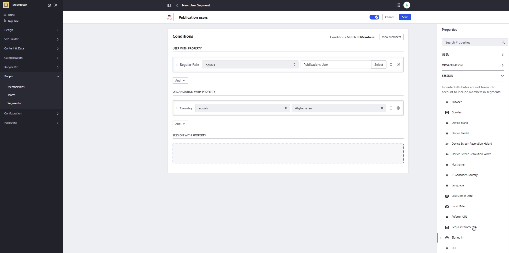
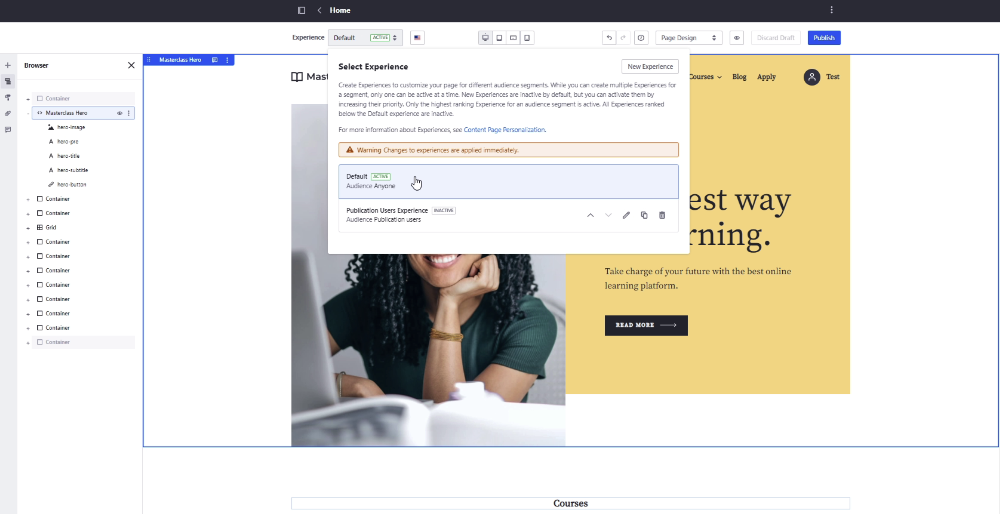

# Segmentation and Personalization

**At a Glance**

* The basics of demonstrating Liferay’s experience management capabilities include:
  * Pages
  * Segmentation and Personalization
  * Content Management
  * Analytics
* Segmentation provides the ability to group site users based on what is known about them and what activities they have carried out.
* Personalization provides the ability to present unique experiences to users belonging to different segments.

## Segmentation & Personalization

[Segmentation & Personalization](https://learn.liferay.com/web/guest/w/dxp/site-building/personalizing-site-experience) allows the user audience to be segmented and digital experiences tailored to each segment to create a more engaging and relevant experience. This leads to increased customer satisfaction, loyalty, and revenue for the business. Key points to discuss here are:

* This topic typically generates a lot of attention
* Always provide relevant examples
* Highlight how easy creating segments is

Personalization can be a sensitive and misunderstood topic, and often generates a lot of attention from the audience. Typical questions include:

* How to segment anonymous users
* What if users disable cookies on their browser?

It is important to be careful and prepared, and to provide examples based on the context and the solution that the prospect is going to implement.

For example an online retailer can personalize the shopping experience based on a customer's previous purchases, browsing history, or search queries. They can also personalize the content of the website based on the customer's location, language, or interests.

Or, for an employee portal, an organization can personalize the experience by providing different content and features based on an employee's role, department, or location. For example, a sales representative may see a different set of resources and tools compared to a human resources manager.

### Example Segmentation Walkthrough

In the demo, show that segment creation is an easy task for business users, that there is no need to write code and everything is done with easy configuration through the admin user interface.

It’s important to mention that Liferay is able to segment audiences using both static information, and behavioral information. Segments can be created from within Liferay itself in a very easy way.

**Creating a Segment**

A new segment can be created by dragging and dropping the Role attribute from the User section. Ensure that there are some users that match the conditions that are defined in order to demonstrate that the platform immediately previews the number of users belonging to the segment that has just been created. Show also that it is easy to add and combine other conditions, like the Organization or Session attributes..

If the demo environment is connected with Liferay’s Analytics and the customer is interested in Analytics, show segmentation directly through the Analytics UI, which provides more advanced segmentation possibilities using user behavior. For example, this can show whether a user has downloaded a document, submitted a form, shown interest on some topics, etc.

If relevant, it might be helpful to mention that segments can also be generated in an external system and then imported into Liferay to create personalized experiences.

**Creating an Experience**

Once a new segment is created, show how to create a new experience. Remove a component from the page and add or replace a component in the page with a banner.

When selecting an image, be sure to have a proper image ready. Don’t forget to explain that this is just an example of how different experiences can be created, and that this approach allows building completely different user journeys for different user segments. Highlight that everything is done by configuration, that no technical or coding skills are required.

More information on Personalization and Segmentation and how to use the features provided is available elsewhere on this site:

* [Creating and Managing User Segments](https://learn.liferay.com/w/dxp/site-building/personalizing-site-experience/segmentation/creating-and-managing-user-segments)
* [Creating and Managing Experiences](https://learn.liferay.com/w/dxp/site-building/personalizing-site-experience/experience-personalization/creating-and-managing-experiences)

### Not only Segmentation

Segmentation is not the only way to create personalized experiences. Liferay DXP offers other capabilities to personalize the user experience and the content shown on the pages, including:

* Roles and permissions
* Product recommendations
* Catalog and price personalization

**Roles and Permissions**

Liferay provides sophisticated, granular [permissions](https://learn.liferay.com/web/guest/w/dxp/users-and-permissions/roles-and-permissions) settings, so a content article or a page might not be shown to a user if they do not have the appropriate permission to see the content or page. For example an internal document is only accessible to HR people within an employee portal.

When talking about the potential to use Roles and Permissions to personalize Liferay it is important to mention that the best practice is to only restrict access when it is required, and to use segmentation and experiences to provide a guided view, but still allow users to find other content in other ways. See the module on [authentication](../liferay-authentication.md) for more details.

**Product Recommendations**

Another possibility when displaying a digital catalog is to use [product recommendations](https://learn.liferay.com/web/guest/w/commerce/pricing/promoting-products/product-recommendations) to show different content depending on users’ interests. Liferay DXP, in combination with Liferay Analytics Cloud, can analyze this browsing behavior and show relevant products for the users. 

This can be useful to promote certain products or content that users are more likely to buy or consume. For example, when a user visits an online store and shows interest in a particular type of product, product recommendations can be used to Recommends Products similar to the currently viewed product, or products the customer has bought in the past or similar customers did.

**Catalog and Price Personalization**

Also Catalogs and Prices can be personalized. If a company sells bespoke products for specific customers, they can [limit visibility for a product](https://learn.liferay.com/en/w/commerce/product-management/creating-and-managing-products/products/configuring-product-visibility-using-account-groups) to a specific customer. Or, they might have some products that are only sold to certain types of customers, for example some premium service they sell only to gold customers. 

Liferay allows the list of products to be presented to be easily personalized using straightforward configuration. [Pricing](https://learn.liferay.com/w/commerce/pricing/creating-a-price-list) and [Promotions](https://learn.liferay.com/w/commerce/pricing/promoting-products/creating-a-promotion) can be configured per customer or customer group. This means that with Liferay an organization can be sure that a customer will only see the personalized product, prices, promotions, and discounts.

Next: [Content Management and Analytics](./content-management-analytics.md).
