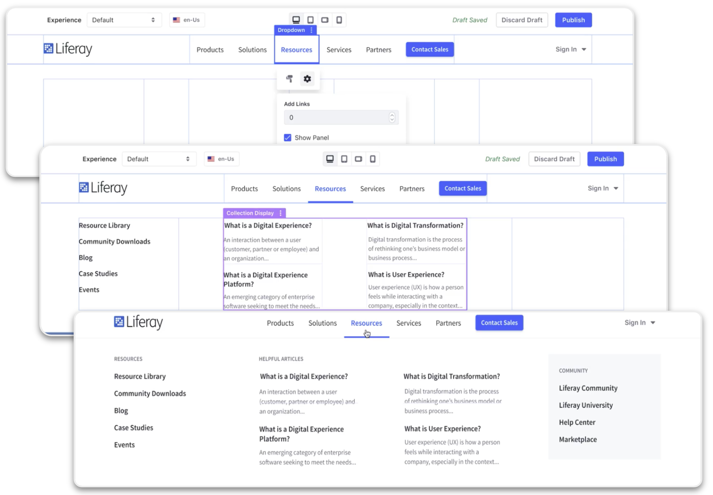
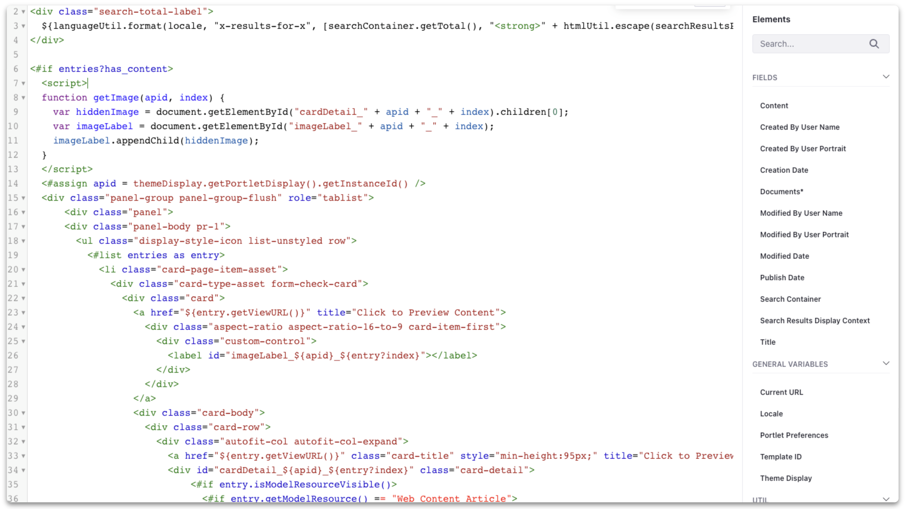

---
toc:
  - ./extending-liferay/low-code-no-code.md
  - ./extending-liferay/client-extensions.md
uuid: fff3c165-26ff-48d7-8937-cdc26f1b0062
---

# Extending Liferay

**At a Glance**

* Extending Liferay is a crucial aspect of leveraging the platform's full potential
* By customizing Liferay with specific business needs in mind, digital experiences which are tailored to the needs of the users can be created
* This module coves five key ways to extend Liferay
  * Configuration
  * Fragments, Templates, Style Books
  * Low-Code / No-Code
  * Integrations
  * Client Extensions

## Background

Liferay DXP is a full-featured digital experience platform and provides a wide range of capabilities out-of-the-box which can be used to implement sophisticated solutions for customers.

Even with this wide-range of capabilities each customer will have requirements that cannot be met solely with out-of-the-box features. Liferay has always been a flexible platform that allows customizations and extensions to be made in order that each customer’s unique requirements can be delivered.

This module outlines the key approaches that can be used to configure, extend, and customize Liferay to meet those customer needs. For the purposes of this module “extending” is defined to be anything that can be done when starting from a vanilla Liferay DXP configuration.

The primary focus is to introduce all of the possibilities that are available to make changes that do not require writing code. The objective of this learning path is to provide the tools needed to deliver a 30-minute demo of Liferay using an existing demo. This includes tailoring the demo to fit the needs of the prospect, without writing code.

But, writing code is sometimes going to be needed, and as such the module concludes with information about Client Extensions, which are the modern approaches to extending Liferay using code.

```{note}
* View the [recording](https://learn.liferay.com/web/guest/d/se1-7-extending-liferay) from the live workshop of this module.
* Download the [PDF](https://learn.liferay.com/documents/d/guest/se1-7-extending-liferay-pdf) of the presentation used in the live workshop.
```

## Traditional Customizations

Up to and including Liferay DXP 7.3, the primary method of extending Liferay was via writing Java OSGi Modules: e.g. portlets, hooks, etc. This enabled developers to add, remove, and modify functionality with ease while achieving a high degree of flexibility and customization.

OSGi modules are deployed to, and extend, the core of the platform, which introduces a number of challenges:

* Modifying the core impacts upgrades due to changes in APIs and so on
* Customers are unable to access new features in the newer releases of Liferay DXP without going through a full upgrade

## Latest Version of Liferay DXP

It is important to note that:

* The latest version of Liferay DXP includes three main capability sets: Digital Experience Platform core, Commerce, Analytics
* This offers customers both a simplified product line but also access to quarterly updates
* Updates contain not only includes fixes to known issues, but new features as well
* Liferay DXP is suitable for DXP, CMS, Commerce, LCAP, Portal, and many other use-cases


### Impacts of Quarterly Releases on Customization

One major impact of Liferay releasing a new version each quarter is that this provides the opportunity for Customers to upgrade every quarter. 

For Liferay SaaS customers in particular this is something done automatically by Liferay every quarter.

In order to ensure that these upgrades do not impact customisations a new approach to extending the platform using code has been introduced. Client Extensions allow customizations to be made without modifying the platform. These extensions are loosely coupled from the platform and ensure that upgrades can be run effectively and and as needed.

## Extending Liferay - Configuration

While not technically _extending_ Liferay, Liferay can be tailored to meet specific customer needs by configuring the out of the box capabilities and features. These allow developers and administrators to extend the platform's functionality without writing any code.
 
Some examples of configuration options include:

* System Settings
* Instance Settings
* Virtual Instances
* Site Settings

### System Settings

[System Settings](https://learn.liferay.com/w/dxp/system-administration/configuring-liferay/system-settings) allows administrators to configure the global settings for the Liferay portal. Including site, mail or search settings, and more.

System Settings often set defaults which can be overridden at the Instance and/or Site level later.

```{note}
When Liferay DXP is deployed through the Liferay SaaS offering, System Settings are not available.
```

### Instance Settings

Instance Settings are a powerful tool for customizing the behavior and appearance of a specific Liferay instance. Instance Settings allow administrators to configure a wide range of options, including authentication, email, language, search settings, and more.

Some Instance Settings override defaults configured in System Settings to allow flexibility where an individual instance might require a different configuration to the others. Other settings are only available per Instance - for example connections from Liferay DXP to Analytics Cloud are always managed per Instance.

### Virtual Instances

A [Virtual Instance](https://learn.liferay.com/w/dxp/system-administration/configuring-liferay/virtual-instances) is a logical separation of Liferay's resources, which allows administrators to create multiple, independent solutions within a single Liferay installation. Each Virtual Instance has completely separate data and configurations. Each is accessed via a unique domain name and for all intents and purposes, is a separate Liferay-based implementation which shares an installation with additional instances.

```{note}
When Liferay DXP is deployed through our Liferay Experience Cloud SaaS offering, each customer environment (Production, UAT, etc.) is a virtual instance within a shared cluster shared with other Customers. Within this Virtual Instance, Customers are able to create additional Sites, up to the limits provided for their chosen subscription Plan.
```

## Extending Liferay - Fragments, Templates, Stylebooks

Another way of extending Liferay is to create UI elements, templates for rendering different types of content and assets, and to modify the look and feel of a Liferay application using:

* Fragments
* Templates
* Style Books

### Fragments

[Fragments](https://learn.liferay.com/web/guest/w/dxp/site-building/creating-pages/page-fragments-and-widgets/using-fragments) are one of the building blocks which can be used to create content and pages in Liferay DXP. Fragments are intended to be used by Content Authors and Page Creators.



Thanks to Liferay's drag-and-drop interface, adding fragments to pages, and configuring them once added is a straightforward process which can be done by anyone, regardless of their technical expertise.

Once a fragment is deployed on a page it can either be configured directly through “in-line editing”. Alternatively they will be mapped to other assets like Web Content.

In-line edited fragments contain information unique to the page they are deployed on, but when content is mapped to a fragment that same content might be present on other pages. This means that the page builder has a great amount of flexibility in how Fragments are used.

Users can also save pre-configured sets of fragments as [Fragment Compositions](https://learn.liferay.com/web/guest/w/dxp/site-building/creating-pages/page-fragments-and-widgets/using-fragments/saving-fragment-compositions), which can then be added to any other page to speed up the process of creating similar pages.

**Developing Page Fragments**


In addition to this, developers can create new fragments from scratch, through the editor within the UI, or via a CLI tool. Developers use a combination of HTML and optionally CSS, JavaScript and Freemarker to build new fragments to serve almost any purpose.

Custom tags are available to allow developers to build in-line editable fragments, and to embed other fragments and widgets within their fragments.

Fragments also include Configuration, to allow values to be set or overridden by page builders when the fragment is added to a page. 

See: [Developing Page Fragments](https://learn.liferay.com/web/guest/w/dxp/site-building/developer-guide/developing-page-fragments)

### Templates



Templates are a powerful tool for customizing the appearance and behavior of both the UI and assets that are displayed in the UI.

Once a template has been written it can be selected by the users, such as the marketing team, allowing them to easily control how pages render information and how content is displayed..

At a technical level, templates use combinations of HTML, CSS, Javascript, and are based upon the popular Freemarker scripting language. 

See also:

* [Widget Templates](https://learn.liferay.com/w/dxp/site-building/displaying-content/additional-content-display-options/styling-widgets-with-widget-templates) control the look and feel of Widgets.
* [Web Content Templates](https://learn.liferay.com/web/guest/w/dxp/content-authoring-and-management/web-content/web-content-templates) are used to control how Web Content is displayed:
 * A single template might be used if the Content Display fragment or Web Content Display widget are used.
 * A combination of templates rendering a single field or smaller number of fields might be used if the developer prefers page builders to map templates to individual fragments.
* [Information Templates](https://learn.liferay.com/w/dxp/site-building/displaying-content/using-information-templates) work in a similar way to Web Content Templates but for other asset types like Documents and Media.
* Freemarker templates can also be used in custom Fragments.

### Style Books


[Style Books](https://learn.liferay.com/en/w/dxp/site-building/site-appearance/style-books/using-a-style-book-to-standardize-site-appearance) are sets of visual standards which apply to a Site, such as colors, fonts, and spacing. This allows the layout for every page to be designed independently while maintaining a consistent experience across each of them.

Next: [Extending Liferay with Low-Code / No-Code capabilities](./extending-liferay/low-code-no-code.md)
