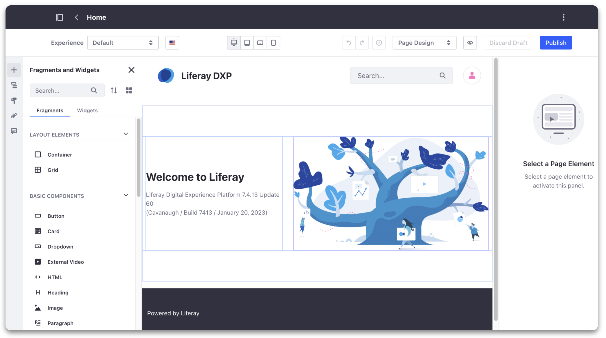

# Extending Liferay with Low-Code / No-Code and Integrations

**At a Glance**

* Extending Liferay is a crucial aspect of leveraging the platform's full potential
* By customizing Liferay with specific business needs in mind, digital experiences tailored to the needs of users can be created
* Low-Code / No-Code capabilities allow the platform to be extended by writing little to no code
* Integrations with external systems allows incorporation of data from those systems into a Liferay application

## Extending Liferay - Low-Code / No-Code

Using a Low-Code and No-Code approach is becoming increasingly popular as it allows developers and business users to create custom functionality without extensive coding knowledge or experience.

Low-Code and No-Code are actually not new concepts to Liferay as many of the existing features in Liferay DXP are designed with this principle in mind.

Some quick examples in Liferay DXP are:

* Objects
* Workflow
* Collections
* Page Builder

### Objects


[Objects](https://learn.liferay.com/w/dxp/building-applications/objects) can be used to quickly create business applications without writing any code to reduce costs and boost agility without deploying modules.

Points to note here:

* Objects simplify data management and accelerate creation of solutions tailored to business needs.
* Data Models can be built visually, along with defining the attributes representing the different types of data required.
* Business definitions can be decomposed into discrete models with relationships defined between them.
* From a mortgage simulator, to an e-learning platform, almost any functionality that might need to be included in Liferay can be created with Objects.
* Such out of the box features allow developers to add new capabilities and override native Liferay functions - without modifying the core of Liferay DXP.

## Workflows


* [Workflows](https://learn.liferay.com/w/dxp/process-automation/workflow) allows administrators to review and approve content such as Blogs, Web Content and Wikis - before they are published.
* Workflow can also be used with Objects to provide an additional layer of process management to those business applications.
* Liferay’s Process Builder provides a visual way of constructing any number of different workflows for different purposes.
* Workflow Metrics provide the ability to monitor the overall workflow and define SLAs to ensure work is processed on time.

### Collections


* [Collections](https://learn.liferay.com/w/dxp/content-authoring-and-management/collections-and-collection-pages) are sets of content items and other assets which can be used to group and filter information.
* The contents of Collections can be manually defined, but are more often dynamic selections of assets based on predefined criteria.
* Dynamic collections are automatically updated as new assets are published, ensuring that the most relevant information is presented to users.
* Collections can be displayed via the Collection Display Fragment, in Collection Pages, or using the Asset Publisher.

A typical use case for collections would be, for example, to have a section or page showing new customer success stories automatically as they are published.

### Page Builder



Liferay’s Page Builder is a drag-and-drop tool that enables pages to be constructed without writing any code.

Pages are built by adding Fragments and Widgets to create exactly the presentation required.

The Page Builder is used for defining a wide-range of different types of pages:

* Content Pages for general site pages
* Display Page Templates to enable all assets of a given type to be presented consistently and without the need to build a specific page for each asset
* Utility Pages for things like 404 and 500 error pages, and now also for other pages like Sign-In, Forgot Password, etc.
* Master Pages to use as templates for other page
* Building Personalized experiences for site pages
* Building A/B test

## Extending Liferay - Integrations

Liferay DXP can also be extended using integrations. This allows Liferay to connect with existing systems and tools, including Customer Relationship Management (CRM) systems, Enterprise Resource Planning (ERP) systems, among others.

Liferay provides several integration points which allow customers to integrate with external systems, services, or applications.

Examples include:

* Google Drive
* Microsoft Office 365
* Live Chat
* DocuSign
* ETL and ESB
* Headless APIs

### Google Drive

Liferay provides native integration capabilities to connect to Google Drive to support two different use cases:

1. [Enabling Document Creation and Editing with Google Drive](https://learn.liferay.com/w/dxp/content-authoring-and-management/documents-and-media/devops/google-drive-integration/enabling-document-creation-and-editing-with-google-drive)
2. [Enabling Links to Google Drive Documents](https://learn.liferay.com/w/dxp/content-authoring-and-management/documents-and-media/devops/google-drive-integration/enabling-links-to-google-drive-documents)

The fundamental difference between these two modes is where the documents are ultimately stored - in both cases the documents are created and edited using Google’s browser-based applications.

* In the first mode the documents are ultimately stored directly in Liferay’s Documents and Media library
* In the second they are stored in Google Drive with shortcuts to those documents stored in Liferay

### Microsoft Office 365

[Microsoft Office 365](https://learn.liferay.com/w/dxp/content-authoring-and-management/documents-and-media/uploading-and-managing/creating-documents/creating-and-editing-documents-with-microsoft-office-365) OneDrive for Business integration allows users to use the Microsoft Office 365 applications to create and edit documents which are then stored in Liferay’s Documents and Media library.

Also with Office 365's Exchange Online calendar, if integrated, users are able to view and manage their calendars directly within the Liferay portal.

### Live Chat

Liferay DXP provides comprehensive support for a number of [Live Chat](https://learn.liferay.com/w/dxp/site-building/personalizing-site-experience/enabling-automated-live-chat-systems) platforms. Enabling this integration adds a chat window to sites on the Liferay instance and can be used to enable improved support and site experience for your users.

### DocuSign

[DocuSign](https://learn.liferay.com/web/guest/w/dxp/content-authoring-and-management/documents-and-media/uploading-and-managing/enabling-docusign-digital-signatures) digital signatures can also be integrated with Liferay documents. 

DocuSign is a service which manages documents to be signed electronically. This integration allows the management and collection of signatures on documents.

### ETL & ESB

Liferay is able to integrate with ETL (Exchange-Transform-Load) tools and Enterprise Servivec Bus (ESB) systems.

With Liferay’s [Talend](https://learn.liferay.com/web/guest/w/dxp/system-administration/data-integration/liferay-talend-components-overview) Components, customers can import and export data to and from Liferay. For example, user data, web contents or products, can be imported from and exported to other systems such as a CRM, an ERP or database.

Similarly, Liferay provides a connector to the [MuleSoft](https://learn.liferay.com/w/commerce/add-ons-and-connectors/mulesoft) ESB, to enable integration with platforms and services in the MuleSoft ecosystem.

```{note}
It is not possible to use Talend for import or export jobs when using Liferay SaaS.
```

### Headless APIs

Liferay’s [Headless](https://learn.liferay.com/w/dxp/headless-delivery/using-liferay-as-a-headless-platform) integration capabilities provide developers with a flexible and efficient way to incorporate Liferay's functionality into their own applications. Liferay’s Headless APIs provide CRUD (Create, Read, Update, Delete) functions for almost all Liferay functionality.

* Liferay’s Headless APIs are OpenAPI compliant and provide GraphQL endpoints.
* New Headless APIs are automatically created for Liferay Objects.

The Headless APIs can be used for Headless CMS, Headless Commerce, Headless Administration, etc. use cases to provide developers with greater control over the user experience, and enable faster time-to-market for their applications.

```{note}
* Some of above mentioned integrations might not be possible with Liferay SaaS
* Please check with your designated Liferay contact on the latest supported integrations if you are using Liferay SaaS.
```

Next [Extending Liferay with Client Extensions](./client-extensions.md)
