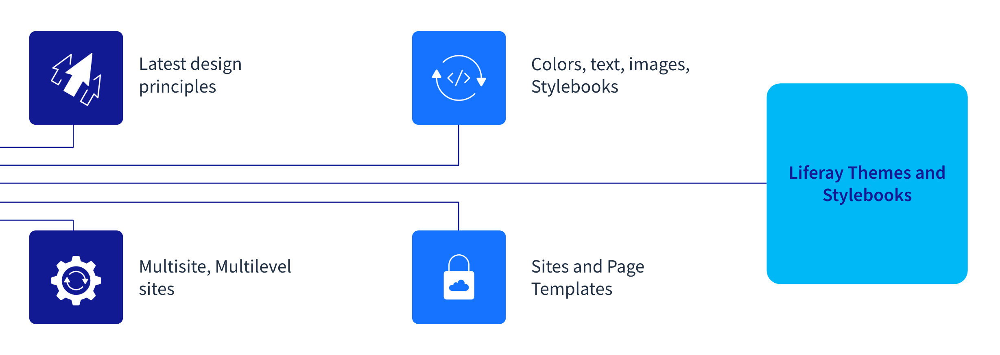
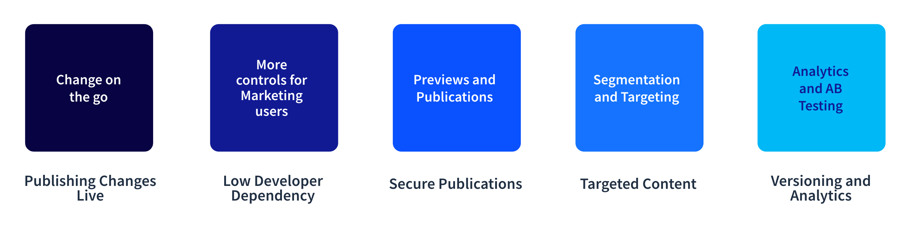

# Branding and Consistency

**At a Glance**

* Many customers struggle to deliver consistent look and feel
* Liferay styling ensures sites, pages, and content on those pages behave consistently
* Ease of use, lack of developer dependency support reduced time to market and scalability

```{note}
* View the [recording](https://learn.liferay.com/web/guest/d/se1-2-public-pages-experience) from the live workshop of this module.
* Download the [PDF](https://learn.liferay.com/documents/d/guest/se1-2-public-pages-experience-pdf) of the presentation used in the live workshop.
```

## Styles and Themes - Branding and Consistency

When talking about styling and themes in Liferay, what that really means to the prospect is branding and consistency. The demo has already introduced the overall and feel, and how that look and feel is carried through the pages. Now it is important to establish the fact that the look and feel that has been shown is very flexible and also consistent. 

Many customers struggle with inconsistency in their look and feel often because their applications are made from multiple systems, each one with its own approach to look and feel, or even where look and feel is left to individual content authors. This might relate to misalignment in images, inconsistent colors, font sizes, or even the fonts themselves.



In terms of branding and consistency in Liferay, this is primarily delivered through the use of Themes and Style Books, which can be broken down into four main aspects at a high level:

* Latest design principles
* Multi-site, multi-level sites
* Colors, Text, Images, Style Books
* Sites and Page Templates

### Latest Design Principles

The phrase “latest design principles” may seem somewhat technical, or vague, but the value of talking about Liferay’s styling in these terms is that it provides confidence that a Liferay application supports principles like, for example, Responsive Design, and consequently that prospects should be comfortable that the best look and feel can be implemented with Liferay. 

### Multi-Site, Multi-level Sites

Another topic to cover is Liferay’s ability to support multiple sites, and multi-level sites, where each page, and indeed each site can share the same overall look and feel. The design team can implement a theme that enforces the brand guidelines, and then define different Style Books to allow variations to this to be applied to different sites. Perhaps the public website uses one color scheme, while the customer self-service portal uses a variant. All of these support the need for consistency, but at the same time allowing for variations.

### Colors, Text, Images, Style Books

As indicated above, Liferay allows designers to create Style Books that extend on each theme to allow tailoring, without the need to write any code, of all aspects of the look and feel. In addition to supporting multiple Style Books with variations for different sites, this means that if the branding or branding guidelines change these can be easily adapted. Further to this, when it comes to images, Liferay includes adaptive media features that automatically supply appropriately sized images to different screen resolutions to optimize performance and improve user experience.

### Site and Page Templates

Site and Page Templates allow new sites and pages to be created quickly and easily, and further support consistency by defining a consistent layout for each page above and beyond the basic look and feel.

## Scalability and Faster time to market

In any demo situation the audience includes people with different roles. Some, like Enterprise Architects, or Developers, are evaluating Liferay from a technical perspective. One main consideration for executives like CTO, CFO, CEO etc. is evaluating Liferay from the point of view of the overall cost, the time to market, and the scalability.

These topics are addressed in many ways, not least of which is through the implementation, which is discussed at a much later stage in the sales cycle. The connection here is that all of the capabilities discussed in this module around speed of creating pages, sites, and content, and the consistency provided through the look and feel build confidence that a Liferay application supports fast time to market and scalability. 

### Scalable and Flexible

Before finishing the public pages demo and moving deeper into the prospect’s specific use case, the following topics can be introduced to further build confidence that a Liferay application is scalable and flexible:



**Changes on the go**

Liferay supports the ability to change on the go through the ability to publish changes live, without needing to go through a development cycle.

**More controls for Marketing users**

Much of the demo so far has showcased how non-developers like Marketing users can easily create and update content and pages. Having low developer dependency on these activities ensures that Liferay applications can evolve and change as quickly as the prospect needs.

**Previews and Publications**

When talking about changes being made live, it’s important to cover the fact that this is not just that anyone can change anything, but that these publications and previews are secured through Liferay’s role-based access control, to ensure that only authorized users can make changes.

**Segmentation and Targeting**

This is also a good time to remind the prospect about Liferay’s Segmentation and Targeting capabilities that allow content and applications to be targeted to specific users based on the segments that they belong to.

**Analytics and AB Testing**

Closely linked to segmentation and targeting are the analytics capabilities and features like AB testing, which allow multiple variants of a page to be tested against one another to determine the most effective version.

## Summary

Congratulations, that’s the end of the Public Pages Experience module. Remember that this part of a demo is short, and high-level, and serves to both introduce Liferay to a prospect and to start to build confidence that this is a platform that can be used to address many typical concerns, even without covering the specific use-case that the prospect is looking for.

The next module, [Liferay Authentication](../liferay-authentication.md), covers logging into Liferay and how to discuss the rich options that are available with the platform.
