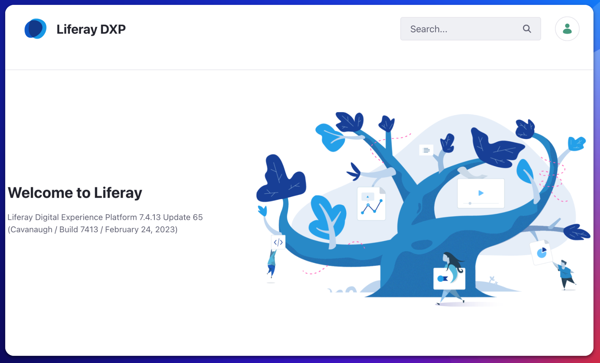
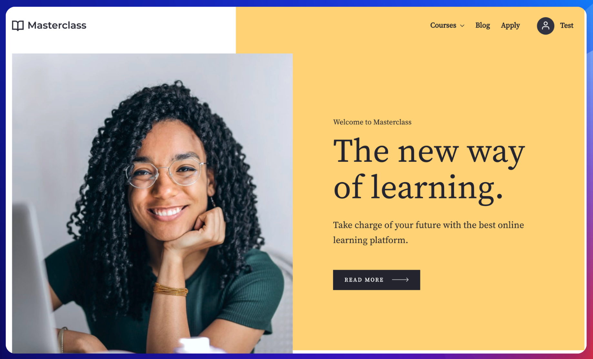

# Public Pages - Home Page

**At a Glance**

* Never use the Liferay default site or theme for a demo
* Spend time browsing the home page, don’t jump straight to login
* Discussing how pages are structured and the different types of content
    * Static and Dynamic content
    * Interaction
    * Targeted content
    * Third party content

## Demo Home Page

A key objective for the demos is to ensure that the prospect remembers Liferay. Never show a white screen with no styling, and never use the default vanilla Liferay global site that is provided the first time the product is started up.

Ideally create and show a custom demo, or at least a demo tailored for the customer needs. The best way to start is to use one of the Liferay out of the box Site Initializers, or Site Templates for the basis of any demo.

Remember that _custom_ doesn’t mean a demo built from scratch, with custom styling, UI, UX, applications etc. Ideally Liferay’s out-of-the-box features should be used, because this gives a lot of scope to talk about Liferay as a platform, which is where Liferay shines. 

If the demo only shows solving the prospect’s individual problem then theoretically a single application could be built, not even on Liferay, and presented as a proof-of-concept. Liferay is a platform, and should be shown as a platform, so the prospect needs to know that Liferay offers a lot of functionality beyond just their specific use case. 

Using the out of the box features provides the opportunity to showcase these features and capabilities. Even if there is no specific use-case supplied and the prospect is just interested in seeing what Liferay has to offer, do not use the default “Classic” theme but use one of the pre-supplied site initializers.

In this module the Masterclass template is being used. For the best learning experience create a new site based using Masterclass and use this to follow along. If not using Masterclass, just be sure to use a demo with a similarly rich engaging home page, with different types of content and capabilities.

The pre-login home page provides an opportunity to talk about some of Liferay’s features:

* Headers and Footers
* Static and Dynamic content
* Information and content that can be interacted with
* Targeted content
* Third Party content

### Headers and Footers

Not necessarily a topic to spend a lot of time on. Headers and footers provide a way to present the same information on every page. In later modules, and indeed later on in a demo, the mechanisms, like Master Pages, used to define Headers and Footers are covered.

### Static and Dynamic Content

As the demo of the home page continues, talk about different types of content and how they are displayed. The panel at the top shows static content, which is always displayed in the same way.

Other sections of the page might show dynamic content, where the selection of content changes over time as new articles are added, or as the user is browsing the page when using techniques like a carousel.

At this point in the demo the key is to mention that it is built using out-of-the-box features. Editing is not shown yet, but it is OK to say that Liferay’s content authoring allows Marketing users to easily create content like this, using drag and drop tools.

At this point though there is no discussion about how content is built, or about content management, that comes later. And this can be stated if asked. For now the goal is to allow the prospect to get an understanding of how pages are structured, and how content looks and can be displayed.

### Interaction

Scrolling down the page there are some containers which are more dynamic in nature which have some functionality like being able to click on “Apply now” to trigger an application which is managed elsewhere within the site. 

Scrolling further down are articles which are more like an assembly or an abstract of full content. These generally allow the user to click to display the full content, or redirect to another page.

### Targeted Content

While talking about content it is also worthwhile discussing how content can be targeted to different users through segmentation, allowing the page to have a different feel based on the different types of users.

Liferay has an ability to understand who is browsing the website and that can happen even before a user has logged in. Attributes provided by the browser agent can help to present content based on where a user is geographically located, or even for less useful things like operating system and browser. Content can also be targeted based on Cookies, so for example if the site is designed to store a cookie when a user first visits, that could be used to present something dedicated if they return at a later date.

The more that is known about a user the more sophisticated the targeting can get - so once a user logs in a lot more personalization is possible. This will be covered in a later module, and can be addressed later on in the demo, but it’s a good point to introduce the concepts.

### Third Party Content

Finally, scrolling to the very bottom of the page, there are some social media icons. This is a good point to introduce the possibility to integrate with external sources or even to embed content coming from other systems.

Next: [Other Public Pages](./other-public-pages.md).
