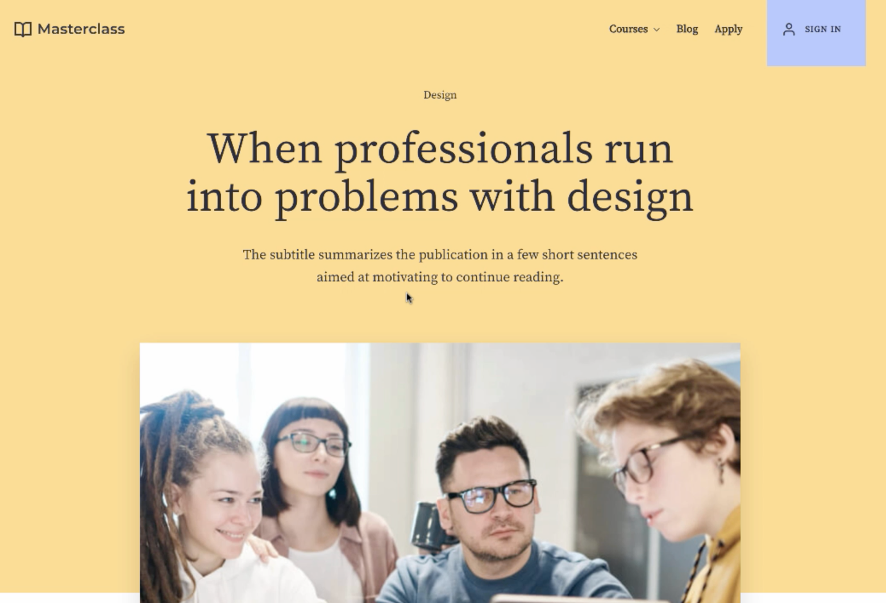
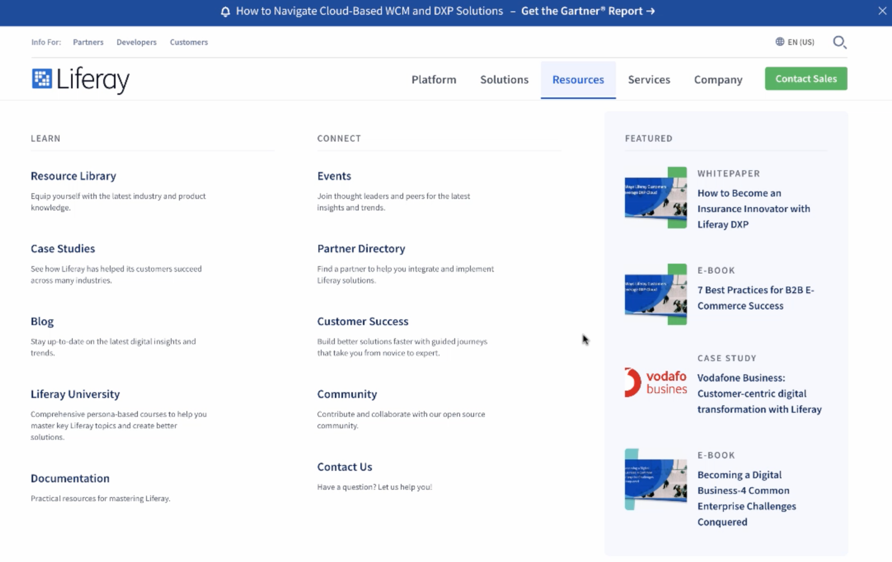

# Other Public Pages

**At a Glance**

* Use other pages to showcase other types of content and applications
* Browsing pages provides the opportunity to introduce navigation
* Optimized user experiences require fewer clicks
* Navigation and Search both contribute to improved user experience

## Blogs Page

Scrolling back up to the top, the Blog link takes the user to a second page, where a different type of content - Blogs - is displayed. This page displays different information to the user, in a different way to the home page, but is still very consistent in look and feel because it is inheriting the styling from the Style Book that is applied to the site as a whole. Style Books are covered in a later module, and can be demonstrated later too, but for now it is useful to mention that Liferay allows different teams, with different skills, to work simultaneously on a site, or any number of sites.

Generally a designer, or team of designers will work on the styling, and marketing users and other content authors will design the pages and publish content to them. Separating the styling from the page design means that there’s the consistent look and feel that this site displays, plus any required changes can be easily made site-wide.

Blogs are a different type of content, which is fully supported by Liferay out-of-the-box, and in this example site all of the blogs are presented on one page. Clicking on the summary for one blog automatically displays the full content of the blog. What’s good to mention here is that this requires no coding, just some configuration. Even adding new pages is purely a configuration exercise, and each page can display and host any type of application that the site might need. 

## Apply Page

Masterclass also provides another page, which helps to talk further about interactive applications. In this case the Apply page includes a simple application which allows users to subscribe to updates from the learning platform. As with the other pages, at this stage it’s not to talk in detail about how this is created, but to note that creating this sort of feature is simple with Liferay.

## Navigation and Search

At this point the demo has already moved on from showing a single page, so it is a good opportunity to pause and talk about features like Navigation and Search that are available before logging in. When talking about these it is important to cover:

* Multi-level navigation
* Content within navigation
* Reducing clicks to improve UX
* Liferay Search

### Multi-level Navigation

The navigation for the Masterclass template is relatively simple. Showing this first provides an opportunity to introduce the topic, before potentially showing a more complex example. Point out at this stage that the navigation can be multi-level in nature, providing direct access to not just child pages of the home pages, but potentially to child pages of those pages as well.

### Content within Navigation

A good way of demonstrating a more sophisticated navigation model is to use liferay.com, which has a different approach that includes content embedded within the navigation itself. All of this is possible without having to write any code.

### Reducing clicks to improve user experience

Core to the effectiveness of any site is ensuring that users can quickly find the information they are looking for. Navigation plays a big part in providing an effective user experience by reducing the number of clicks needed for users to get to relevant information.

### Liferay Search

Search is another tool to enable users to quickly find the information they need, and in Liferay is also another way to arrange content. At this stage in the demo the discussion is not going to go deep into Liferay’s search capabilities, but worthwhile mentioning is that Liferay’s search capabilities are:

* Powered by Elasticsearch
* Include search suggestions
* Used for full site search, as well as tailored search experiences
* Enhanced with tools like Search Blueprints to tailor search results, ordering etc.

If the prospect is particularly interested in Search keep that in mind for later in the demo, after logging in.

Next: [Branding and Consistency](./branding-consistency.md).
