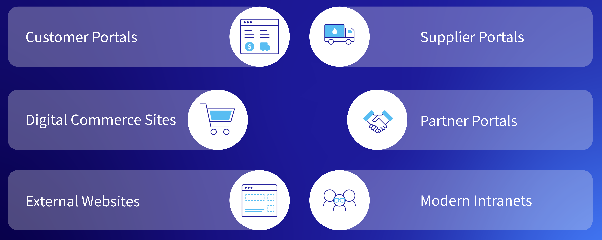
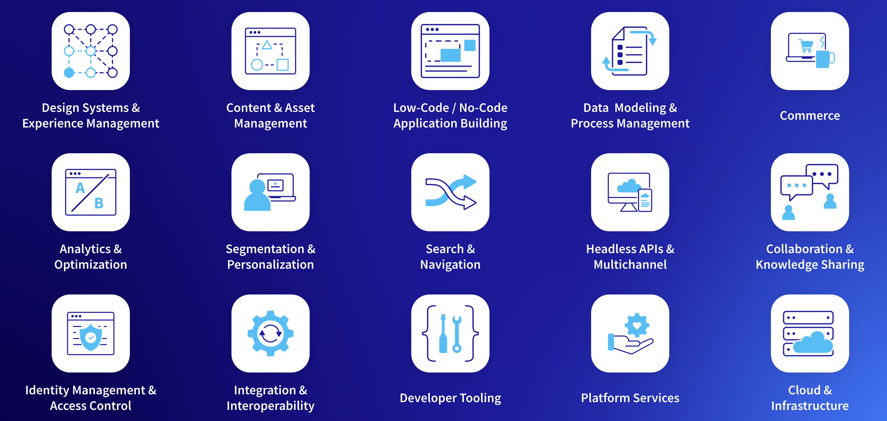

---
toc:
  - ./success-stories-analysis/presentation-breakdown.md
  - ./success-stories-analysis/additional-solutions.md
uuid: 8a466648-818b-4be9-bbb1-6c3f5c20a6aa
visibility: 
- Employee
- Partner
---

# Success Stories - Analysis

**At a Glance**

* Preparing to deliver a demo of Liferay requires more than just learning the demo environment to be used.
* Sales Engineers should make use of all resources available to them to learn about the platform capabilities and how those capabilities are used in real world scenarios.
* This module provides an example of how to use one of the presentations from an earlier module to map key capabilities to requirements for common solutions.

## Background

In the earlier module in Level 1 for Business Sales Roles, [Tailored Solution Highlights](https://learn.liferay.com/w/courses/selling-liferay/level-1-business/tailored-solution-highlights) we reviewed, in detail, six of the horizontal solutions that Liferay is a good fit for:

* Customer Portals
* Digital Commerce Sites
* Enterprise Websites
* Supplier Portals
* Partner Portals
* Intranets

This module uses the same presentation as its content, but is presented as a resource that can be used to aid the Sales Engineer as they do additional discovery and provide guidance on pre-built demos and Liferay DXP capabilities that might be useful for a prospect with a similar requirement.

This module discusses the horizontal solutions and out-of-the-box functionality at a high level, and then deep dives into one of the solutions, in the context of the presentation provided for the earlier Level 0 module. In this module the _presentation_ provided is useful as a reference source. It is not intended that the presentation is used as part of the demo process.

Reviewing the previous modules in this learning path - the series started with what can be done during a discovery call, talked about pre-login and post-login scenarios, authentication into Liferay, how to style Liferay and customization customization approaches and so on. Those sessions provide a guide to how to go about the process of tailoring an existing demo to deliver in 30 minutes to a prospect.

This module provides a guide to using the success stories as an existing resource to supplement that demo, rather than being about presenting the demo itself.

```{note}
* View the [recording](https://learn.liferay.com/web/guest/d/se1-9-success-stories-analysis) from the live workshop of this module.
* Download the [PDF](https://learn.liferay.com/documents/d/guest/se1-9-success-stories-analysis-pdf) of the presentation used in the live workshop.
```

## Horizontal Solutions



The most popular horizontal solutions that Liferay is used for are:

* Customer Portals
* Digital Commerce Sites
* Enterprise Websites
* Supplier Portals
* Partner Portals
* Intranets

First, it is important to remember that this is _not_ the complete list of solutions that LIferay is suitable for. Liferay provides a very wide range of out of the box capabilities which are suitable for many different use cases. Even knowing Liferay really well it sometimes comes as a surprise when hearing that it has been used successfully somewhere that wouldn’t at first glance be seen as a logical fit for the platform.

This module focuses though on the most common solutions implemented, and maps the key Liferay features that are required with those solutions, to provide an understanding of how to prepare for the demo, and how to manage objections or concerns that the prospect might have.

As an example, consider walking into a meeting where the prospect’s objective is to build a customer portal. There are certain groups of Liferay features that are going to be particularly suited to solving this problem. By not being well versed with those features it will be difficult to answer questions about them, or to build confidence for the prospect that Liferay can be used effectively as a customer portal. Rather than going through the content for all six of the solutions this module provides an explanation of the structure of the Horizontal Solutions presentation using Customer Portals as the chosen example.

## Liferay DXP Key Capabilities



The above image provides the key capabilities of the platform at a high level. All the horizontal solutions mentioned incorporate many of these capabilities. The breadth of functionality provided by Liferay DXP is one of the primary reasons why Liferay is a strong player in the DXP market.

Given that the objective of this Level 1 learning path is to prepare Sales Engineers to deliver a 30 minute demo of Liferay, it is important that the Sales Engineer is able to communicate this breadth of features to a prospect, and be able to talk about how Liferay can solve their business problem. It is important, as a Sales Engineer, to not just know this information academically but to have hands-on experience with the platform, using the above as a checklist to work through and learn about group by group.

It is important to know not just that Sites can be built with Liferay, but that Liferay provides Content and Asset Management, strong Search and Navigation features, rich sets of Headless APIs, how integration is supported, how Authentication works, and so on.

Start by learning these groups at a high level, and then go deeper. Having a prospective demo to work on, where certain groups are more important than others, provides an excellent way to do that deeper level learning, and in doing so become more effective at delivering demos and dealing with objections.

Next, [Breaking down the Horizontal Solutions presentation](./success-stories-analysis/presentation-breakdown.md)
