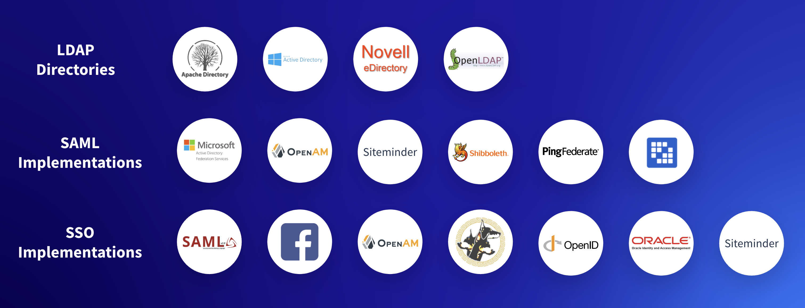

# Additional Horizontal Solutions

**At a Glance**

* The Tailored Solution Highlights learning path presentation provides details of six common solutions where Liferay has been successful.
* Sales Engineers should make use of all resources available to them to learn about the platform capabilities and how those capabilities are used in real world scenarios.
* The section on Partner Portals includes valuable information which can supplement information provided to prospects on Authentication and Single Sign On.

```{note}
* View the [recording](https://learn.liferay.com/documents/d/guest/se1-9-success-stories-analysis) from the live workshop of this module.
* Download the [PDF](https://learn.liferay.com/documents/d/guest/se1-9-success-stories-analysis-pdf) of the presentation used in the live workshop.
```

## Additional Solutions

After Customer Portals the presentation provides similar information for Digital Commerce Sites, and so on. Each section follows the same structure:

* Definition for the Horizontal Solution
* Key Capabilities required
* Demo Screenshots to illustrate how the key capabilities are utilized
* Customer Case Study for the solution

In some cases, and Digital Commerce is an example, there may be more than one demonstration environment that can be used, perhaps focussing on one of the key capabilities more than the other, or perhaps with some important distinctions - like a B2B example and a B2C example.

Following Digital Commerce Sites are Enterprise Websites, and then Supplier Portals, each again following the same structure.

Partner Portals are a bit different, because they often combine features from one or more of the other Horizontal Solutions. The key capabilities called out are not therefore the complete set of capabilities needed to implement a Partner Portal. Remember that each of these slides details eight or more groups of capabilities that are needed, but focuses on just two of them. The Sales Engineer should be prepared to discuss all of the required capabilities, so these slides provide the opportunity to carry out self-guided learning.

One of the key requirements for Partner Portals is Identity Management and Access Control. Instead of calling out a specific demo, the presentation includes details of many of the security-related features that are provided by Liferay.



The module on [Liferay Authentication](https://learn.liferay.com/web/guest/w/courses/selling-liferay/level-1-technical/liferay-authentication) covers the process of logging in to Liferay and discusses authentication capabilities that are provided. This slide could be used for those purposes as well - to explain to the customer that there are many ways of incorporating identity management systems into Liferay.

The final Horizontal Solution is Intranet. Intranets have been a popular use case for Liferay for many years, and as such there are many case studies that showcase the strength of features that Liferay provides for intranet solutions.

## Summary

Sales Engineers should use as many materials as possible to learn not only about what the features of Liferay are, but how those features apply to the different solutions that Liferay can be used for, how they have been used by real successful customers, and how to incorporate those capabilities into demonstrations for prospective customers.

The [Tailored Solution Highlights](https://learn.liferay.com/w/courses/selling-liferay/level-1-business/tailored-solution-highlights) presentation is an excellent and detailed resource that first sight might not seem relevant for demos, but using this module has hopefully explained how to use similar materials to be better prepared to give successful demonstrations.

Congratulations, that’s the end of this module. Next, the final module in the series discusses [demo ethics](../demo-ethics.md) - or what to do and not to do in a demo. 
