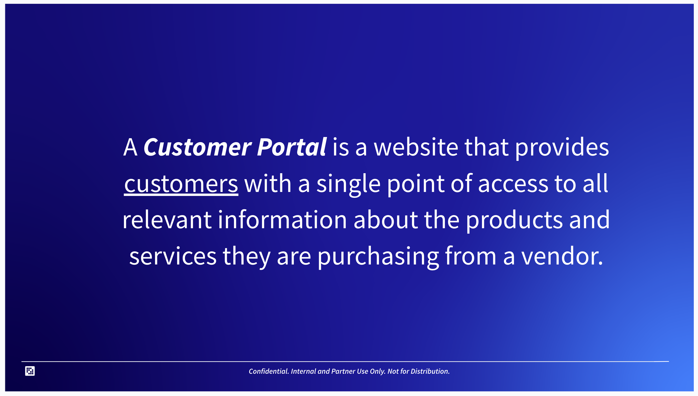
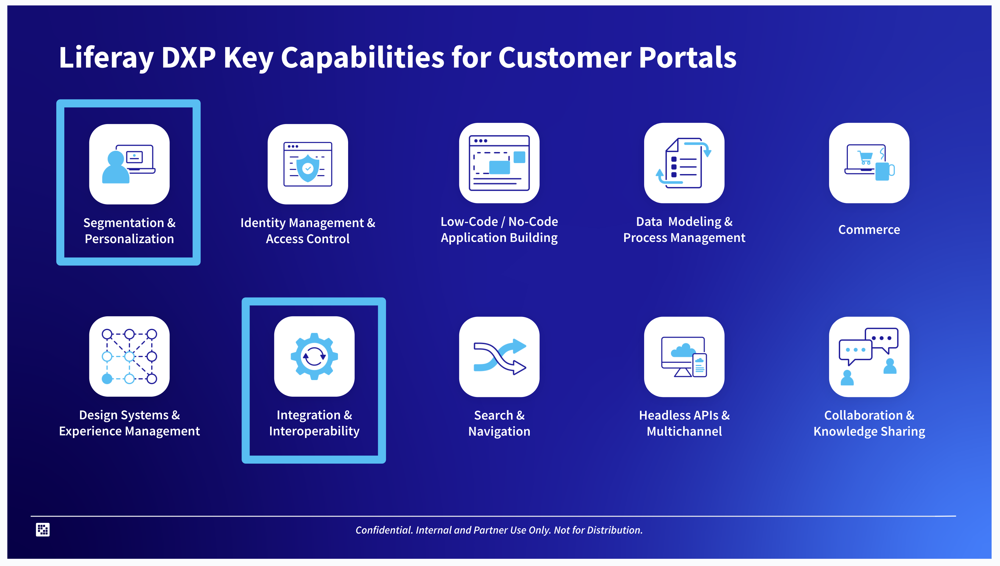
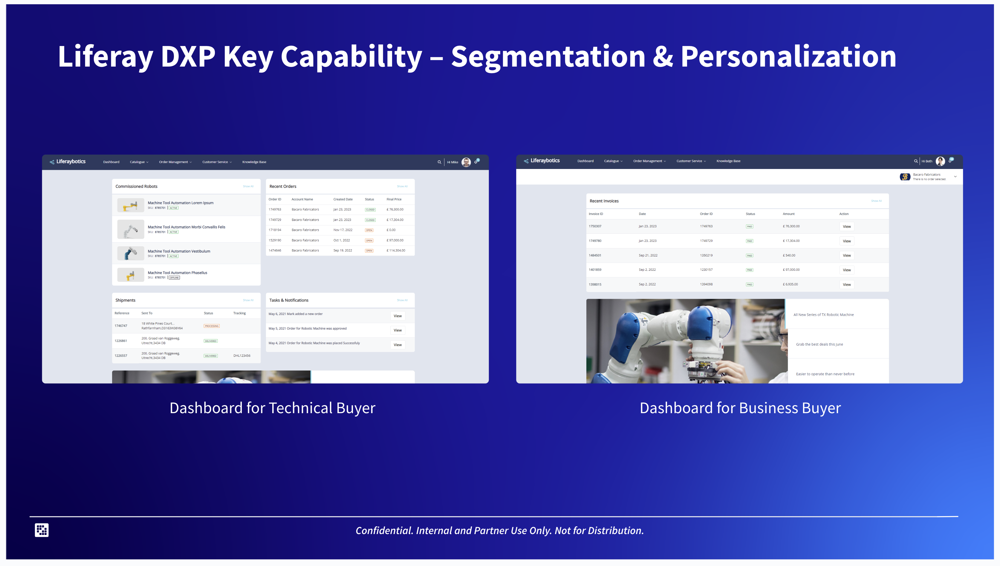
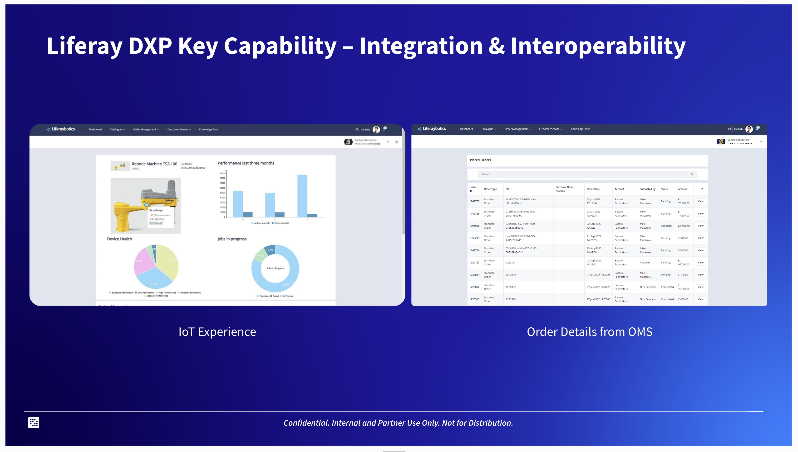
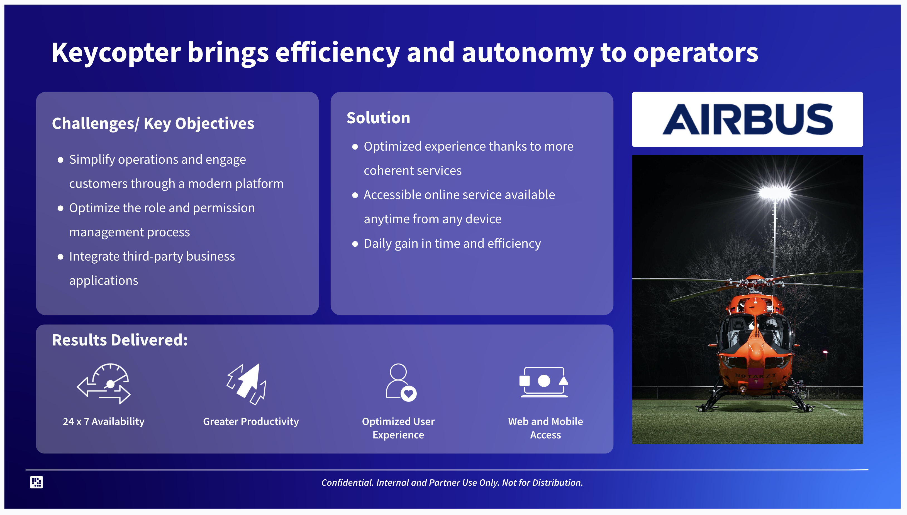

# Breaking Down the Horizontal Solutions Presentation

**At a Glance**

* The Tailored Solution Highlights learning path presentation provides details of six common solutions where Liferay has been successful.
* Each Solution is detailed in the same way:
  * Solution Definition
  * Key Liferay Capabilities to support that solution
  * Screenshots from demos for those key capabilities
  * Case Study from a real Liferay implementation

## Introduction Slides

Each section in the presentation starts with an introduction slide for the solution, followed by a definition for the solution. Here’s the definition for a Customer Portal:

While most people in the industry have a basic understanding of what a Customer Portal is, it is important to to have a textbook definition:

> A Customer Portal is a website that provides customers with a single point of access to all relevant information about the products and services they are purchasing from a vendor.

At any point in time everyone has used a lot of customer portals. Every time you create an account, whether it is on eBay, or Amazon, or for an airline, once you log in you are shown your orders, your purchase history, your interaction with customer service, notifications, your services, and so on.

A customer portal is a website - and as such there is a strong dependency on content management presented to the end users, and the site needs to be engaging to ensure that customers get the best value from the portal.

Consequently, when talking about customer portals the sales engineer needs to have a good understanding of content management in general, and the content management features that Liferay provides.

Secondly, customer portals provide a single point of access by aggregating information from a diverse set of systems. This also means that there is a heavy dependency on integration in many customer portal implementations.

## Key Capabilities for Customer Portals

The next slide in the presentation includes the main groups of features that are important for the solution, with a particular focus on two of them that are critical.

For Customer Portals the key features to focus on are

* Personalization
* Integration

Personalization is important, because it provide features that enable customers to be targeted, and in doing so stay more engaged with the application.

Integration is another important capbility, as noted earlier, because customer portals are more than just landing pages, they aggregate information from various underlying systems, and in many cases surface this information through dashboards. Dashboards are ultimately a combination of these two feature areas that Liferay is particularly strong in.

Sales Engineers need to know what kind of Integration capabilities Liferay provides, how it can be integrated into third-party solutions, and so on.

When providing a Customer Portal demo, it is important that these areas are demonstrated well, and that they showcase the potential that Liferay has to offer.

## Key Capabilities with Demo Screenshots

Next, the presentation provides some screenshots, usually taken from existing Liferay demos, for each of the focus capability areas.

When preparing for a demo, it is very effective to take some time to find out if there is a pre-built demo for the required solution. For Customer Portals there is the LiferayBotics demo which can be used, practiced, learned, and tweaked to meet the specific needs of a prospective customer. As they say, practice makes perfect and this part of preparing for a demo should not be overlooked.

The LiferayBotics demo presents a dashboard for Technical Buyers, and another one for Business Buyers, both of which make use of the Segmentation and Personalization capabilities provided by the platform.

The Technical Buyer dashboard is presented with details about recent orders, shipments, tasks and notifications, and via integration of IoT details of Commissioned Robots.

Meanwhile, when the Business Buyer accesses the same page they will see information that is more relevant to their role. They don’t really care about the Commissioned Robots, or tasks and notifications, but are much more concerned about Invoices and new offers.

For each type of user this information is presented up front, without needing to search for it, creating an experience that is instantly engaging, for each of the different roles.

For each scenario there are two sets of key capabilities called out, so there are two slides providing screenshots for each of those. For Customer Portals the second aspect called out is integration and interoperability.

The first screenshot provided here demonstrates bringing external data into Liferay through integration. In the LiferayBotics demo an IoT simulator has been integrated into the system to display some simulated real-time data of the commissioned robots seen in the Technical Buyer dashboard.

The second screenshot shows orders placed using Liferay’s order management system, but could equally be discussed as a way of bringing an external OMS into Liferay in place of the native capabilities - and in doing so demonstrate interoperability.

The LiferayBotics demo is available for use, both internally and by partners, and provides a well-rounded Customer Portal experience which can be used in front of prospects as required.

## Real World Example

Using an existing demo to showcase the key capabilities that are required for the given solution is a key part of building confidence that Liferay can solve the customer’s business problem. Another key part, and perhaps one that is even more important is to provide proof-points that Liferay has already solved similar problems for similar customers.

Liferay has many successful customers for each of the solutions provided, and to back this up each scenario includes details of one of those successful implementations.

The case study presented for Customer Portals is Airbus Helicopters. Each Case Study slide presents details on:

* Challenges and Key Objectives faced by the customer
* The solution implemented using Liferay
* Results delivered by the Liferay solution

For the most part, and Airbus is no exception, there is a full Case Study available on liferay.com, which provides more information than can be presented on a single slide. The Case Studies section on liferay.com also contains many other Customer Portal success stories alongside Airbus, as well as case studies on all of the other solutions as well.

Sales Engineers should take the time to review the available Case Studies so that the details of these implementations are well understood, to be able to talk confidently to a prospect about how Liferay is used to build a customer portal, the impacts that a Liferay customer portal implementation can have, and so on. Similarly, the more that is known about the way that Liferay has been used previously for a given solution, the easier it becomes to map a challenge or problem statement onto how it could be addressed with a Liferay solution.

For Airbus Helicopters, the key objectives included simplifying operations and engaging customers through a modern platform, something that they did not previously have. They also sought to optimize role and permission management and to integrate third-party business applications.

As has already been shown in the previous slides, Liferay supports these key objectives because it includes segmentation, personalization, integration, and interoperability capabilities.

In terms of the results delivered, the customer was able to achieve 24/7 availability with Liferay, enable greater productivity for the users of the solution alongside an optimized user experience with web and mobile access, and so on.

These deliverables are likely to be common for similar prospects - generally they are looking for their portal to deliver more productivity, be easier to use, support multiple channels, and so the learnings gained from this Case Study are going to be relevant in many situations.

Next, [additional solutions](./additional-solutions.md) covered in the presentation.
