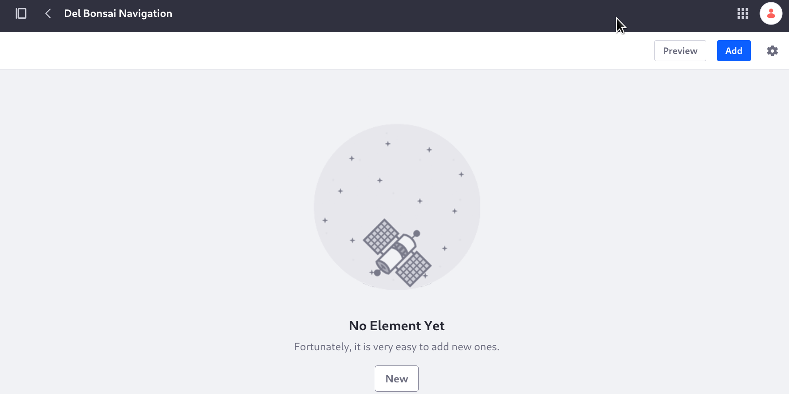
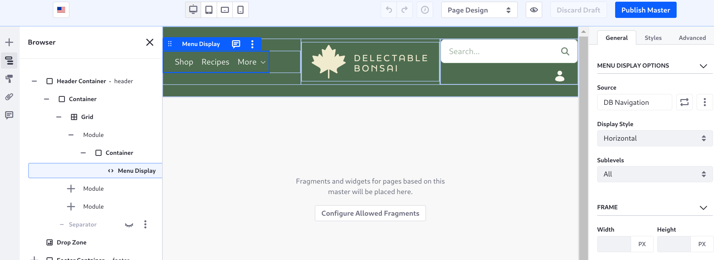

# Creating Navigation Menus

The menu we want has three items only: 

1. Shop (link to shop page on click, on hover shows a product card for some featured product: ADT for this)
1. Recipes (link to recipes page)
1. More (drop down Events, FAQ, About Us)

Note: set the new nav menu to not automatically include all new pages

Notes from outline/meeting w/Evan and Mateo: Linking to DPTs, external URLs are benefits (of having readers create a custom nav menu), etc. Look and feel customization as well (ADTs)

When you add blank pages to a blank site in Liferay, a navigation menu is provided by default: the page hierarchy of your site's pages are added to this default navigation menu.

Delectable Bonsai's header currently uses this menu as well.

NOTE: The reader can't see this in their site, it's really a made-up screenshot to show something--is that okay or must all screenshots show the current state of the site?

From Managing Site Navigation:
See [Using the Navigation Menu Application] to learn how to create Navigation Menus and deploy them on a Page. See [Configuring Menu Displays] to learn more about how to configure the [Menu Display Fragment]  (available in Liferay DXP 7.4+) and [Menu Display Widget].

Add a navigation menu to link to some common resources in both the B2B and B2C sites:

NOTE: Provide steps for adding a Common Resources navigation menu, linking to the wikipedia Bonsai entry and a Web Content article's DPT.  Should we demonstrate the dynamic vocabulary element?

We want to create a different style then the ones available, so style the navigation menu with a widget template.
NOTE: Separate lesson? Is this the right module for it? We can put it off until later. "The navigation menu you created earlier is ugly, so style it..."

1. Create the navigation menu

1. Add it to the Display Menu widget and fragment

1. Change the look and feel using a widget template (too much? An additional lesson in Styling the Site, module 6?)

First create the navigation menu:

1. Open the Site Menu () and go to _Site Builder_ &rarr; _Navigation Menus_.

1. Click the Add button ().

1. Enter _Del Bonsai Navigation_ as the name, then click _Save_.

   

1. Click _New_ &rarr; _Page_.

1. In the Select Pages selector, expand the Delectable Bonsai hierarchy and click _Shop_, then click _Recipes_.

   <!-- For this menu I want Recipes but it wasn't created in the completing the site structure lesson--need to add it -->

1. Click _Select_.

The main pages are in place. Next you need a sub-menu called More, with link to the remaining pages.

1. Click _Add_ &rarr; _Sub-menu_.

1. Enter the name _More_, then click _Add_.

1. Open the More item's Actions menu ().

1. Click _Add Child_ &rarr; _Page_.

1. Add About Us, Events, and FAQ to the sub-menu.

   

   The menu is ready to use.

The menu display fragment showing the current navigation is added to the master page. Configure it to use the new navigation menu:

1. Open the Site Menu (), then click _Design_ &rarr; _Page Templates_.

1. Click the text _Del Bonsai MP_ and you're taken to the page editor.

1. Click the area on the page with the current navigation. The Menu Display Options configuration appears in the right sidebar.

   

