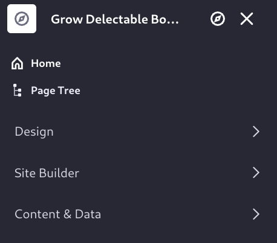
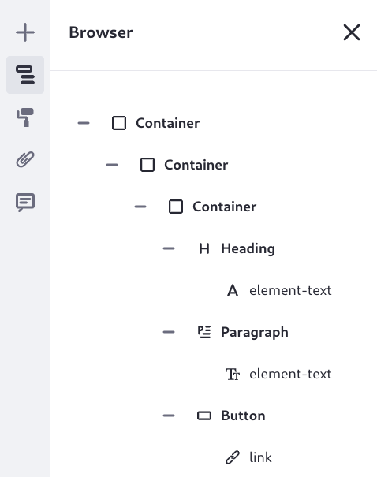
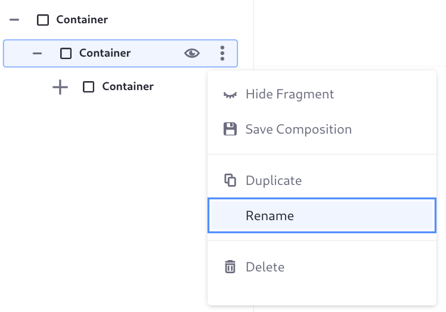
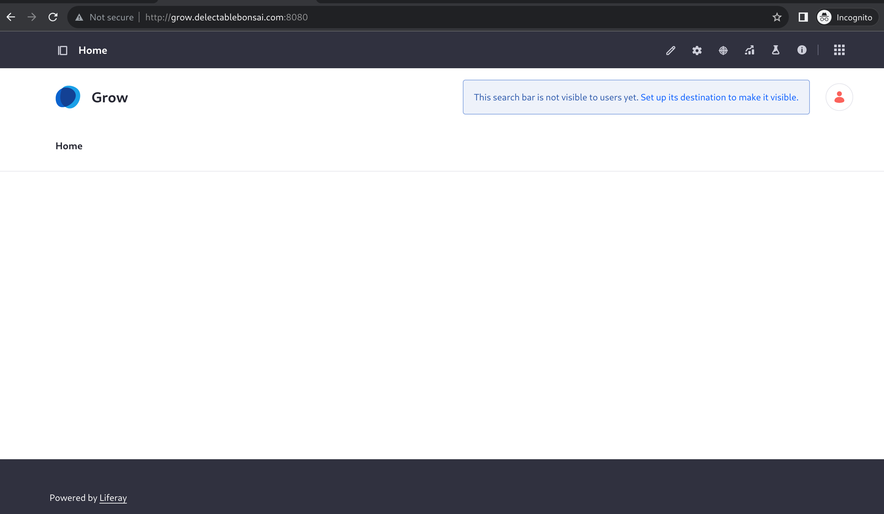

# Adding the Home Page

Right now, browsing to <http://grow.delectablebonsai.com:8080> shows a 404 page, with the option to sign in. 

Grow Delectable Bonsai needs a home page. Page creation can be completed by anyone with the proper permissions. Out-of-the-box, Liferay comes with a role named Site Administrator that provides the required permissions. Any user assigned to the role and a member of the site can act as an administrator in the site. The setup script and the steps completed in the [Liferay Administrator](../../liferay-administrator.md) lessons have your Liferay instance pre-populated with just such a user, NAME NAME. 

NOTE: must iron this site administrative user out.

While logged in as the site administrator, create the home page:

1. Open the Site Menu (), then click the compass icon () to browse the sites you have access to.

   

   The Site Menu is only visible to site administrators or other users granted the proper permissions. From here users can access applications and configurations scoped to the current site, which is labeled at the top of the menu.

1. Click _Grow Delectable Bonsai_.

1. Click _Site Builder_, then _Pages_. In a new blank site like Grow, there are no pages.

1. Click _New_ &rarr; _Page_.

1. Choose the _Blank_ template, and name the page _Home_.

   You created a content page by choosing the blank template. Content pages are the default in Liferay, as they offer the most page building features. You can add fragments and widgets to a content page.

1. Click _Add_.

   The content page editor appears. This is where you add content, functionality, and structure to the page.

1. Click the plus icon () to open the Fragments and Widgets sidebar menu.

1. Drag the _Container_ fragment onto the page.

   Containers define configurable drag and drop zones for fragments and widgets. Adding all content page elements to a container makes styling the page more convenient.

1. Add a banner to the container. Search for _Banner_ in the Fragments and Widgets sidebar menu, and drag it into the container you already added.

   The banner consists of two containers, a heading, a paragraph, and a button.

   In the Browser sidebar (), expand the elements to see the current page element hierarchy:

   

1. Rename the Banner's top level container. In the Browser sidebar, open the Actions menu () and click _Rename_.

   

1. Enter _Banner_.

1. Configure the outer Container element. Click the first Container in the Browser sidebar and the configuration sidebar appears on the right side of the page.

1. In the Container Options section, change the Container Width setting to _Fixed Width_.

1. For a consistent look to the Banner, let's change its padding to be 3 REM all around. Click the inner _Container_ in the Browser sidebar to open its configurations, then click _Styles_.

1. In the Spacing settings, choose _Spacer 3_ for the padding on the right, left, top, and bottom of the element.

   The value for each spacer setting is defined by the Style Book.

1. Click the _Publish_  Button.

Now there's a home page for Grow Delectable Bonsai. It's not fully implemented yet, but users can navigate to <http://grow.delectablebonsai.com:8080> and see the home page.

Before completing the home page design and moving on to design each additional page separately, Delectable Bonsai wants to create a common header and footer for all its pages.

## Relevant Concepts

* [Adding Pages to a Site](https://learn.liferay.com/web/guest/w/dxp/site-building/creating-pages/adding-pages/adding-a-page-to-a-site)
* [Page Fragments and Widgets](https://learn.liferay.com/web/guest/w/dxp/site-building/creating-pages/page-fragments-and-widgets)
* [Configuring Fragments](https://learn.liferay.com/web/guest/w/dxp/site-building/creating-pages/page-fragments-and-widgets/using-fragments/configuring-fragments)
