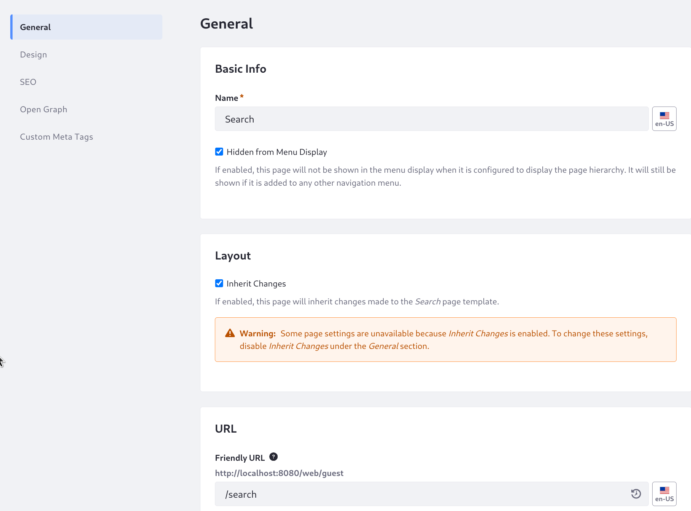
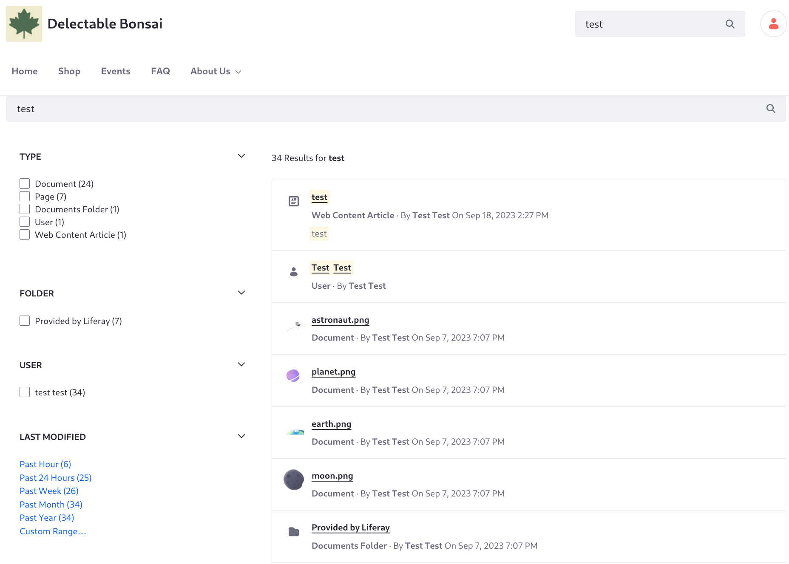
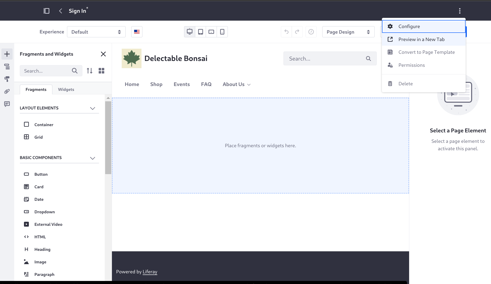

# Completing the Site Structure

Now that the home page is in place and the master page is able to define the header and footer, Delectable Bonsai needs some additional pages to fill out its site structure. These pages will comprise the initial site structure:

- Home
- Search
- Shop
- Events
- FAQ
- About Us
- Careers

1. While logged in with the site administrator, NAME NAME, open the Site menu (), then click _Site Builder_ &rarr; _Pages_.

   

   By default there are two pages: Home and Search.

1. Open the Actions menu next to the Search page, then click _Delete_. Confirm the deletion when the warning menu appears.

1. Test search after deleting the page. Navigate to the home page and enter _test_ in the search bar.

   Nothing happens. You deleted the search page, and now the search bar can't function properly.

1. Go back to the pages administration page. Click the Add button (), then click _Page_. Click the _Global Templates_ item in the menu and then _Search_.

   

1. Enter the name _Search_ and click _Add_. You're taken to the General page settings.

1. Enable _Hidden from Menu Display_. This excludes the search page from the Menu Display widget's page hierarchy. It will still be present in other navigation menus.

   Leave the Inherit Changes setting enabled, so that any changes made to the template will be reflected on the search page. 

   The friendly URL can be changed, but leave it as `/search`. The Search Bar widget is configured to use this friendly URL as its destination page, redirecting the user to the search page after a search is executed.

   

1. Click _Save_ at the bottom of the General settings.

1. Navigate to the home page again. Enter _test_ in the search bar again and click _Enter_. Now you're redirected to the search page. Whether you see [results](https://learn.liferay.com/en/w/dxp/using-search/search-pages-and-widgets/search-results/search-results) and [facets](https://learn.liferay.com/en/w/dxp/using-search/search-pages-and-widgets/search-facets) depends on what content is in your system and whether you have permission to view the content.

   

   Consider why this search worked. You added a search bar widget to the master page's header and a search page in the site. How did the search bar know to redirect you to the search page? It's all in the configuration. The friendly URL of a page named Search defaults to `/search`, and the search bar configuration has a setting called Destination Page, and it also defaults to `/search`. The search page's friendly URL must match its search bar's Destination Page setting.

1. Now create the important e-commerce storefront page, where site visitors can buy Delectable Bonsai's products. Go back to the pages administration page. Click the Add button (), then click _Page_. Click the _Blank_ page template and enter the name _Shop_.

1. In the content page editor, open the Page Design Options sidebar menu () and select _Del Bonsai MP_, then publish the page. The header and footer you defined for Delectable Bonsai are now in place.

   The content for this page is defined in the [Commerce Architect](../../commerce-architect.md) course.

1. Repeat the same page creation procedure to create these blank sites, configured to use the master page:

   - Events
   - FAQ
   - About Us

1. Create a [child page](https://learn.liferay.com/en/w/dxp/site-building/site-navigation/managing-page-hierarchies) of the About Us page, called Careers. Click the Add button () next to About Us, and then follow the same page creation procedure. You can also drag existing top-level pages onto other pages to nest them.

   The site hierarchy looks like this, from the pages administration panel:

   

   Now go to the Home page and observe that these pages are automatically added to the navigation menu provided by the site header's Menu Display widget:

   

   Recall that you excluded the search page from appearing in the page hierarchy menu of the Menu Display widget. That's why it doesn't appear in the navigation.

1. Log out. On any page, click the user icon and choose _Sign Out_ from the drop-down menu. Currently the custom fragment controlling the logout link uses the default Liferay logout URL: `c/portal/logout`.

1. Test the Sign In page. On any page, click the user icon and _Sign In_ link. Currently the custom fragment controlling the sign-in link uses the default Liferay login URL: `c/portal/login`. This activates the default Sign In widget on any page where it's invoked. However, it's currently ugly with the Delectable Bonsai master page applied to it:

   

1. Delectable Bonsai needs a better sign in experience. Next you'll add a custom sign in page.

1. Add the Sign In page as you added the previous pages, but don't configure it to use the master page. Instead, once you've clicked Add and the content page editor is loaded, open the Options menu () in the administrative bar at the top of the page, and click _Configure_.

   

1. On the General page setting screen, once again enable _Hidden from Menu Display_ so the sign in page does not appear in the Menu Display widget's navigation menu. Note the friendly URL, `/sign-in`, and click _Save_.

1. Click the _Design_ link from the menu, and look at the Theme options. These are currently being set for all pages by the pages administration's configuration (similarly accessed via the Options menu (). 

1. Override the inherited theme options by clicking _Define a Custom Theme for this Page_. Un-check these settings: _Show Footer_ and _Show Header_. You do not want the search bar present so you can also un-check _Show Header Search_, but hiding the header entirely accomplishes that as well.

1. Save the configuration.

1. Back on the content page editor, add the imported fragment called Sign In.

1. In the Sign In fragment's Styles configuration, set the background image to use the `sign_in` image from Documents and Media. 

1. Set the logo to use the `DB Green - 1W` image. 

1. Publish the page.

   

1. Now edit the custom user navigation fragment to point to the new login page instead of `c/portal/login`. Go to Site menu () &rarr; Design &rarr; Fragments. 

1. Open the `user-nav_Dropdown` fragment and find the line setting the login URL:

   ```html
   <a class="user-sign-in" href="/c/portal/login">
   ```

1. Change the `href` value to `"/sign-in"` and click Publish.

   <!-- The change needs to be propagated to the fragment in use. Requires setting Propagate Fragment Changes Automatically in Instance Settings -> Page Fragments. Alternatively, do the manual propagation method and maybe also mention that there's a setting that can be used in testing/dev scenarios. -->

1. From any page, log out, then click _Sign In_. You're redirected to the new page, where you can sign in.

   

   <!-- We might want to define the redirect behavior so the user ends up wherever they were-- right now we model it after Masterclass and redirect to the home page in a <script> tag. Maybe that's fine though. -->

Don't be concerned with the gray background for now. The custom sign-in fragment's CSS styles the `form-box` class like this:

```css
.form-box {
    align-items: flex-start;
    background-color: var(--brand-color-2);
    display: flex;
    flex-direction: column;
    justify-content: space-between;
    padding: var(--spacer-6) var(--spacer-7) var(--spacer-4);
    width: 35%;
}
```

Setting the background color to a brand color variable like this is a good practice, because it can be influenced later when styling the site. For now, the `brand-color-2` variable resolves to a gray that doesn't look right, but hard coding the color to fix it isn't a good solution, so leave it gray for now.

Now Delectable Bonsai's basic pages are in place. However, the navigation menu is pretty basic, and could use some enhancements. 

<!-- We could just configure the Careers page to be excluded from the Menu Display navigation, like we did with search and sign-in-->

   

Design a new navigation menu so that it behaves exactly how you want.
