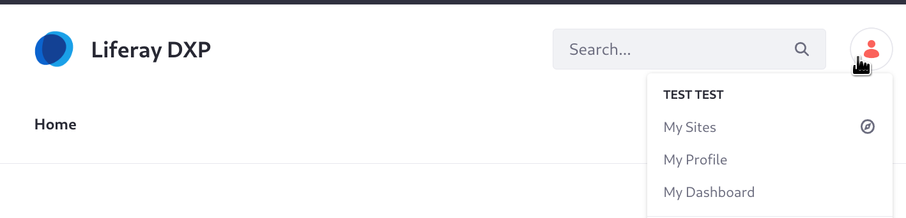
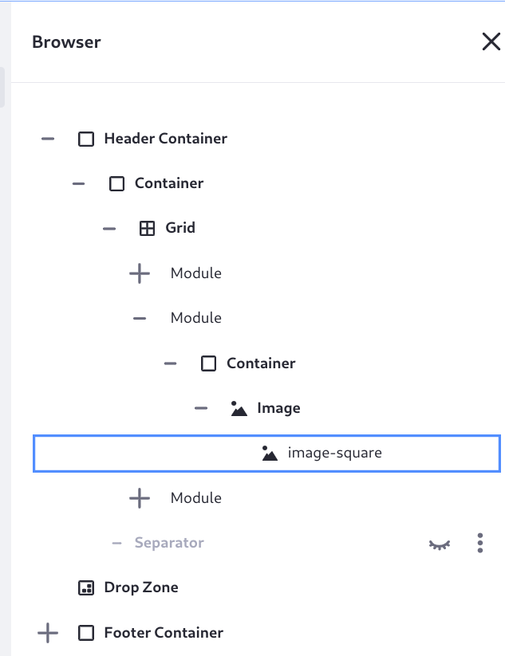
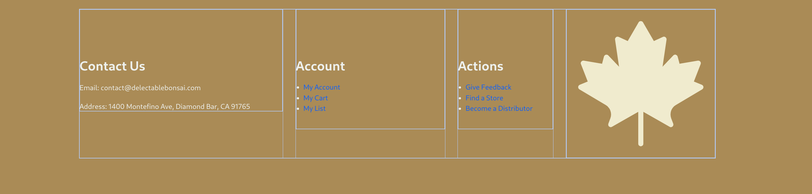
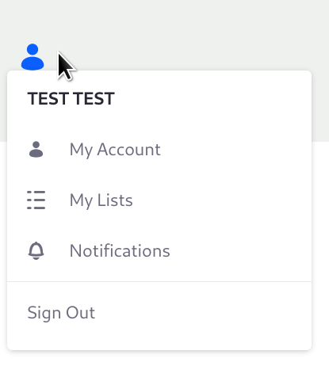

# Defining the Pages' Header and Footer

With [Liferay's master pages](https://learn.liferay.com/en/w/dxp/site-building/creating-pages/defining-headers-and-footers/master-page-templates), Delectable Bonsai can define common elements for their pages' headers and footers. Delectable Bonsai has just one page currently, the Home page. Since no master page was defined, the blank master page was automatically associated to the page. The blank master page does not define the default header and footer: instead, the default header and footer are defined in the default Classic theme. The header has the Liferay logo and label, a page-based navigation menu, the search bar widget, and the Sign In/personal menu.

Delectable Bonsai needs their own design, of course. At first the master page will define the header and footer for the one page and the utility pages, but Delectable Bonsai will re-use it across the entire site, as more pages are added.

1. Add the Master Page. Open the Site Menu (), then click Design &rarr; Page Templates.

1. Click the Add button () and name the page _Del Bonsai MP_.

   The content page editor appears. Only one element is currently on the page, a drop zone. Your header and footer appear above and below the drop zone, respectively.

1. In the Fragments and Widgets () menu on the sidebar, drag _header-composition_ above the drop zone, then drag _footer-composition_ below the drop zone.

1. Map the image fragment in the header to a logo. Open the browser () and expand the Header Container element, and continue expanding elements until you get to the middle grid module's image fragment.

   

1. Click the image fragment to open its settings, then click _image-square_ to set the source of the image.

1. Choose direct source selection, then choose the image _DB Green - 1W_.

   

1. Using the same procedure, add the _DB Green - 3_ image to the footer's image fragment.

   

1. Click _Publish Master_.

   The user menu is a custom fragment: `user-nav-fragment.zip`. It uses HTML and CSS to create a menu for logged in users. For logged out users, they see a user icon and the words SIGN IN, which they can click on to access the sign in page.

   

The master page is in place, so it's time to configure Liferay to use it on the existing Home page and in all widget pages (e.g., the existing Search page).

1. Open the master page's Actions menu () and click _Mark as Default_. Confirm that you want to use this master page as the default for all widget pages.

1. Go to the Home page and click Edit () in the administrative header.

1. In the content page editor, open the Page Design Options sidebar menu () and select _Del Bonsai MP_.

1. Click _Publish_.

1. Use a similar procedure to configure the default utility pages (404 and 500 error pages) to use the master page. In the Site Menu (), click _Site Builder_ &rarr; _Pages_ &rarr; _Utility Pages_. 

Your master page is defining the header and footer.

Even with a header and footer, the look and feel is not yet well polished. Links are all currently blue and do not match with Delectable Bonsai's brand colors, for example. Instead of spending time manually fixing this, leave it for. The theme CSS client extension you deploy later will remedy these visual faults.
<!-- Note: we may want to remove the manual color-setting here, and only do it when the brand colors are loaded in from the Theme CSS CX later -->
