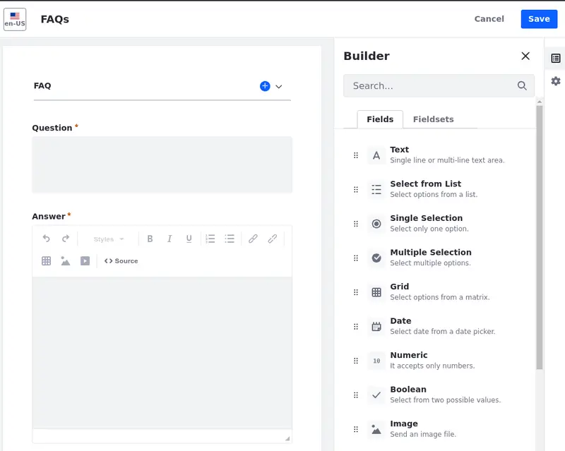
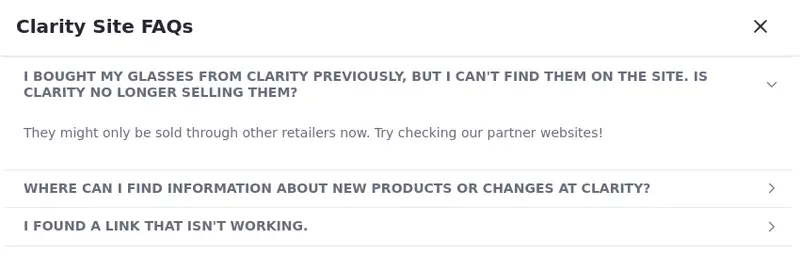

---
toc:
  - ./creating-content/adding-a-structure-for-events.md
  - ./creating-content/adding-a-structure-for-frequently-asked-questions.md
  - ./creating-content/adding-a-template-to-display-an-event.md
  - ./creating-content/adding-a-template-to-display-faqs.md
  - ./creating-content/adding-the-sites-first-web-content.md
  - ./creating-content/adding-simple-display-page-templates.md
uuid: 3d15a19a-8321-4f41-8dd0-7672f71fa99f
---
# Creating Content

<!-- The time is now. It is time to write the intro. :-) -Rich -->

Creating content is an integral part of a company's activities:

  - Companies create content for marketing purposes, social media campaigns, blog posts, and email newsletters.

  - They present their products, services, and information to online visitors (such as a list of frequently asked questions).

  - Content is created even for internal purposes, including employee newsletters, events announcements, and training materials.

These examples are just a glimpse into the content creation possibilities. Companies may engage in additional content initiatives tailored to their specific needs and goals.

Fortunately, Liferay provides tools to make the content creation process easier and faster. You can create *web content structures* to enforce a format for your content, so content creators know exactly what elements a complete article needs.

Use a *web content template* and associate it with a web content structure (or even embed it in other templates) to determine how content fields are rendered on a page.

Create *web content articles* based on a structure and display it using a template. These elements help you maintain consistency throughout your content.

In this module, you are creating two types of content: one related to upcoming events and the other comprising lists of frequently asked questions and their answers (FAQs). To begin, let's create the structures for these contents.

Ready?

[Let's go!](./creating-content/adding-a-structure-for-events.md)
