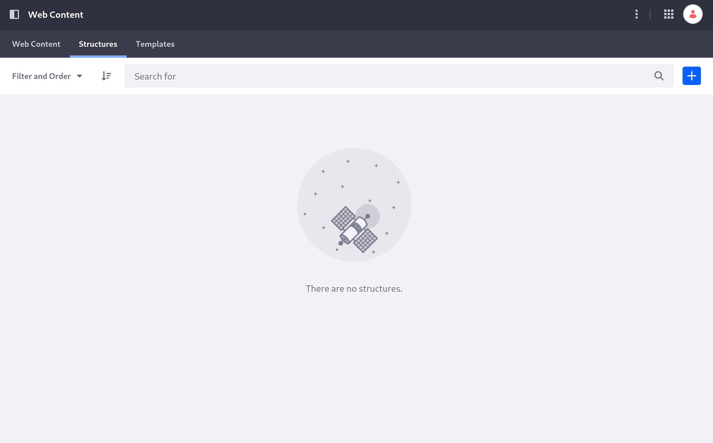
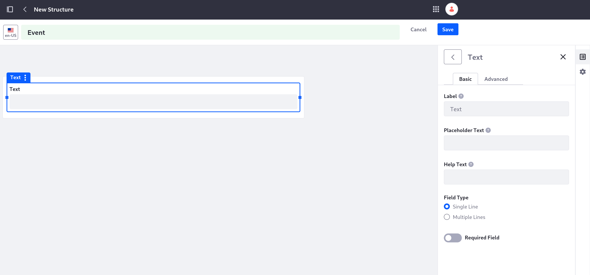

# Adding a Structure for Events

Liferay comes with just one out-of-the-box web content structure, *Basic Web Content*, which isn't appropriate for what Clarity wants. Clarity needs structures specific to more specialized types of content: *event* articles and *FAQs*.

## Start Creating the Event Structure

First, Clarity needs a structure for content that describes a specific event or announcement.

1. Log in as Preston Palmer, your public site administrator, if you haven't already.

1. Navigate to the Site Menu () &rarr; *Content & Data* &rarr; *Web Content*.

1. Click the *Structures* tab.

1. Click *Add* () to add a new structure.

1. Click into the title field at the top of the page and name the structure `Event`.

   

1. Click *Properties* () to access the structure's properties and enter this description: `Generic structure for internal and external announcements.`

Now you are ready to configure the structure with the necessary fields.

## Configure the Event Structure's Fields

1. Click *Builder* () to reopen the Builder menu.

1. From the Builder menu, drag a *Text* field into the body of the structure.

   The text field is added to the structure, and the menu on the right automatically changes to its configuration.

   

1. Set these values in the text field's configuration:

   * **Label**: Summary

   * **Help Text**: Brief description of the event.

   * **Field Type**: *Multiple Lines*.

   * Enable the *Required Field* toggle.

1. Exit the text field's configuration and drag a *Rich Text* field onto the existing text field.

   This adds both fields into a fields group containing them.

1. Set these values in the rich text field's configuration:

   * **Label**: Body

   * **Help Text**: Full text of the event.

   * Enable the *Required Field* toggle.

1. Exit the rich text field's configuration and drag an *Image* field onto the existing fields group, under the rich text field.

   

   !!! note

      You can place fields groups inside fields groups. In this exercise, if you drop the image field onto the rich field (instead of under it), you'll create a fields group with the rich text and the image fields inside the existing group.

1. Enter `Banner Image` into the image field's Label in the configuration menu.

1. Click the fields group containing the fields to access its configuration and enter `Content` into its Label field.

1. Click *Save* at the top of the page.

Now you have a web content structure you can use for any event or announcement on your site.

Next: make a structure for [frequently asked questions](./adding-a-structure-for-frequently-asked-questions.md).

## Relevant Concepts

- [Assigning Permissions to Web Content Structures and Templates](https://learn.liferay.com/web/guest/w/dxp/content-authoring-and-management/web-content/web-content-structures/assigning-permissions-to-web-content-structures-and-templates)

- [Configuring Structure Fields](https://learn.liferay.com/web/guest/w/dxp/content-authoring-and-management/web-content/web-content-structures/configuring-structure-fields)

- [Web Content Structures](https://learn.liferay.com/web/guest/w/dxp/content-authoring-and-management/web-content/web-content-structures)
