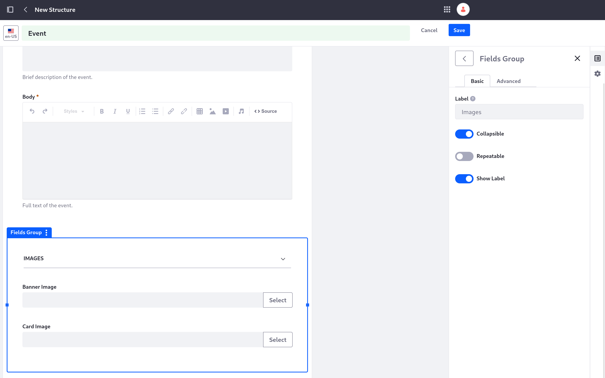

# Adding a Structure for Events

Liferay comes with just one out-of-the-box web content structure, *Basic Web Content*. This structure works fine for standard articles, but Clarity needs structures that are specific to more specialized types of content: *event* articles and *FAQs*.

Here, you'll create the structure for an event, such as a new announcement or bulletin.

## Start Creating the Event Structure

First, Clarity needs a structure for content that describes a specific event or announcement.

1. Log in as Preston Palmer, your public site administrator, if you haven't already.

1. Navigate to the Site Menu &rarr; *Content & Data* &rarr; *Web Content*.

1. Click the *Structures* tab.

1. Click Add () to add a new structure.

1. Click into the title field at the top of the page, and name the structure "Event".

   

1. Click the *Properties* button () to access the structure's properties, and enter this description: "Generic structure for internal and external announcements."

Now you are ready to configure the structure with the necessary fields.

## Configure the Event Structure's Fields

1. Click the *Builder* button () to reopen the Builder menu.

1. From the Builder menu, drag a *Text* field into the body of the structure.

   The text field is added to the structure, and the menu on the right automatically changes to its configuration.

   

1. Set these values in the text field's configuration:

   * **Label**: Summary

   * **Help Text**: Brief description of the event.

   * **Field Type**: *Multiple Lines*.

   * Enable the *Required Field* toggle.

1. Exit the text field's configuration and drag a *Rich Text* field onto the existing text field.

   This adds both fields into a field group containing them.

1. Set these values in the rich text field's configuration:

   * **Label**: Body

   * **Help Text**: Full text of the event.

   * Enable the *Required Field* toggle.

1. Click the fields group containing the two text fields to access its configuration, and enter "Content" into its Label field.

1. Exit the field group's configuration and drag an *Image* field into the structure, below the Content field group.

   Look for the blue bar indicating where you're placing the field, and make sure it shows at the very bottom of the structure to make sure it's placed outside of the field group.

   

1. Enter "Banner Image" into the image field's Label in the configuration menu.

1. Drag another Image field into the structure onto the existing image field so it creates another field group.

1. Enter "Card Image" into the second image field's Label in the configuration menu.

1. Click the fields group containing the image fields and change these settings in its configuration:

   * **Label**: Images

   * Enable the *Collapsible* toggle.

   

1. Click *Save* at the top of the page.

Now you have a web content structure you can use for any event or announcement on your site.

Next, you'll make a web content structure for a variable number of [frequently asked questions](./adding-a-structure-for-frequently-asked-questions.md).

## Relevant Concepts

* [Assigning Permissions to Web Content Structures and Templates](https://learn.liferay.com/web/guest/w/dxp/content-authoring-and-management/web-content/web-content-structures/assigning-permissions-to-structures-and-templates)
* [Configuring Structure Fields](https://learn.liferay.com/web/guest/w/dxp/content-authoring-and-management/web-content/web-content-structures/configuring-structure-fields)
* [Understanding Web Content Structures](https://learn.liferay.com/web/guest/w/dxp/content-authoring-and-management/web-content/web-content-structures/understanding-web-content-structures)
