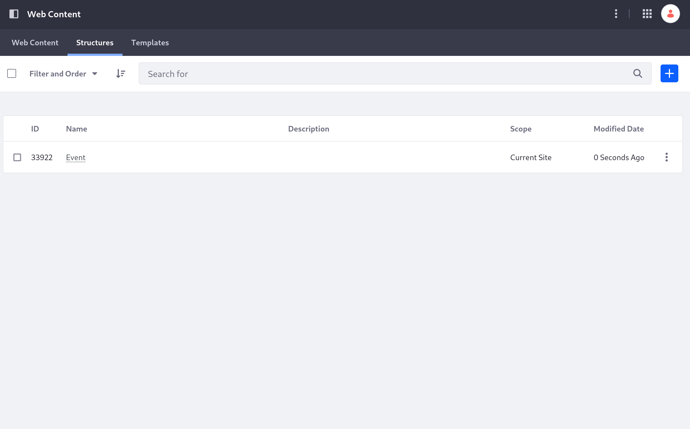
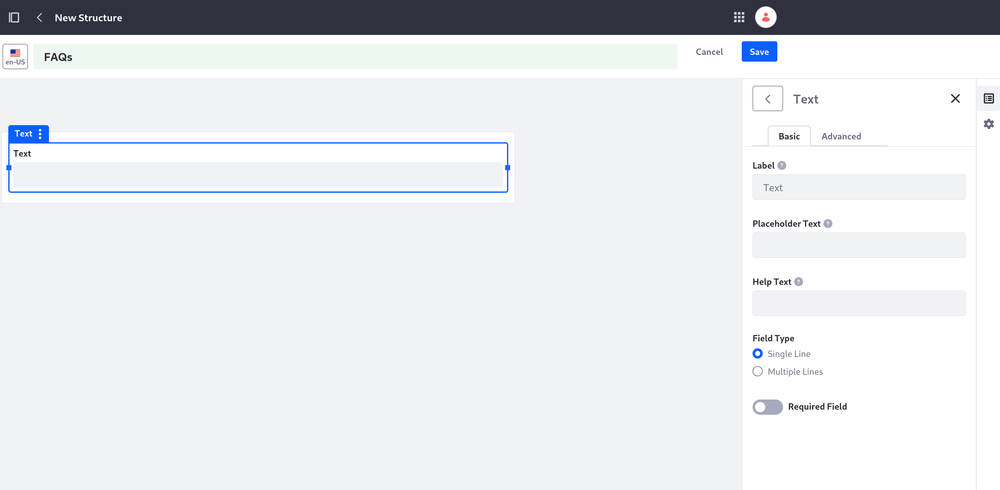

# Adding a Structure for Frequently Asked Questions

Clarity wants a way to manage its Frequently Asked Questions page that empowers its site maintainers to add questions, remove questions, and group them together easily.

Here, you'll create a structure with a repeatable field to allow creating articles with any number of questions. A repeatable field is one that you can have as many instances of as you want. In this case, you'll add a repeatable pair of text fields (a question and its answer).

## Start Creating the FAQs Structure

1. Log in as Preston Palmer, your public site administrator, if you haven't already.

1. Navigate to the Site Menu () &rarr; *Content & Data* &rarr; *Web Content*.

1. Click the *Structures* tab.

1. Click *Add* () to add a new structure.

   

1. Click into the title field at the top of the page and name the structure `FAQs`.

1. Click *Properties* () and enter this description: `Generic structure for a set of common questions and answers.`

Now you're ready to configure the structure with the necessary fields.

## Configure the FAQs Structure's Fields

1. Click *Builder* () to reopen the Builder menu.

1. From the Builder menu, drag a *Text* field into the body of the structure.

   The text field is added to the structure, and the menu on the right automatically changes to its configuration.

   

1. Set these values in the text field's configuration:

   * **Label**: Question

   * **Field Type**: *Multiple Lines*

   * Enable the *Required Field* toggle.

1. Click the *Advanced* tab and change the *Field Reference* value to `QuestionText`.

   Using this instead of the automatically generated reference value makes it easier to refer to it in templates later.

1. Exit the text field's configuration and drag a Rich Text field from the Builder menu onto the first one.

   This adds both fields into a field group containing them.

1. Set these values in the rich text field's configuration:

   * **Label**: Answer

   * Enable the *Required Field* toggle.

1. Click the *Advanced* tab and change the *Field Reference* value to `AnswerText`.

1. Click the fields group containing the two text fields to access its configuration and set these fields:

   * **Label**: FAQ

   * Enable the *Collapsible* toggle.

   * Enable the *Repeatable* toggle.

   

1. Click the *Advanced* tab and change the *Field Reference* value to `FAQ`.

1. Click *Save* at the top of the page.

Now the structure is ready to use, and you can add FAQs or Event web content articles to your site. Content structures, however, require display templates to go with them.

Next: add a [template for your Event structure](./adding-a-template-to-display-an-event.md).

## Relevant Concepts

- [Assigning Permissions to Web Content Structures and Templates](https://learn.liferay.com/web/guest/w/dxp/content-authoring-and-management/web-content/web-content-structures/assigning-permissions-to-web-content-structures-and-templates)

- [Configuring Web Content Structure Fields](https://learn.liferay.com/web/guest/w/dxp/content-authoring-and-management/web-content/web-content-structures/configuring-web-content-structure-fields)

- [Web Content Structures](https://learn.liferay.com/web/guest/w/dxp/content-authoring-and-management/web-content/web-content-structures)
