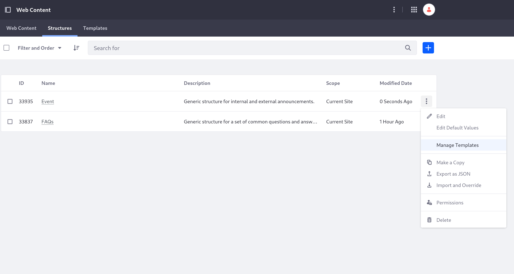
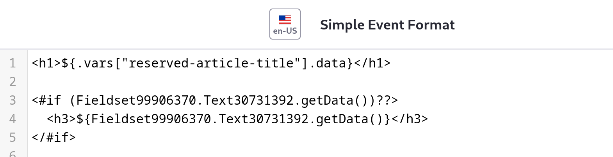
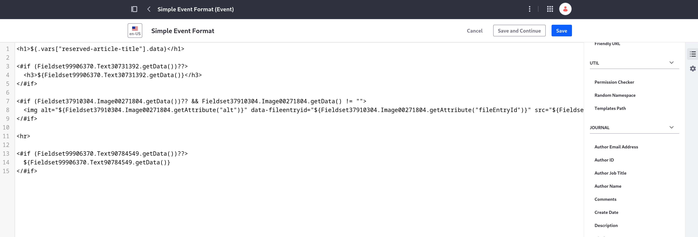

# Adding a Template to Display an Event

You should have a web content template for each new type of structure you add. Liferay needs them to know how to order and arrange each field in the structure.

Here, you'll use HTML and [FreeMarker tags](https://freemarker.apache.org/docs/dgui.html) to format the fields for an Event article.

## Start Creating the Template

1. Log in as Preston Palmer, your public site administrator (if you haven't already).

1. Navigate to the Site Menu &rarr; *Content & Data* &rarr; *Web Content*.

1. Click the *Structures* tab to get to the structures you created previously.

1. Select *Manage Templates* in the Event structure's Actions menu (  ).

   

1. Click Add (  ) to create a new template.

   The new template is automatically associated with the Event structure because you chose to manage templates for it.

1. At the top of the page, enter "Simple Event Format" as the title.

1. In the Properties menu (on the right side of the screen), enter this into the *Description* field: "A generic template to display an event."

## Configure the Template's Fields

Now you'll arrange the order and format to display each of the field contents that an Event article can have. 

1. Click the *Elements* button (  ) to reopen the Elements menu.

1. Click into the body of the template, and delete the placeholder text.

1. In the Elements menu, scroll down to the fields under *Journal* and click *Title*.

   This automatically fills in code that uses the title value.

   

1. Surround the code with H1 heading HTML tags (`<h1>`), like this:

   ```html
   <h1>${.vars["reserved-article-title"].data}</h1>
   ```

   Now displaying Event articles with this template begins with the title as an H1 header.

1. In the Elements menu, scroll up to the fields under *Fields* and click *Summary*.

   This adds a reference to the Summary contents, as long as it exists. It uses the FreeMarker `<#if>` tag to do this.

1. Surround the Summary text reference with H3 heading HTML tags (`<h3>`).

   

1. Press Enter twice to add two new lines and, from the list of fields in the Elements menu, click *Banner Image*.

1. Press Enter twice to add two more new lines, and add a separator line with an HTML tag (`<hr>`).

1. Press Enter twice to add two more new lines and, from the list of fields in the Elements menu, click *Body*.



Now your Event template is complete, and you can display an Event article with a presentable format. You'll see this later when you display an article on a page.

Next, you'll need [a template for the other structure you created, FAQs](./adding-a-template-to-display-faqs.md).

## Relevant Concepts

* [Creating Web Content Templates](https://learn.liferay.com/web/guest/w/dxp/content-authoring-and-management/web-content/web-content-templates/creating-web-content-templates)
* [Mapping Web Content Templates to Fragments](https://learn.liferay.com/web/guest/w/dxp/content-authoring-and-management/web-content/web-content-templates/mapping-web-content-templates-to-fragments)
