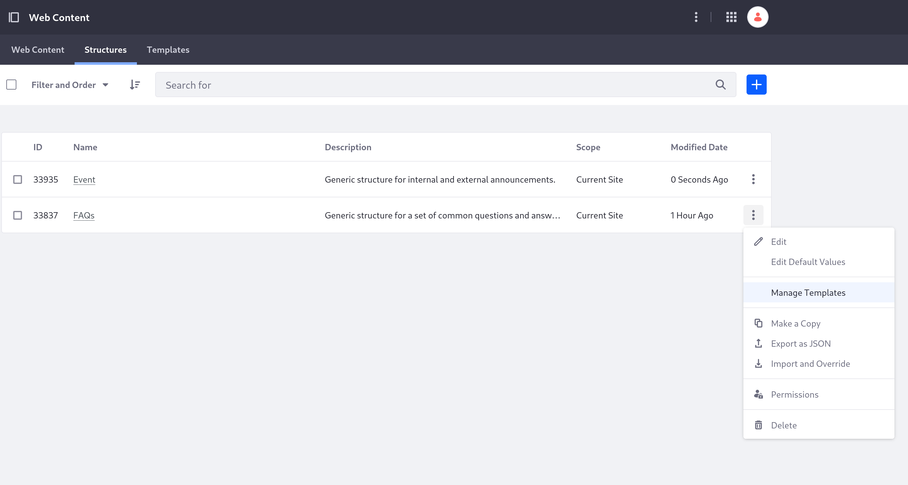
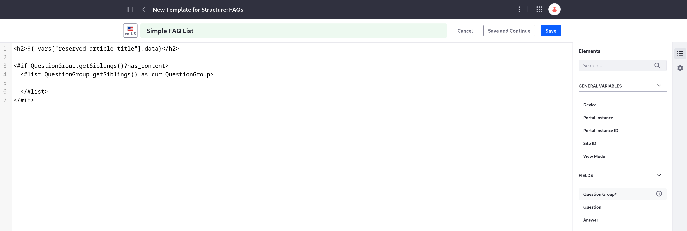
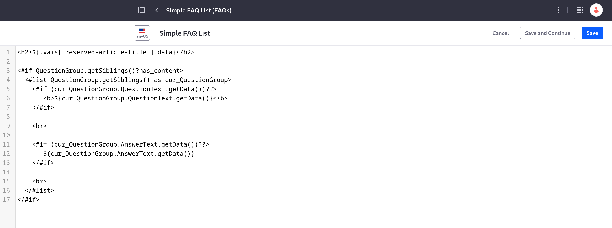
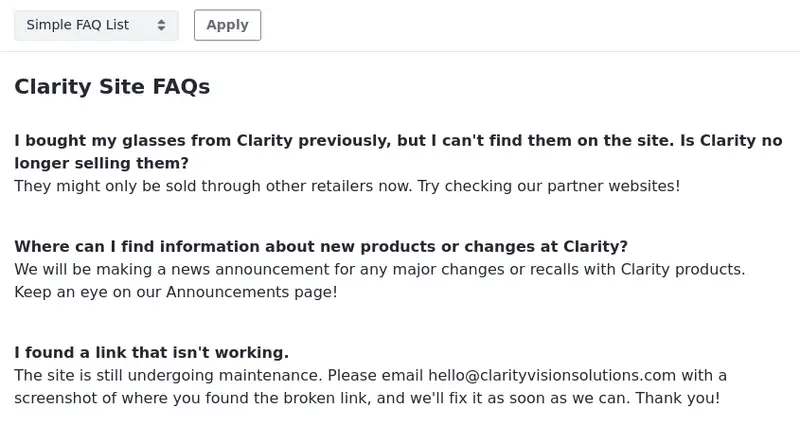

# Adding a Template to Display FAQs

The template for FAQs needs to be able to not only display each field you added, but every repetition of a question and answer the article could have.

Here, you'll make use of a [FreeMarker list](https://freemarker.apache.org/docs/ref_directive_list.html) to ensure every question and answer is shown.

## Start Creating the Template

1. Log in as Preston Palmer, your public site administrator (if you haven't already).

1. Navigate to the Site Menu &rarr; *Content & Data* &rarr; *Web Content*.

1. Click the *Structures* tab to get to the structures you created previously.

1. Select *Manage Templates* in the FAQs structure's Actions menu (  ).

   

1. Click Add (  ) to create a new template.

   The new template is automatically associated with the FAQs structure because you chose to manage templates for it.

1. At the top of the page, enter "Simple FAQ list" as the title.

1. In the Properties menu (on the right side of the screen), enter this into the *Description* field: "A simple template to list each question and answer."

## Configure the Template's Fields

Next, you'll format the way a FAQs article is listed.

1. Click the *Elements* button (  ) to reopen the Elements menu.

1. Click into the body of the template, and delete the placeholder text.

1. From the Elements menu, scroll down to the fields under *Journal* and click *Title*.

   This automatically fills in code that uses the title value.

1. Surround the code with H2 heading HTML tags (`<h2>`), like this:

   ```html
   <h2>${.vars["reserved-article-title"].data}</h2>
   ```

1. Press Enter twice to add two new lines and, from the list of fields in the Elements menu, click *Question Group**.

   Because the Question Group is a repeatable field, this adds a FreeMarker list that iterates over each instance in the displayed content.

   

1. Copy this segment in the middle of the inner FreeMarker tags:

   ```html
   <#if (cur_QuestionGroup.QuestionText.getData())??>
      ${cur_QuestionGroup.QuestionText.getData()}
   </#if>
   <#if (cur_QuestionGroup.AnswerText.getData())??>
      Answer: ${cur_QuestionGroup.AnswerText.getData()}
   </#if>
   ```

   This is similar to clicking both the *Question* and *Answer* fields from the fields list, but it uses `cur_QuestionGroup` to reference each specific question and answer in the list, each time it iterates.

1. Surround the whole line with the question field's text (`${cur_QuestionGroup.QuestionText.getData()}`) in *bold* text HTML tags (`<b>`)), like this example:

   ```html
   <b>${cur_QuestionGroup.QuestionText.getData()}</b>
   ```

1. Surround the word *Answer* on the line with the answer field's text with bold text HTML tags.

1. Add an HTML tag for a new line (`<br>`) after each of the question and answer blocks of FreeMarker tags.

   

1. Click *Save*.

Now you have a template that displays each question and answer wherever you display a FAQs article, and you can display both of your new types of web content properly on your site.

Next, you'll import a second template for the FAQs structure.

## Import Another Template

While you're still on the Templates page, make sure the top of the page reads "Templates for Structure: FAQs"

1. Still on the Templates page, click Add (  ) to create another new template.

   ```{note}
   The top of the Templates page reads "Templates for Structure: FAQs" to remind you that adding a new template still associates it with the FAQs template. If you access the Templates tab normally (without clicking "Manage Templates" for the structure), you'll need to manually set the structure when you're creating it.
   ```

1. Download and unzip the template resource:

   ```bash
   curl https://resources.learn.liferay.com/courses/latest/en/liferay-c8m2.zip -O
   ```

   ```bash
   unzip liferay-c8m2.zip
   ```

1. At the top of the page, click Actions (  ) &rarr; *Import Script*.

   

1. Upload the FreeMarker template you downloaded (`faq-web-content-template.ftl`) and click *Open*.

   The template body is filled with the new template's FreeMarker code. This template uses the same techniques as the previous template you added, but it also includes [Clay components](https://learn.liferay.com/web/guest/w/dxp/building-applications/developing-a-java-web-application/using-mvc/tag-libraries/clay-tag-library) and an embedded button component.

1. Enter "Collapsible FAQs" as the new template's name.

1. Click *Save*.

Now you have a template with more components in it, for a cleaner look and feel.

Next, you'll start [adding some articles](./adding-the-sites-first-web-content.md) with your new content types.

## Relevant Concepts

* [Creating Web Content Templates](https://learn.liferay.com/web/guest/w/dxp/content-authoring-and-management/web-content/web-content-templates/creating-web-content-templates)
* [Mapping Web Content Templates to Fragments](https://learn.liferay.com/web/guest/w/dxp/content-authoring-and-management/web-content/web-content-templates/mapping-web-content-templates-to-fragments)
