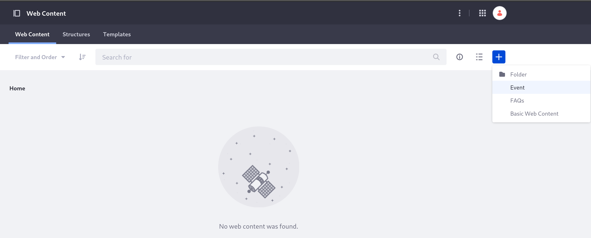
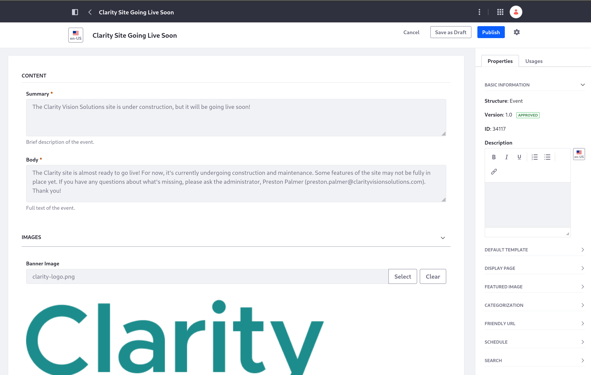
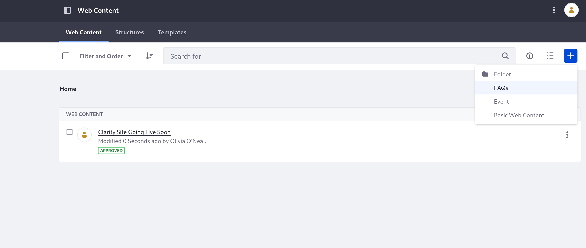

# Adding the Site's First Web Content

Now that you have structures and templates for two new types of content, you're ready to add some articles. Here, you'll add content to the site for both of these types (Event and FAQs).

The site administrator doesn't need to work on adding individual content articles. Log out and log back in as your site's content manager, Olivia O'Neal, before you begin.

## Add an Event Article

First, add an event article to announce the Clarity site going live soon.

1. Navigate to the Site Menu &rarr; *Content & Data* &rarr; *Web Content*.

1. Click *Add* (  ) &rarr; *Event*.

   

1. At the top of the page, title the article "Clarity Site Going Live Soon".

1. In the *Summary* field, enter this text:

   ```
   The Clarity Vision Solutions site is under construction, but it will be going live soon!
   ```

1. In the *Body* field, enter this text:

   ```
   The Clarity site is almost ready to go live! For now, it's currently undergoing construction and maintenance. Some features of the site may not be fully in place yet. If you have any questions about what's missing, ask us at hello@clarityvisionsolutions.com. Thank you!
   ```

1. Click *Select* beside the *Banner Image* field, and choose the Clarity logo (`clarity-logo.png`) you used for the site's [header and footer in the previous module](../creating-pages/defining-the-pages-header-and-footer.md).

   

1. Click *Publish* at the top of the page.

You're brought back to the Web Content page, and now you have an Event article. Next, create an article to answer some frequently asked questions.

## Create a FAQs Article

1. While on the Web Content page, click *Add* (  ) &rarr; *FAQs*.

   

1. At the top of the page, title the Article "Clarity Site FAQs".

1. Click *Add* (  ) at the top-right of the Question Group to create two more sets of questions and answers (for 3 total).

1. In the first *Question* field, enter this question:

   ```
   I bought my glasses from Clarity previously, but I can't find them on the site. Is Clarity no longer selling them?
   ```

1. In the first *Answer* field, enter this answer:

   ```
   They might only be sold through other retailers now. Try checking our partner websites!
   ```

1. Enter this in the second *Question* field:

   ```
   Where can I find information about new products or changes at Clarity?
   ```

1. Enter this in the second *Answer* field:

   ```
   We will be making a news announcement for any major changes or recalls with Clarity products. Keep an eye on our Announcements page!
   ```

1. Enter this in the third *Question* field:

   ```
   I found a link that isn't working.
   ```

1. Enter this in the third *Answer* field:

   ```
   The site is still undergoing maintenance. Please email hello@clarityvisionsolutions.com with a screenshot of where you found the broken link, and we'll fix it as soon as we can. Thank you!
   ```

1. Click *Publish* at the top of the page.

Now you have a new article for each of the web content structures you've added.

<!-- TODO: Add one more section to import more events and content -->

Next, you'll [add templates to show your events and FAQs on specific display pages](./adding-simple-display-page-templates.md).

## Relevant Concepts

* [Creating a Basic Web Content Article](https://learn.liferay.com/web/guest/w/dxp/content-authoring-and-management/web-content/web-content-articles/adding-a-basic-web-content-article)
