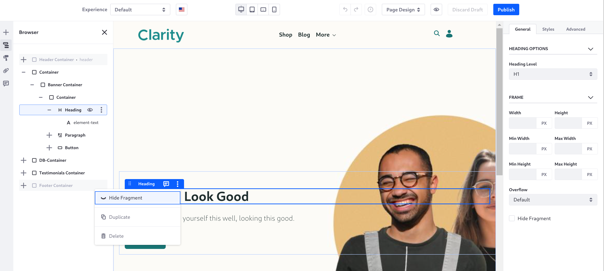
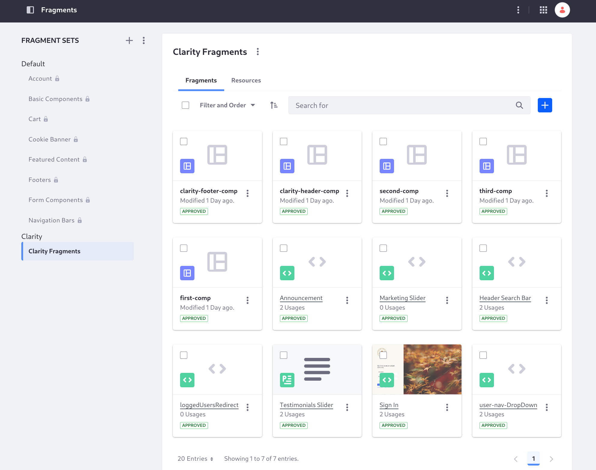
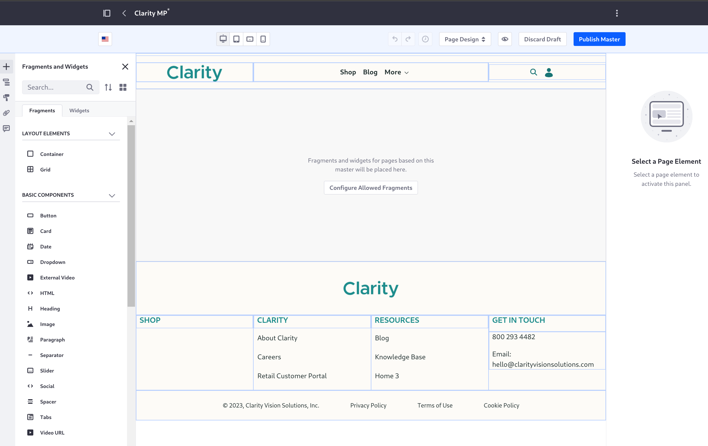
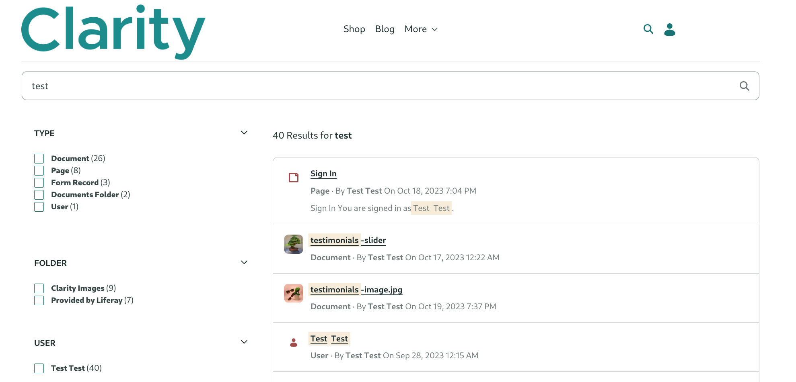

---
toc:
- ./creating-pages/importing-fragments-and-resources.md
- ./creating-pages/adding-the-home-page.md
- ./creating-pages/defining-the-pages-header-and-footer.md
- ./creating-pages/completing-the-site-structure.md
- ./creating-pages/adding-the-sign-in-page.md
- ./creating-pages/creating-navigation-menus.md
- ./creating-pages/designing-the-home-page.md
uuid: 30c0c2ed-18a3-460f-a7e3-48cb46b608d1
---
# Creating Pages

Now that Clarity's public site settings are configured, you can create your first pages! 

When finished, you'll have created this structure for Clarity's public site:

- Home
- About Us
   - Careers
- Search
- Shop
- Blog
- Contact Us

Initially, you'll populate the Home and Search pages with content. Most of the others are populated later during the Content Management module. The Shop page is a placeholder for the Commerce Architect course. You'll begin by repurposing the default home page of the site, then move into creating and configuring the site's pages.

## Editing Content Pages

There are several page types in Liferay, but [content pages](https://learn.liferay.com/en/w/dxp/site-building/creating-pages/using-content-pages) are the default and the type used most often. Content pages provide a convenient user interface for managing and editing page content and design. You'll design Clarity's pages through fragments and widgets added to content pages. 

## Using Fragments

[Fragments](https://learn.liferay.com/en/w/dxp/site-building/creating-pages/page-fragments-and-widgets/using-fragments) are reusable snippets of HTML, JavaScript (if necessary), and CSS that you add to content pages to build the look-and-feel and add content. You'll use both out-of-the-box fragments and custom fragments to build the Clarity site. Whether custom or built-in, *fragment compositions* are exportable collections of fragments that you can re-use across pages, sites, and systems.

- Custom fragments are developed by you, if none of the [out-of-the-box fragments](https://learn.liferay.com/en/w/dxp/site-building/creating-pages/page-fragments-and-widgets/using-fragments/default-fragments-reference) suit your needs. Often you can start by [copying an existing fragment](https://learn.liferay.com/en/w/dxp/site-building/creating-pages/page-fragments-and-widgets/using-fragments/duplicating-fragments) that contains some of the HTML, CSS, or JavaScript you'll need to create your own fragment.
- [Fragment compositions](https://learn.liferay.com/en/w/dxp/site-building/creating-pages/page-fragments-and-widgets/using-fragments/saving-fragment-compositions) are reusable fragment groups you've added to the content page editor and saved for repeated use.

## Defining Common Page Elements with Master Pages

In addition to the main page content, many sites require a common header and footer across pages. With [master pages](https://learn.liferay.com/en/w/dxp/site-building/creating-pages/defining-headers-and-footers/master-page-templates), you can define these common elements. If you don't define a master page, Liferay uses the *Blank* master, which contains a header with the Liferay logo and label, a page-based navigation menu, the search bar widget, and the Sign In/personal menu. Using a custom master page, you'll define Clarity's header and footer using the content page editor:

## Navigating the Site/Site Navigation Menus

You'll build Clarity's navigation menus with the [Navigation Menus application](https://learn.liferay.com/en/w/dxp/site-building/site-navigation/using-the-navigation-menus-application) and display them using the [Menu Display fragment or widget](https://learn.liferay.com/en/w/dxp/site-building/site-navigation/configuring-menu-displays). In the page header, the page hierarchy helps users navigate the site.

## Configuring a Search Page

Clarity wants a [search page](https://learn.liferay.com/en/w/dxp/using-search/search-pages-and-widgets/working-with-search-pages/search-pages) on the site and a search bar in the master page header. They can rely on the [search page template](https://learn.liferay.com/en/w/dxp/using-search/search-pages-and-widgets/working-with-search-pages/using-a-search-page-template) to accomplish this with little effort.

Ready to build this?

[Let's Go!](./creating-pages/importing-fragments-and-resources.md)
