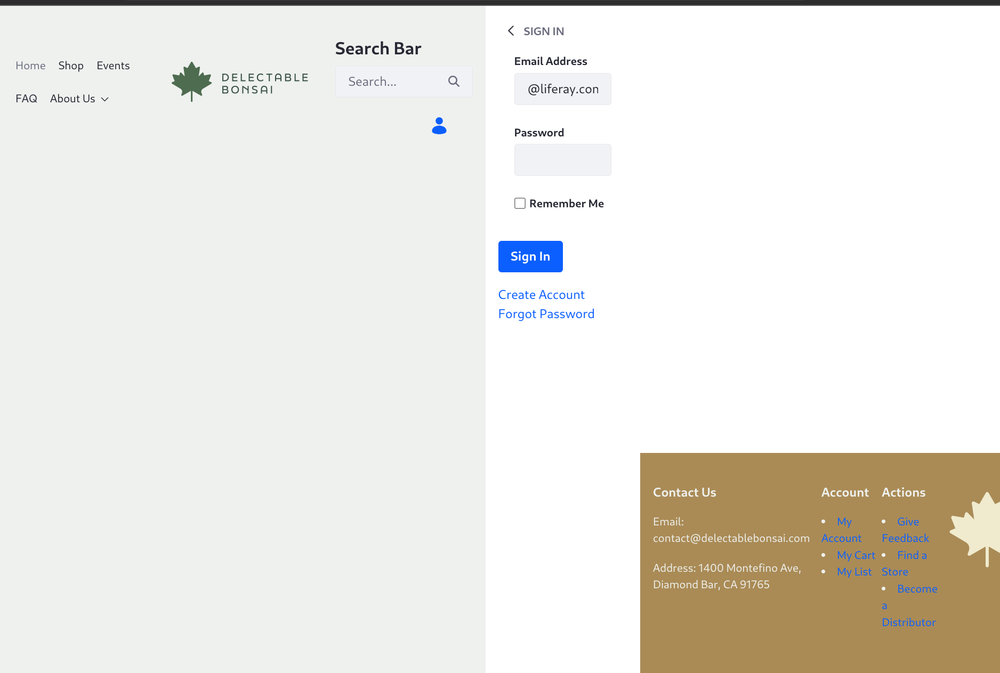
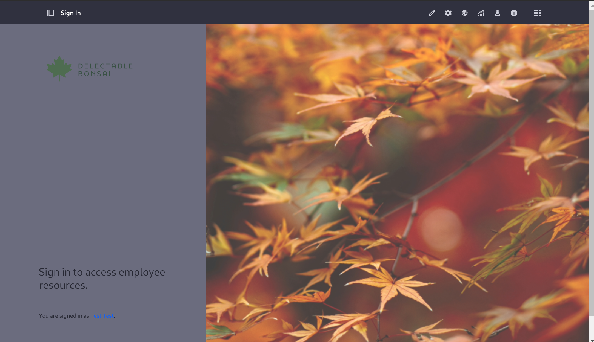

# Adding the Sign In Page

<!-- copied from completing-the-site-structure.md -->
1. Log out. On any page, click the user icon and choose _Sign Out_ from the drop-down menu. Currently the custom fragment controlling the logout link uses the default Liferay logout URL: `c/portal/logout`.

1. Test the Sign In page. On any page, click the user icon and _Sign In_ link. Currently the custom fragment controlling the sign-in link uses the default Liferay login URL: `c/portal/login`. This activates the default Sign In widget on any page where it's invoked. However, it's currently ugly with the Clarity master page applied to it:

   

1. Clarity needs a better sign in experience. Next you'll add a custom sign in page.

1. Add the Sign In page using the Blank template. Click _Add_ and the content page editor is loaded. 

1. Open the *Options* menu () in the administrative bar at the top of the page and click _Configure_.

   

1. On the General page setting screen, once again enable _Hidden from Menu Display_ so the sign in page does not appear in the Menu Display widget's navigation menu. Note the friendly URL, `/sign-in`, and click _Save_.

1. Click the _Design_ link from the menu and look at the Theme options. These are currently being set for all pages by the pages administration's configuration (similarly accessed via the Options menu (). 

1. Override the inherited theme options by clicking _Define a Custom Theme for this Page_. Un-check these settings: _Show Footer_ and _Show Header_. You do not want the search bar present so you can also un-check _Show Header Search_, but hiding the header entirely accomplishes that as well.

1. Scroll down and save the configuration.

1. Use the back arrow at the top of the page to go back to the content page editor, then add the imported fragment called Sign In.

1. In the Sign In fragment's Styles configuration, set the background image to use the `sign_in` image from Documents and Media. 

1. Set the logo to use the `DB Green - 1W` image. 

1. Publish the page.

   

1. Now edit the custom user navigation fragment to point to the new login page instead of `c/portal/login`. Go to *Site* menu () &rarr; *Design* &rarr; *Fragments*. 

1. Open the `user-nav_Dropdown` fragment and find the line setting the login URL:

   ```html
   <a class="user-sign-in" href="/c/portal/login">
   ```

1. Replace the line so it points at the Sign In page's friendly URL, `sign-in`:

   ```html
   <a class="user-sign-in" href="${publicFriendlyURL}/sign-in">
   ```

1. Click _Publish_.

   <!-- The change needs to be propagated to the fragment in use. Requires setting Propagate Fragment Changes Automatically in Instance Settings -> Page Fragments. Alternatively, do the manual propagation method and maybe also mention that there's a setting that can be used in testing/dev scenarios. -->

1. From any page, log out, then click _Sign In_. You're redirected to the new page, where you can sign in.

   

Don't be concerned with the gray background for now. The custom sign-in fragment's CSS styles the `form-box` class like this:

```css
.form-box {
    align-items: flex-start;
    background-color: var(--brand-color-2);
    display: flex;
    flex-direction: column;
    justify-content: space-between;
    padding: var(--spacer-6) var(--spacer-7) var(--spacer-4);
    width: 35%;
}
```

Setting the background color to a brand color variable like this is a good practice, because it can be influenced later when styling the site. For now, the `brand-color-2` variable resolves to a gray that doesn't look right, but hard coding the color to fix it isn't a good solution, so leave it gray for now.

Now Clarity's site structure is in place. However, the navigation menu is pretty basic, and could use some enhancements. 

   

Clarity next needs a [new navigation menu](./creating-navigation-menus.md) so that it behaves exactly as desired.

## Relevant Concepts

* [Adding Pages to a Site](https://learn.liferay.com/en/w/dxp/site-building/creating-pages/adding-pages/adding-a-page-to-a-site)
* [Working with Search Pages](https://learn.liferay.com/en/w/dxp/using-search/search-pages-and-widgets/working-with-search-pages/search-pages)
* [Searching for Content](https://learn.liferay.com/en/w/dxp/using-search/getting-started/searching-for-content)
