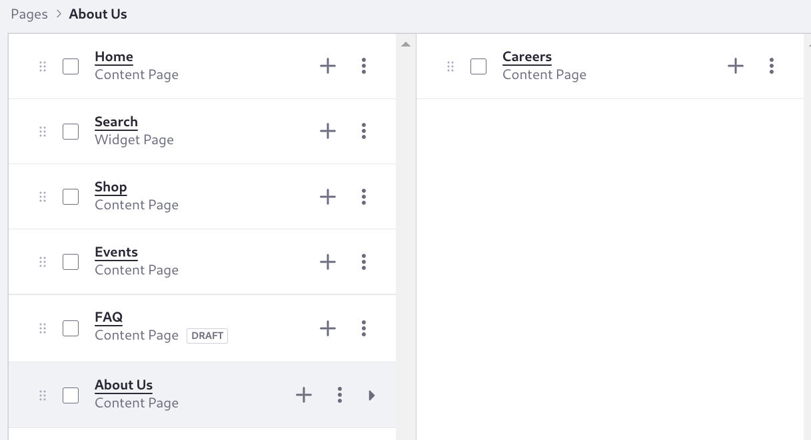

# Completing the Site Structure

Now that the home page is in place and the master page defines the header and footer, you can create the rest of Clarity's pages: 

- Home
- Shop
- Blogs
- About Us
- Contact Us
- Careers

1. Log in as Preston Palmer, the site administrator. Open the Site menu () and click _Site Builder_ &rarr; _Pages_.

   

   By default there are two pages: Home and Search.

1. Open the *Actions* menu next to the Search page and click _Delete_. Confirm the deletion when the warning menu appears.

1. Test search after deleting the page. Navigate to the home page and click _Search_ ().

   Nothing happens. You deleted the search page, and now the search bar can't function properly.

1. Go back to the pages administration page. Click *Add* () &rarr; _Page_. Click the _Global Templates_ item in the menu and then _Search_.

   

1. Enter the name _Search_ and click _Add_. You're taken to the General page settings.

1. Enable _Hidden from Menu Display_. This excludes the search page from the Menu Display widget's page hierarchy. It still appears in other navigation menus.

   Leave *Inherit Changes* enabled, so that changes made to the template are reflected on the search page. 

   The friendly URL can be changed, but leave it as `/search`. The Search Bar widget is configured to use this friendly URL as its destination page, directing the user to the search page after a search is executed.

   

1. Click _Save_ at the bottom of the settings.

1. Navigate to the home page again. Enter _test_ in the search bar again and click _Enter_. The search page appears. Whether you see [results](https://learn.liferay.com/en/w/dxp/using-search/search-pages-and-widgets/search-results/search-results) and [facets](https://learn.liferay.com/en/w/dxp/using-search/search-pages-and-widgets/search-facets) depends on the content in your system and whether you have permission to view the content.

   

   Consider why this search worked. You added a search bar widget to the master page's header and a search page in the site. How did the search bar know to send you to the search page? It's all in the configuration. The friendly URL of a page named Search defaults to `/search`, and the search bar configuration uses the same value in its Destination Page setting. The search page's friendly URL must match its search bar's Destination Page setting.

1. Now create the important e-commerce storefront page, where site visitors can buy Clarity's products. Go back to Pages Administration. Click *Add* () &rarr; _Page_. Select the _Clarity MP_ page template and enter the name _Shop_.

1. In the content page editor, click _Publish_. The header and footer you defined for Clarity are now in place.

   The content for this page is defined in the [Commerce Architect](../../commerce-architect.md) course.

1. Repeat the same procedure to create these content pages, configured to use the master page:

   - About Us
   - Blog
   - Contact Us

1. Create a [child page](https://learn.liferay.com/en/w/dxp/site-building/site-navigation/managing-page-hierarchies) of the About Us page, called Careers. Click *Add* () next to About Us, and then follow the same page creation procedure. You can also drag existing top-level pages onto other pages to nest them.

   The site hierarchy looks like this, from the pages administration panel:

   

   Now go to the Home page and observe that these pages are added automatically to the navigation menu provided by the site header's Menu Display widget:

   

   Recall that you excluded the search page from appearing in the page hierarchy menu of the Menu Display widget. That's why it doesn't appear in the navigation.

Excellent! Clarity's basic pages are in place. 

Next: Clarity needs a [new Sign In page](./adding-the-sign-in-page.md).

## Relevant Concepts

* [Adding Pages to a Site](https://learn.liferay.com/en/w/dxp/site-building/creating-pages/adding-pages/adding-a-page-to-a-site)
* [Working with Search Pages](https://learn.liferay.com/en/w/dxp/using-search/search-pages-and-widgets/working-with-search-pages/search-pages)
* [Searching for Content](https://learn.liferay.com/en/w/dxp/using-search/getting-started/searching-for-content)
