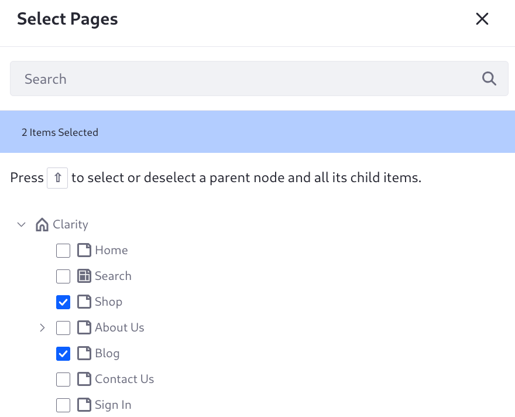
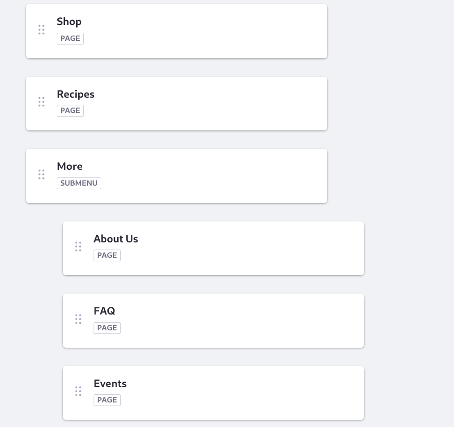
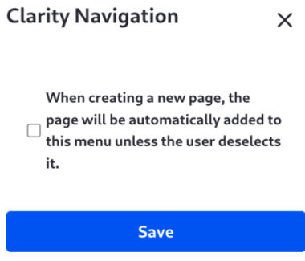
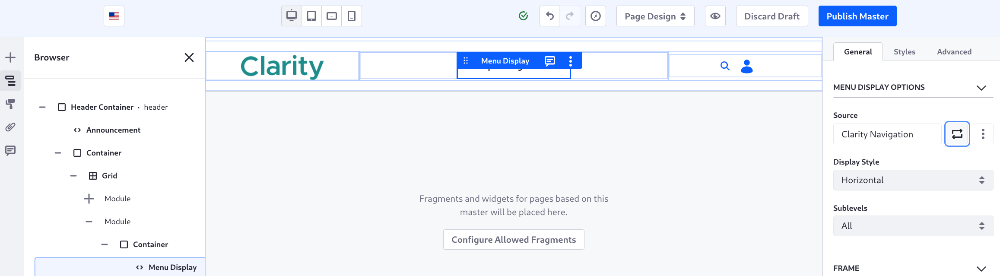

# Creating Navigation Menus

<!-- We could also create a nav menu fragment for the footer: if the user is signed in show some account links like cart, profile, lists, otherwise show the pages hierarchy-->

Clarity's navigation menu is getting cluttered, as it shows all the pages by default. The Menu Display fragment's default configuration shows the page hierarchy of the site. Remember that you excluded Careers, Sign In, and Search from the default menu display, so those pages aren't showing.

To simplify the navigation menu, Clarity wants just three items to appear in the navigation menu: Shop (page), Recipes (page), and More (sub-menu with additional page links).

<!-- Notes from outline/meeting w/Evan and Mateo: Linking to DPTs, external URLs are benefits (of having readers create a custom nav menu), etc. Look and feel customization as well (ADTs)-->

First create the navigation menu:

1. Open the Site Menu () and go to _Site Builder_ &rarr; _Navigation Menus_.

1. Click the Add button ().

1. Enter _Del Bonsai Navigation_ as the name, then click _Save_.

   

1. Click _New_ &rarr; _Page_.

1. In the Select Pages selector, expand the Clarity hierarchy and click _Shop_, then click _Recipes_.

   <!-- For this menu I want Recipes but it wasn't created in the completing the site structure lesson--need to add it -->

1. Click _Select_.

The main pages are in place. Next you need a sub-menu called More, with links to the remaining pages.

1. Click _Add_ &rarr; _Sub-menu_.

1. Enter the name _More_, then click _Add_.

1. Open the More item's Actions menu ().

1. Click _Add Child_ &rarr; _Page_.

1. Add About Us, Events, and FAQ to the sub-menu.

   

   The menu is ready to use.

1. The pages you want to show are in place. To make sure new pages are not added to the menu unless the navigation menu is updated intentionally, click the configuration icon ().

   Disable the configuration for adding new pages to the menu during page creation, then click _Save_.

   <!--If this configuration text is changed it will require a new screenshot: see https://liferay.slack.com/archives/CL9RTSZ52/p1695737943028559 -->

   

The menu display fragment showing the current navigation is added to the master page. Configure it to use the new navigation menu:

1. Open the Site Menu (), then click _Design_ &rarr; _Page Templates_.

1. Click the text _Del Bonsai MP_ and you're taken to the page editor.

1. Click the area on the page with the current navigation. The Menu Display Options configuration appears in the right sidebar.

   

1. Click the _Source_ field, then choose the _Del Bonsai Navigation_ menu.

1. Click _Select this Level_. 

   For a hierarchical structure, you can choose a different level to display in the widget, if it suits your needs. Click _More_ and see that its sub-menu items are shown.

   In addition to these site menus defined in the Navigation Menus application, you can click Contextual Menus to see some additional dynamic menu options. See [Configuring Menu Displays](https://learn.liferay.com/en/w/dxp/site-building/site-navigation/configuring-menu-displays) for more information.

   Before this lesson, Clarity had three pages not appearing in the menu display fragment's page hierarchy menu: Careers, Sign In, and Search. That menu is no longer in use, but those pages were not explicitly added to the new navigation menu, so they continue to remain outside of the navigation.

Next Clarity's design team has requested a [re-design of the Home page](./designing-the-home-page.md), with new fragments and compositions.

