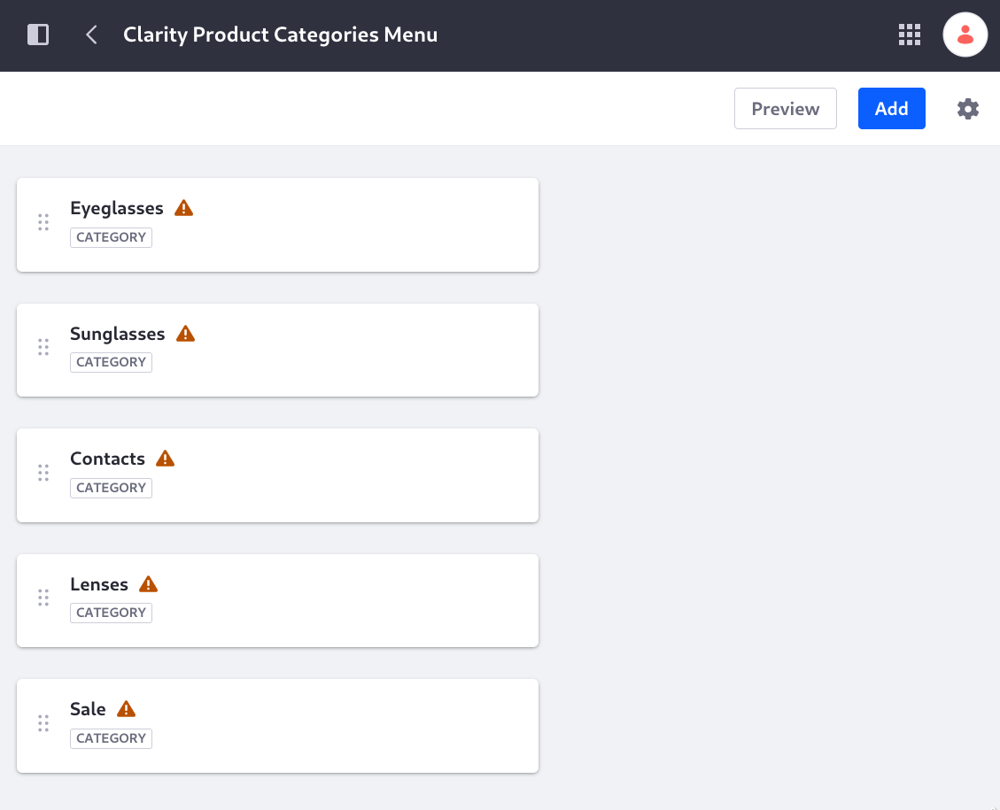
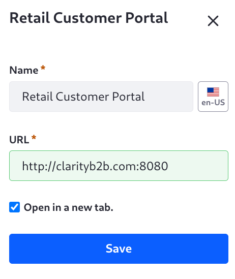
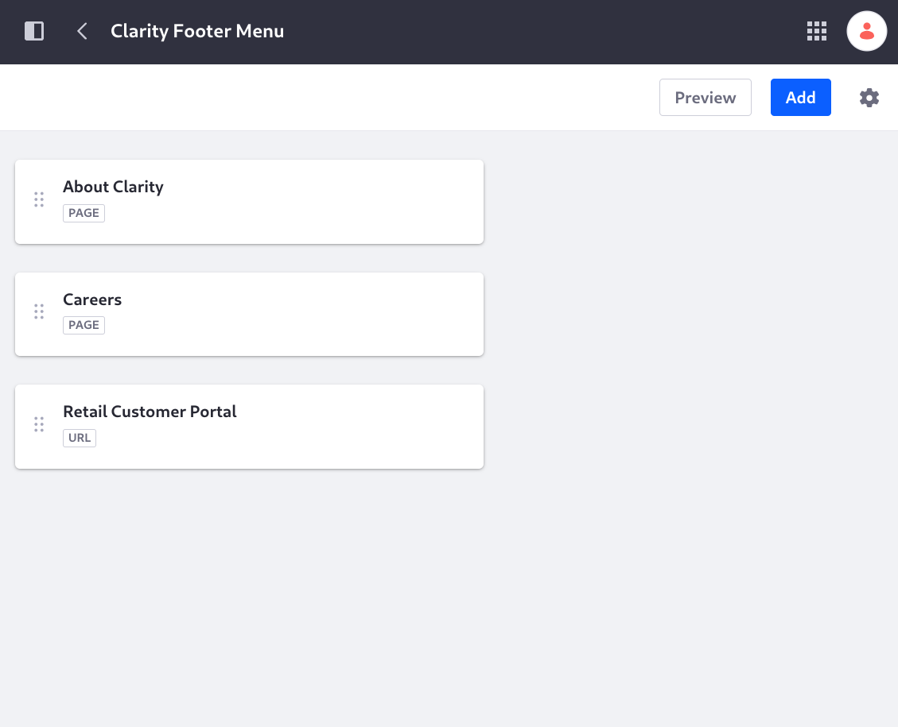
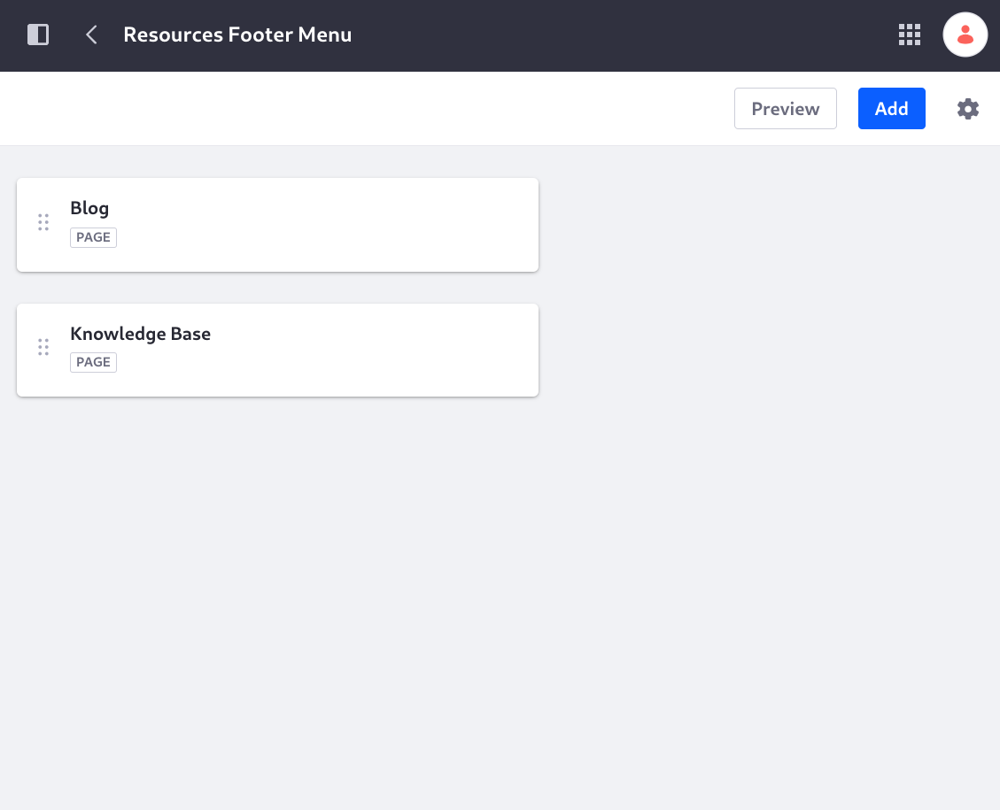
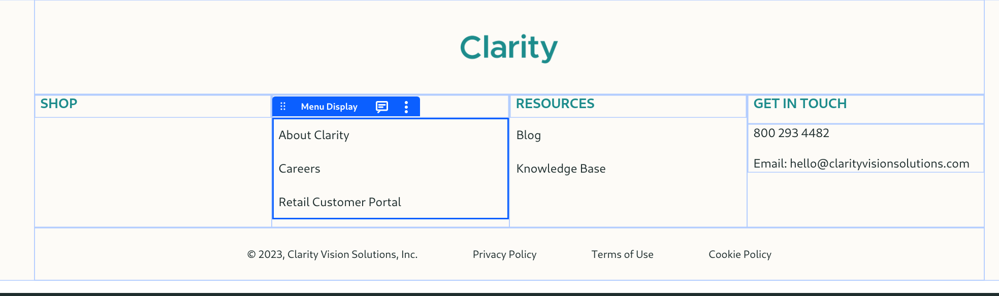
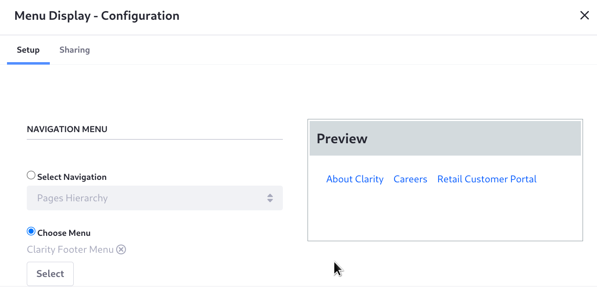
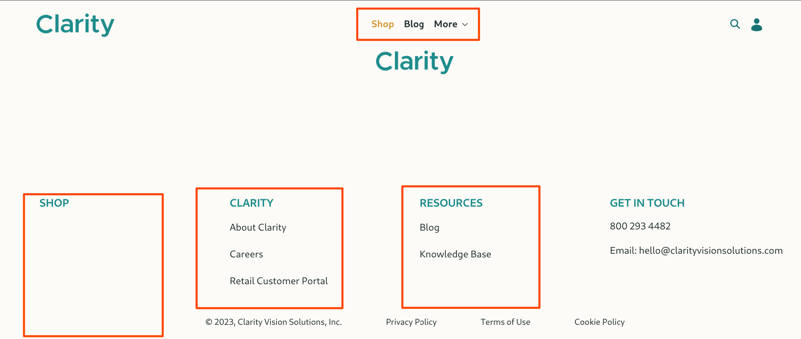

# Creating Navigation Menus

Clarity's navigation menu is getting cluttered, as it shows all the pages by default. The Menu Display fragment's default configuration shows the page hierarchy of the site. Remember that you excluded Careers, Sign In, and Search from the default menu display, so those pages aren't showing.

To simplify the header navigation menu, Clarity wants just three items to appear in the navigation menu: Shop (page), Blog (page), and More (sub-menu with additional page links).

In addition, navigation menus can add dynamic items to the footer. Clarity's footer has these menus to define: SHOP, CLARITY, and RESOURCES.

The SHOP menu will display links to product categories, but it's blank now. See [Commerce Architect](../../commerce-architect.md).

First create the navigation menu:

1. Open the *Site Menu* () and go to _Site Builder_ &rarr; _Navigation Menus_.

1. Click *Add* ().

1. Enter _Clarity Navigation_ as the name, then click _Save_.

1. Click _New_ &rarr; _Page_.

1. In the Select Pages selector, expand the Clarity hierarchy and click _Shop_, then click _Blog_.

   

1. Click _Select_.

The main pages are in place. Next you need a sub-menu called More, with links to the remaining pages.

1. Click _Add_ &rarr; _Sub-menu_.

1. Enter the name _More_, then click _Add_.

1. Open the More item's *Actions* menu ().

1. Click _Add Child_ &rarr; _Page_.

1. Add About Us and Contact Us to the sub-menu.

   

   The menu is ready to use.

1. The pages you want to show are in place. To make sure new pages are not added to the menu unless the navigation menu is updated intentionally, click *Configuration* ().

   Disable the configuration for adding new pages to the menu during page creation, then click _Save_.

   <!--If this configuration text is changed it will require a new screenshot: see https://liferay.slack.com/archives/CL9RTSZ52/p1695737943028559 -->

   

The menu display fragment showing the current navigation is added to the master page. Configure it to use the new navigation menu:

1. Open the _Site Menu_ (), then click _Design_ &rarr; _Page Templates_.

1. Click the text _Clarity MP_ and you're taken to the page editor.

1. Click the area on the page with the current navigation. The Menu Display Options configuration appears in the right sidebar.

   

1. Click the _Source_ field, then choose the _Clarity Navigation_ menu.

1. Click _Select this Level_. 

   For a hierarchical structure, you can choose a different level to display in the widget, if it suits your needs. Click _More_ and see that its sub-menu items are shown.

   In addition to these site menus defined in the Navigation Menus application, you can click Contextual Menus to see some additional dynamic menu options. See [Configuring Menu Displays](https://learn.liferay.com/en/w/dxp/site-building/site-navigation/configuring-menu-displays) for more information.

   Before this lesson, Clarity had three pages not appearing in the menu display fragment's page hierarchy menu: Careers, Sign In, and Search. That menu is no longer in use, but those pages were not explicitly added to the new header navigation menu, so they continue to remain outside of the navigation.

In addition to the header navigation, Clarity needs the menus for the footer: *Shop*, *Clarity*, and *Resources*.

The Shop menu includes categories for products. These categories must be created in the Global site, so log in with Kyle Klein, the instance administrator.

1. Go to the Global site by clicking *Select Site* () &rarr; *My Sites* &rarr; *Global*.

1. Open the _Site Menu_ (), then click _Categorization_ &rarr; _Categories_.

1. Add a vocabulary for the categories. Click *Add* () and name the vocabulary *Clarity Product Categories*.

1. Click *Add Category* (), and enter the name *Eyeglasses*. 

1. Create *Sunglasses*, *Contacts*, *Lenses*, and *Sale* using the same procedure.

1. Log out from Kyle Klein's account and back in as Preston Palmer, the site administrator for Clarity.

1. Following the same basic procedure used to create the header menu, create the *Shop* menu, adding the categories you created in the Global site:

   

1. Create the *Clarity* menu, adding the *About Us* and *Careers* pages.

1. Add an external URL to the Clarity menu: 

   **Name:** *Retail Customer Portal*
   **URL:** *http://clarityb2b.com:8080*
   <!-- Update above link to the actual site address -->

   

   Once finished the Clarity menu contains pages and a URL:

   

1. Create the *Resources* menu, adding the *Blog* and *Search* pages.

   

Now that the menus are created, add them to the footer.

1. Open the Clarity MP master page by opening the _Site Menu_ () and clicking _Design_ &rarr; _Page Templates_.

1. In the page editor, find the Menu Display widget in the first three grid columns of the footer, under the SHOP, CLARITY, and RESOURCES headings. 

   

1. Open each Menu Display widget's configuration and choose the appropriate menu to display.

   

Now Clarity's header and footer is using navigation menus to show its lists. The SHOP menu contains categories with no display pages, so the categories remain hidden for now. These will be populated in the [Commerce Architect](../../commerce-architect.md) course.

Next Clarity's design team has requested a [re-design of the Home page](./designing-the-home-page.md), with new fragments and compositions.

## Relevant Concepts

* [Managing Site Navigation](https://learn.liferay.com/en/w/dxp/site-building/site-navigation/managing-site-navigation)
* [Configuring Menu Displays](https://learn.liferay.com/en/w/dxp/site-building/site-navigation/configuring-menu-displays)
* [Using the Navigation Menus Application](https://learn.liferay.com/en/w/dxp/site-building/site-navigation/using-the-navigation-menus-application)
