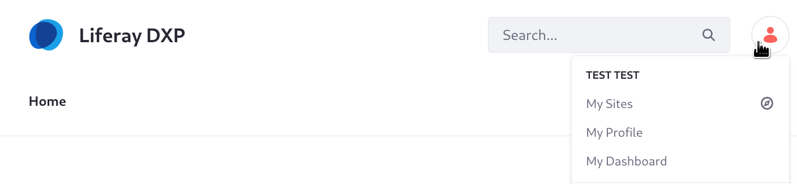
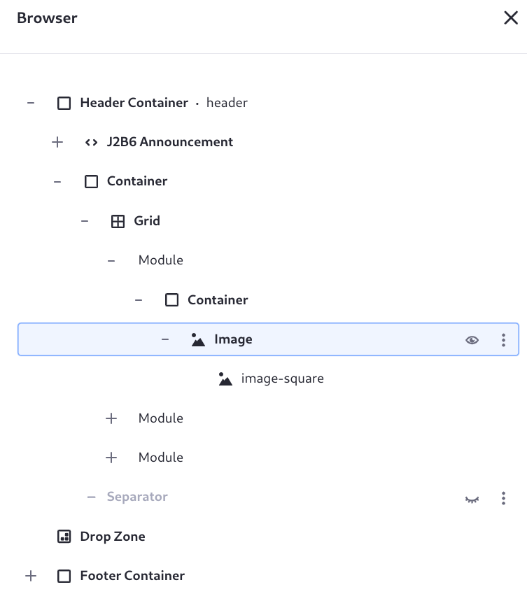
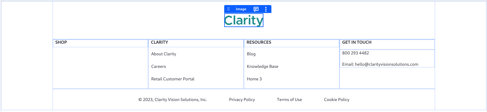
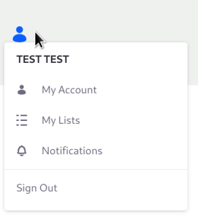
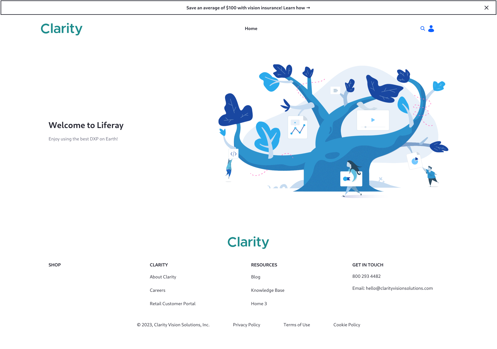

# Defining the Pages' Header and Footer

With [master pages](https://learn.liferay.com/en/w/dxp/site-building/creating-pages/defining-headers-and-footers/master-page-templates), you can define common elements for pages' headers and footers. Clarity has just one page currently, the home page. Since this was created before any master page was available, the blank master page was associated to the page automatically. The header has the Liferay logo and label, a page-based navigation menu, the search bar widget, and the Sign In/personal menu.

Because Clarity needs their own header and footer design, you'll create a master page to define the header and footer and re-use it across the entire site for all pages. 

1. Open the *Site Menu* (), then click *Design* &rarr; *Page Templates*.

1. Click *Add* () and name the page _Clarity MP_.

   The content page editor appears. By default, the page has only one element: a drop zone. Clarity's header and footer should appear above and below the drop zone. 

1. In the Fragments and Widgets () menu on the sidebar, drag _J2B6 Header Composition_ above the drop zone, then drag _J2B6 Footer Composition_ below the drop zone.

   You imported these fragment compositions in the previous step, [Importing Fragments and Resources](./importing-fragments-and-resources.md).

1. Map the image fragment in the header to a logo. Open the browser (), expand the Header Container element, and continue expanding elements until you get to the first grid module's image fragment.

   

1. Click the image fragment to open its settings, then click _image-square_ to set the source of the image.

1. Choose direct source selection, then choose the image *clarity_logo*.

   

1. Using the same procedure, add the *clarity_logo* image to the footer's image fragment.

   

1. Click _Publish Master_.

   The user menu is a custom fragment: J2B6 User Navigation Dropdown. It uses HTML and CSS to create a menu for logged in users. For logged out users, they see a user icon and the words SIGN IN, which they can click to access the sign in page.

   

The master page is in place. Right now the header and footer both contain menus that show the page hierarchy of the site. This will be improved in [Creating Navigation Menus](./creating-navigation-menus.md). Right now it's time to configure Liferay to use the master page on the existing Home page and in all widget pages (e.g., the existing Search page).

1. Open the master page's *Actions* menu () and click _Mark as Default_. Confirm that you want to use this master page as the default for all widget pages.

1. Go to the Home page and click *Edit* () in the administrative header.

1. In the content page editor, open the *Page Design Options* sidebar menu () and select _Clarity MP_.

1. Click _Publish_.

1. Use a similar procedure to configure the default utility pages (404 and 500 error pages) to use the master page. In the Site Menu (), click _Site Builder_ &rarr; _Pages_ &rarr; _Utility Pages_. 

Your master page now defines the header and footer.

Even with a header and footer, the look and feel is not yet well polished. Links are all currently blue and do not match with Clarity's brand colors, for example. Instead of spending time manually fixing this, leave it for now. The theme CSS client extension you deploy later will remedy these visual faults. 

Next: [create the rest of the site's pages](./completing-the-site-structure.md).

## Relevant Concepts

* [Master Page Templates](https://learn.liferay.com/en/w/dxp/site-building/creating-pages/defining-headers-and-footers/master-page-templates)
* [Creating a Master Page Template](https://learn.liferay.com/en/w/dxp/site-building/creating-pages/defining-headers-and-footers/creating-a-master-page-template)
* [Managing Master Page Templates](https://learn.liferay.com/en/w/dxp/site-building/creating-pages/defining-headers-and-footers/managing-master-page-templates)
