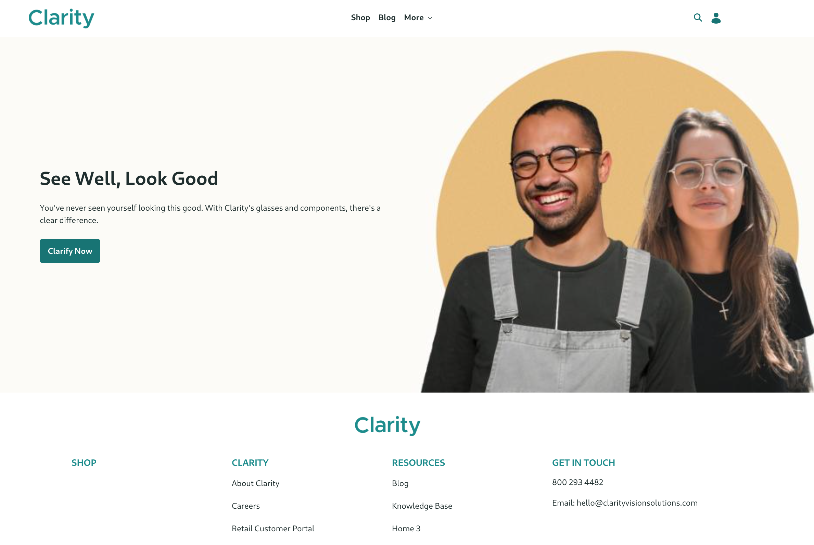
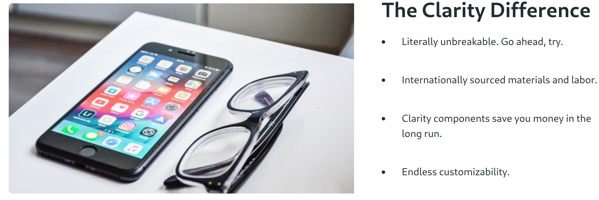

# Designing the Home Page

Clarity's current home page is a bit sparse. Right now it has just a single banner in addition to the header and footer:



The marketing team at Clarity wants more from the home page. They'd like to add

1. A list of traits that highlight the uniqueness of the company.
1. A customer testimonials slider.

<!--  Redundant with the intro? -->
In Liferay you can use [Fragments](https://learn.liferay.com/en/w/dxp/site-building/creating-pages/page-fragments-and-widgets/using-fragments), which are reusable snippets of HTML, JavaScript (if necessary), and CSS to build the look and feel of the site pages. Clarity's design team doesn't have the expertise to develop the custom fragments needed to build a nifty home page, but with their designs and the development team's effort, they can use the built-in fragments and any custom fragments to compose the page with very little custom code.

<!--Re-using my stuff from Delectable Bonsai for now, but will re-design with Abel's concepts later. -->
First, add a fragment composition highlighting the uniqueness of Clarity:

1. Open the Home page in editing mode.

1. Add the _clarity-uniqueness-composition_ to the page.

1. Publish the page.



The uniqueness composition is made entirely from out-of-the-box fragments and a Clarity-supplied image, combined to provide the content and the look-and-feel Clarity wants.

The last section of content shows customer testimonials. In this case the text is changed to display customer quotes.

1. Open the Home page in editing mode.

1. Add the _clarity-testimonials-composition_ to the page.

1. In the fragment configuration sidebar on the right, provide a quote for each *Testimonial* field:

   **First Testimonial:** 

   ```html
   "Wow, HD is way cooler when I have my Clarity glasses on. Let's be honest, I'm way cooler too."<br /><br />Scott, Almuerzo, TX
   ```

   **Second Testimonial:** 

   ```html
   "I look good, and I never knew it!"<br /><br />Cherise, Mittagessen SD
   ```

   **Third Testimonial:** 

   ```html
   "If looks could kill, my mirror would be serving ten life sentences."<br /><br />Bran, Ranchi OR
   ```

1. Publish the page.


The behavior for rotating through three customer quotes is defined in a custom fragment called _Testimonials Slider_, imported in [Importing Fragments and Resources](./importing-fragments-and-resources).

Now Clarity's basic pages are in place and the home page is fleshed out. Most of the site pages have no content. Next, get started [creating content](../creating-content.md).

## Relevant Concepts

* [Managing Content in Content Pages](https://learn.liferay.com/en/w/dxp/site-building/creating-pages/using-content-pages/managing-content-in-content-pages)
* [Content Page Editor UI Reference](https://learn.liferay.com/en/w/dxp/site-building/creating-pages/using-content-pages/content-page-editor-ui-reference)
* [Using Content Pages](https://learn.liferay.com/en/w/dxp/site-building/creating-pages/using-content-pages)
