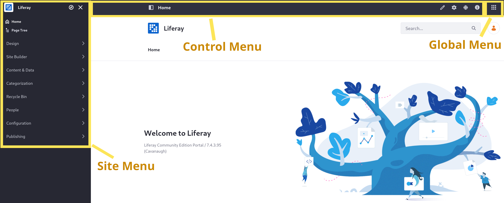
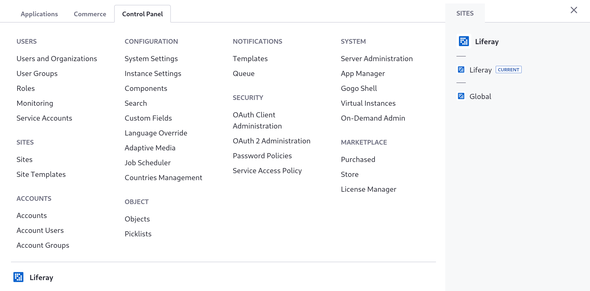
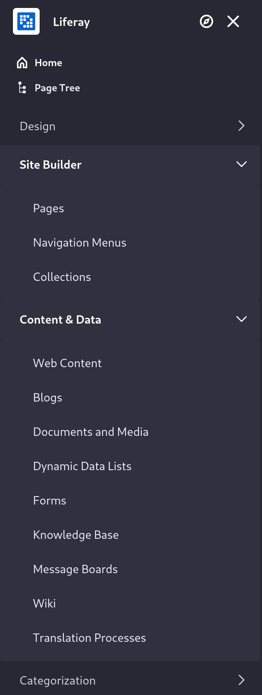

---
toc:
  - ./site-settings/initial-setup.md
  - ./site-settings/changing-the-default-sites-name-and-logo.md
  - ./site-settings/changing-your-public-sites-settings.md
uuid: f77b9dc7-1187-41bb-9af4-a8f5912f532f
---
# Site Settings

To get started managing Clarity's public website, you must first establish some basic settings. Site settings encompass everything from the site's name and logo, to its URL and membership policy. Help Clarity's administrators configure all of these settings to set the foundation for adding in pages and content.

Some settings are safe to enable for most kinds of sites, such as enabling an accessibility menu for users. Other settings, such as the site's membership type, must be configured differently for different types of sites. Clarity's private intranet, for example, requires the private membership setting when you add it in a later module.

This module walks through configuring the site settings for the public Clarity site, for customers to access. In these exercises, you'll change settings for

* The site's name and logo
* The site's URL
* The site's description
* The site's email domain
* The accessibility menu

As you make these changes, you'll navigate with these menus:

* The **Control Menu** is the bar at the top of the screen, which includes context-specific controls for the current page. For example, on a site where you're an administrator (like the image above), you can see buttons to edit (  ) or configure (  ) the page. It also includes the button to show or hide the Site Menu (  ) and the Global Menu (  ). If you don't have permission to view the Control Menu, you can't access either of these other menus.

* The **Global Menu** (  ) groups the *Applications Menu*, the *Commerce Menu*, and the *Control Panel* into tabs. You can also switch to a different site context via the links on the right.

* The **Site Menu** is broken into various other menus for aspects of the current site. You must have the *Access in Site and Asset Library Administration* permission for each type of content or setting to see it in the Site Menu.

Once you're familiar with these menus, it's time to start changing your site's settings.

The new public site replaces the Liferay home site that exists out-of-the-box, so some of the basic settings must be changed in your *instance settings*. The first step in this course is to change those instance settings to repurpose the site for Clarity, but even before that, you'll start Liferay and import some users.

[Let's Go!](./site-settings/initial-setup.md)
