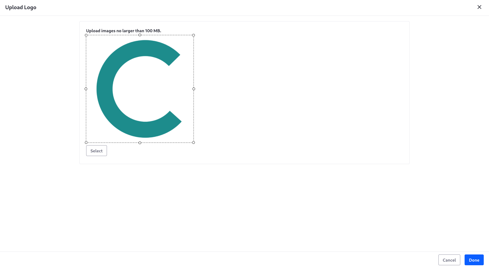
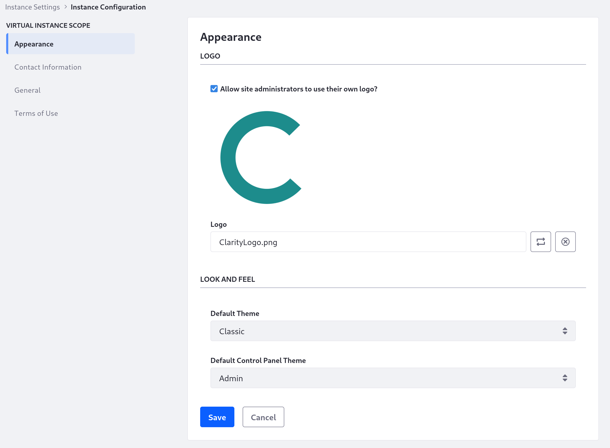
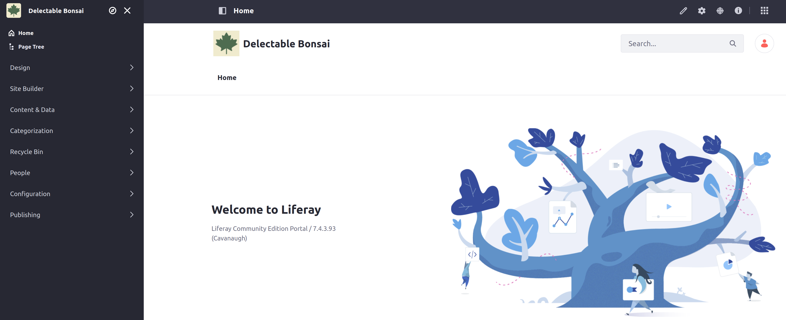

# Changing the Default Site's Name and Logo

Your Liferay instance comes out-of-the-box with a default site, called "Liferay" (with `/guest` as its friendly URL). This site is the default landing page for your instance, so its details are directly tied to the instance's settings. 

Here, you'll repurpose this site to become the new, public Clarity site.

## Change the Site's Logo

Log in as Kyle Klein, [your instance's administrator](https://learn.liferay.com/w/courses/liferay-administrator/users-accounts-organizations/managing-users#create-an-administrator), so you can change the instance settings.

1. Access your Liferay instance and log in as Kyle Klein.

1. At the top of the screen, open the Global menu (  ) and click *Control Panel* &rarr; *Instance Settings*.

1. On the Instance Settings page, click *Instance Configuration*.

   

1. Download and unzip the Clarity site logo:

   ```bash
   curl https://resources.learn.liferay.com/courses/latest/en/liferay-v6j4.zip -O
   ```

   ```bash
   unzip liferay-v6j4.zip
   ```

1. On the Instance Configuration page, click the *Change Logo* button (  ).

1. Upload the image you downloaded (`ClarityLogo.png`) in the pop-up modal and click *Done*.

   

1. Click *Save*.

## Change the Site's Name

Now change the default "Liferay" to the appropriate site name.

1. While in Instance Configuration, click the *General* scope.

   

1. In the *Name* field, enter *Clarity*.

## Change Other Important Instance Settings

You should also change the home URL and email domain to more appropriate terms for your site.

1. On the same General configuration page, change the domain in the *Mail Domain* field to `clarityvisionsolutions.com`.

1. Enter `/web/p` into the *Home URL* field.

   You'll change your site's friendly URL in the next exercise, so you should change the home URL now so that your instance correctly redirects users with the change.

1. Click *Save* at the bottom of the page.

Now your site's general details properly reflect the Clarity brand. Revisit the default home page (`localhost:8080/web/guest`, for a self-hosted or Docker instance) to see the changes.



The URL for this site still doesn't fit Clarity yet though, because it still uses `/guest`. Next, you'll [change that setting and others for the site](./changing-your-public-sites-settings.md).

## Relevant Concepts

* [Instance Configuration](https://learn.liferay.com/w/dxp/system-administration/configuring-liferay/virtual-instances/instance-configuration)
