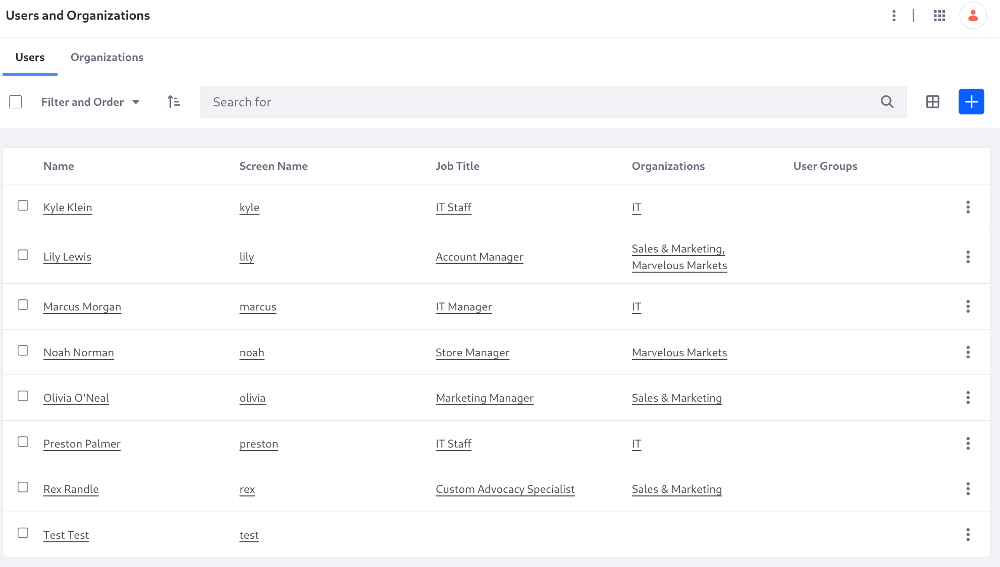
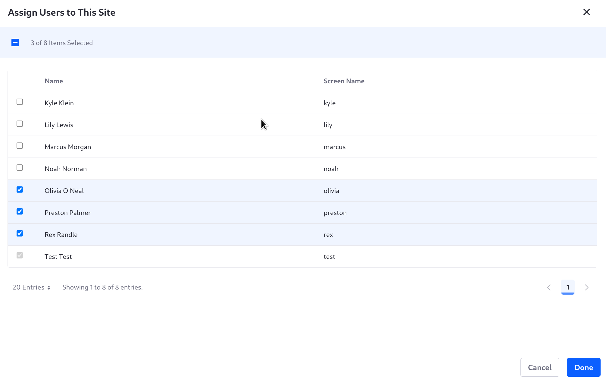

# Initial Setup

If you're beginning this course, and you haven't completed the exercises in [Liferay Administrator](../../liferay-administrator.md), you must import the results of that course before continuing with this one.

1. First, start a new Liferay DXP instance by running

   ```bash
   docker run --env LIFERAY_COMPANY_PERIOD_SECURITY_PERIOD_STRANGERS_PERIOD_VERIFY=false -it -m 8g -p 8080:8080 [$LIFERAY_LEARN_DXP_DOCKER_IMAGE$]
   ```

   Sign in to Liferay at <http://localhost:8080> using the email address _test@liferay.com_ and the password _test_. When prompted, change the password to _learn_.

1. Download and unzip the [J6K3 Site Initializer](https://resources.learn.liferay.com/courses/latest/en/liferay-administrator/liferay-j6k3.zip).

   ```bash
   curl https://resources.learn.liferay.com/courses/latest/en/liferay-administrator/liferay-j6k3.zip -O
   ```

   ```bash
   unzip liferay-j6k3.zip
   ```

   ```bash
   cd liferay-j6k3
   ```

1. Deploy the site initializer:

   ```bash
   ../gradlew clean deploy -Ddeploy.docker.container.id=$(docker ps -lq)
   ```

1. Create a site to kick off the initializer's resource creation logic. In Control Panel &rarr; Sites, click _New_.

1. Select the _J6K3_ template, name the site _TEMP_, then click _Add_.

1. Confirm the users were added in Control Panel &rarr; Users and Organizations.

   

!!! important
    You created this site to run the site initializer's logic only. The instructions proceed assuming you're using the default site created by Liferay on startup.

1. To add users to the site, you must enable manual membership management in the site. Go to _Site Menu_ &rarr; _Configuration_ &rarr; _Site Settings_, and open _Site Configuration_.

1. Toggle _Allow Manual Membership Management_ and click _Save_.

1. In the Site Menu, click _People_ &rarr; _Memberships_.

1. Click _New_, then select Olivia O'Neal, Preston Palmer, and Rex Randle.

   

1. Click _Done_.

1. In the Memberships screen, click the _Actions_ button for Preston Palmer and choose _Assign Roles_.

1. Select _Site Administrator_ and click _Done_.

The users needed in this course are as follows:

| User           | Job Title                  | Role                                               | Function                                                                                                             |
|:---------------|:---------------------------|:---------------------------------------------------|:---------------------------------------------------------------------------------------------------------------------|
| Rex Randle     | Custom Advocacy Specialist | Portal Content Manager                             | Rex receives customer emails and turns them into FAQ entries, and performs other content management tasks as needed. |
| Olivia O'Neal  | Content Manager            | Portal Content Reviewer<br/>Portal Content Manager | Olivia reviews Rex's FAQ entries and manages content creation in the site.                                           |
| Preston Palmer | IT Staff                   | Site Administrator                                 | Preston configures the site, activating workflows, overseeing publications, etc.                                     |
| Kyle Klein     | IT Manager                 | Instance Administrator                             | Kyle manages workflows at the instance level (e.g., importing or creating workflow processes).                       |

Now that the users are in place, [get started by changing some instance settings to repurpose the site for Clarity](./changing-the-default-sites-name-and-logo.md).
