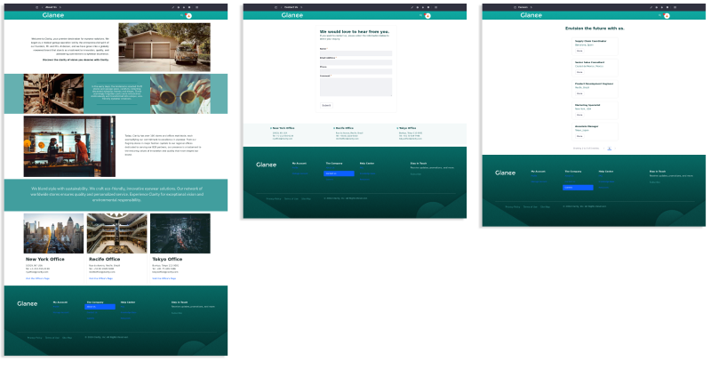

---
toc:
  - ./site-templates/setting-up-the-environment.md
uuid: 61acac6f-ca72-4aae-ae13-4cef75a634a1
---
# Site Templates

*Site templates* are a way to manage websites efficiently. Here are some key advantages of using site templates within Liferay:

1. Consistency Across Sites and Standardized Content. Define a consistent look and feel across multiple websites which ensures a uniform brand identity and user experience. You can also keep consistency by standardizing content (e.g., headers, footers, and navigation menus) across multiple sites.

   

1. Time and Effort Savings and Ease of Site Creation. Instead of recreating the same structure and content for each new website, create a site template with predefined layouts, pages, and content. This saves time and effort during the site creation process as users can create new sites based on these templates with minimal configuration.

1. Global Updates. If you need to make changes or updates to the template, those changes can be applied globally to all sites that use that template. This simplifies maintenance and ensures that updates are reflected uniformly across all associated sites.

1. Reusability. Templates can be reused across different projects or initiatives, promoting scalability.

In Liferay, each template includes most standard site applications for adding pages, stylebooks, web content, and more. Sites created with a template inherit all of its data. And, once you create a site using a template, you can make changes to the template’s pages and automatically propagate those changes to connected sites.

In this module, you'll create a site template with common elements that can be used in other sites (header, footer, menu, and About Us, Contact Us, and Careers pages) and use this template to generate other sites: an intranet for Clarity employees called Glance and a B2B platform.

Ready?

[Let's Go!](./site-templates/creating-a-site-template-and-uploading-files.md)