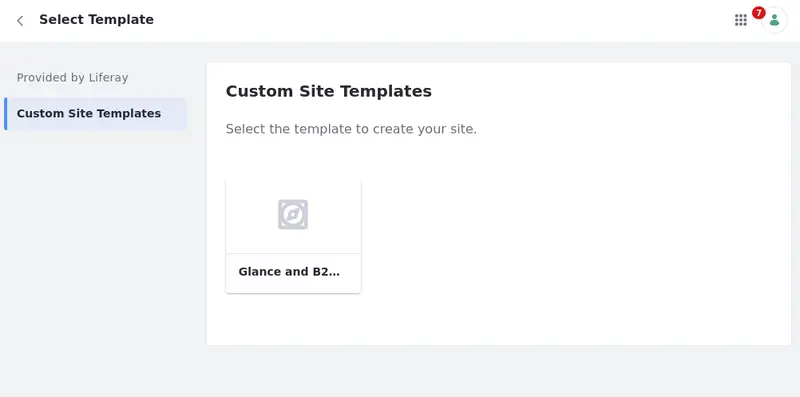

# Creating a New Site

It is time to create a new site based on the template.

But, before you do that, fix the navigation menu in the footer used in the Main template.

## Creating the Navigation Menu and Configuring the Menu Display

1. Open the *Site Menu* () and select *Site Builder* &rarr; *Navigation Menus*.

1. Click *Add* () and name it `The Company Navigation`.

1. Click *Add* and select *Page*. In the modal that opens, select the About Us, Contact Us, and Careers pages. Click *Select*.

Once the navigation menu is created, you can configure the menu display in the Main page template.

1. Open the *Site Menu* () and select *Design* &rarr; *Page Templates*.

1. Under the Masters tab, click the *Main* template to start editing the master page.

   You can also click *Actions* () and select *Edit*.

1. In the Menu Display under Company, click *Options* &rarr; *Configuration*

1. Select *Choose Menu* and click *Select*. Choose Company Navigation.

1. Under Display Template, choose *Pills Stacked* and click *Save*.

The menu display shows the navigation menu with the About Us, Contact Us, and Careers pages.

If you want, you can create and publish blank pages (or you can practice and populate them) and other navigation menus to set the menu displays under My Account and Help Center.

In this example, blank pages were created and added to the respective navigation menus.

## Creating a Site Based on the Template

1. Open the Global Menu (), select the *Control Panel* tab, and under Sites, click *Sites*.

1. Click *Add* (). Select the *Custom Site Templates* tab and click *Glance and B2B Site Template*. Name your new site `Glance` and click *Add*.

   

1. Change the theme of your new site to the Dialect theme.

1. (If you have problems with the menu in the header) Edit the Main master page, start configuring the Menu Display and select the appropriate Menu.

Your new site is generated and you can use all the resources created within the Site Template or create new elements for your site! Repeat the same process and create the Clarity B2B site as well.

<!-- What's the B2B site's name? -Rich -->
<!-- I asked the designer and she did not know . I don't think there is one. So I called it Clarity B2B just in case. - Eric -->

Try it. Don't forget to apply the Dialect theme to your new site as by default it uses the Classic theme. This way you can maintain your standard site appearance.

That's it. Congratulations, Liferay Learner! You have just completed this module.

During these lessons, you have learned how to create a site template, change your site's theme, apply a style book to your site's theme, create a site template, create pages, use compositions, create forms mapped to object definitions, use collection displays, create navigation menus, configure menu displays, and create a new site based on a site template.

Phew! That was a lot. Keep on practicing!

Next, you'll learn how to modify the [Site Look and Feel.]()

## Relevant Concepts

- [Using the Navigation Menus Application](https://learn.liferay.com/web/guest/w/dxp/site-building/site-navigation/using-the-navigation-menus-application)
- [Configuring Menu Displays](https://learn.liferay.com/web/guest/w/dxp/site-building/site-navigation/configuring-menu-displays)
- [Site Templates](https://learn.liferay.com/web/guest/w/dxp/site-building/sites/site-templates)
