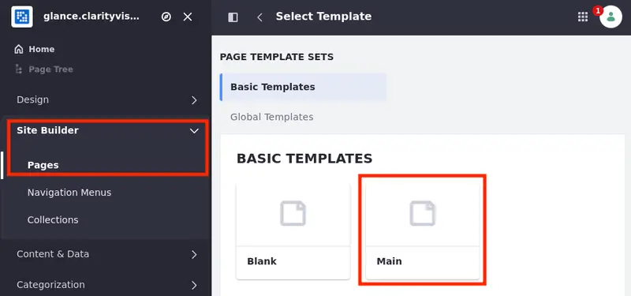
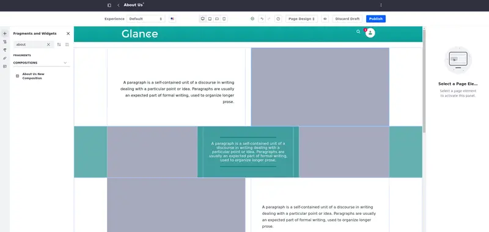
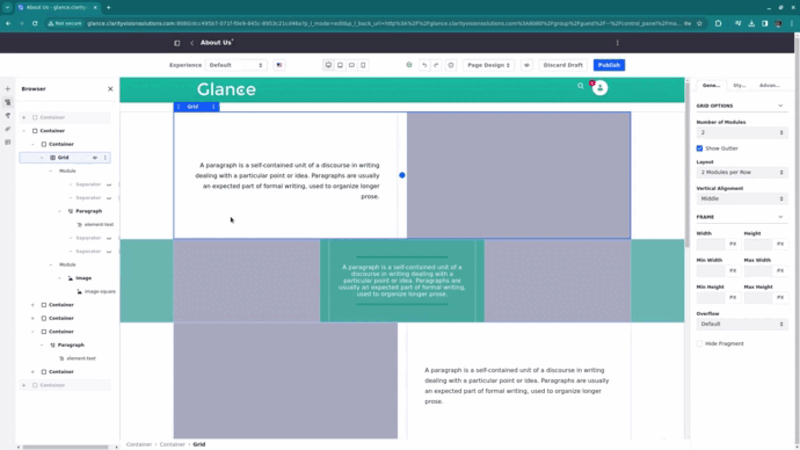
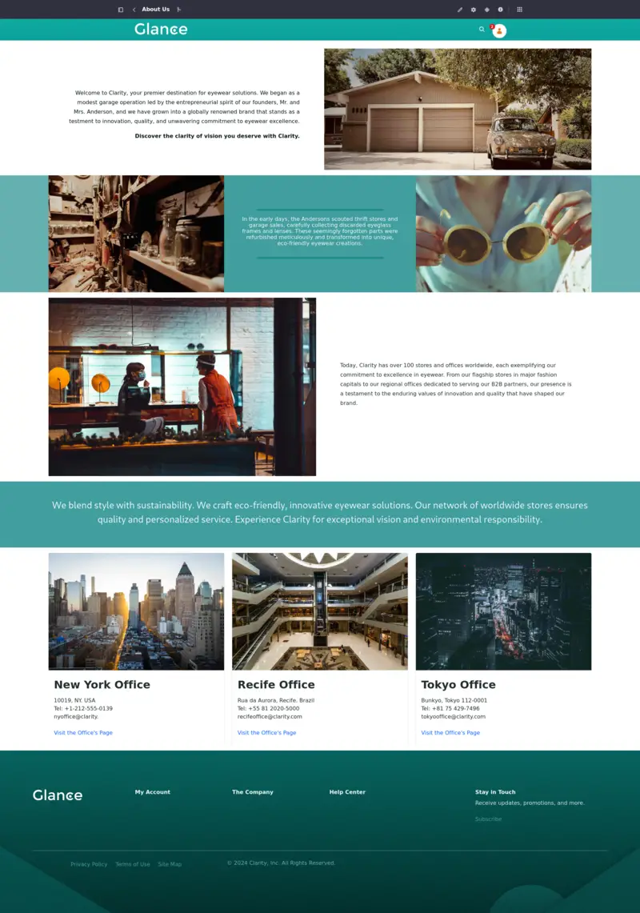
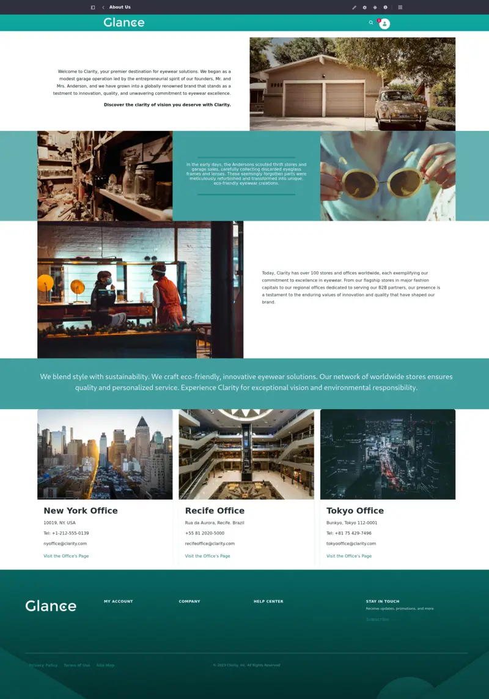

# Creating the About Us Page

Now that you have a master page, use it to create the pages and populate the site template.

In this lesson, you'll use *compositions*, pre-built structures that speed up the process of page building, to create the pages that will populate the site template. With compositions, add the elements to the right places in an existing structure to build your page.

Start by creating a page using the master page template from the last lesson.

## Creating a Page Using a Master Page Template

<!-- This first lesson teaching how to deal with compositions is going to take longer, the others are just going to contain general directions instead of more specific ones. -->

1. Open the *Site Menu* () and select *Site Builder* &rarr; *Pages*.

1. Click *Add* () &rarr; *Add Site Template Page* and select the Main template.

   

1. Name the page `About Us` and click *Add*.

   You are redirected to the page editor.

All the created pages have the same structure set in the Master page: a header, the content in the middle, and a footer. Now, populate the About Us page.

## Populating the About Us Page

1. Look at the Fragments and Widgets tab on the left of the page editor and search for *About Us Composition*.

1. Drag and drop the *About Us Composition* into the editing area".

   A whole structure is set and you can edit its elements. If you applied the Dialect theme and imported the style book correctly, the composition should look like this:

   

Add some information and images to the composition. Start by editing the first row:

1. Select the first paragraph element and double-click its content to edit it. Erase its placeholder text and enter this text instead:

   ```
   Welcome to Clarity, your premier destination for eyewear solutions. We began as a modest garage operation led by the entrepreneurial spirit of our founders, Mr. and Mrs. Anderson, and we have grown into a globally renowned brand that stands as a testment to innovation, quality, and unwavering commitment to eyewear excellence.
   Discover the clarity of vision you deserve with Clarity.
   ```

1. Select `Discover the clarity of vision you deserve with Clarity.`. In the toolbar that pops up, click *Bold* to emphasize that part of the text.

1. Select the first image element and double-click its content to open the Documents and Media modal. Open the *About Us Images* folder and select image `01`.



Now, edit the second row:

1. Repeat the last step and choose image `02`.

1. Enter this text in the paragraph in the middle:

   ```
   In the early days, the Andersons scouted thrift stores and garage sales, carefully collecting discarded eyeglass frames and lenses. These seemingly forgotten parts were refurbished meticulously and transformed into unique, eco-friendly eyewear creations.
   ```

1. Select image `03` for the image on the right.

Next, edit the third row:

1. Select image `04` for the image on the left and enter this text into the paragraph on the right:

   ```
   Today, Clarity has over 100 stores and offices worldwide, each exemplifying our commitment to excellence in eyewear. From our flagship stores in major fashion capitals to our regional offices dedicated to serving our B2B partners, our presence is a testament to the enduring values of innovation and quality that have shaped our brand.
   ```

Edit the fourth row:

1. Enter this text into the paragraph:

   ```
   We blend style with sustainability. We craft eco-friendly, innovative eyewear solutions. Our network of worldwide stores ensures quality and personalized service. Experience Clarity for exceptional vision and environmental responsibility.
   ```



Last, edit the cards. They hold information about the main Clarity offices: an image (a picture of the office), a title (the name of the office), a paragraph (information about the office), and a link (to redirect the user to the office's page).

1. Use the information and the instructions in the table below to fill in the cards:

   | Office | Component | Content |
   | :--- | :--- | :--- |
   | New York | Image | `nyoffice` |
   | New York | Title | New York Office |
   | New York | Paragraph | 10019, NY. USA <br> Tel: +1-212-555-0139 <br> nyoffice@clarity.com |
   | Recife | Image | `recifeoffice` |
   | Recife | Title | Recife Office |
   | Recife | Paragraph | Rua da Aurora, Recife. Brazil <br> Tel: +55 81 2020-5000 <br> recifeoffice@clarity.com |
   | Tokyo | Image | `tokyooffice` |
   | Tokyo | Title | Tokyo Office |
   | Tokyo | Paragraph | Bunkyo, Tokyo 112-0001 <br> Tel: +81 75 429-7496 <br> tokyooffice@clarity.com |

1. Add the image by double-clicking the image component and selecting the image as indicated in the table.

1. Change the title/paragraph by double-clicking the text component and replacing its content with the text in the table.

1. Change the text of the link by double-clicking the link component. Change its content to `Visit the Office's Page`.

   <!-- You are not going to create an individual page for each office in this exercise, but if you create one, you can link it here. -->

Once the elements are in place, click *Publish* at the top right corner of the page. This is how the About Us Page should look once you are finished:



Now that the About Us Page is complete, let's [create the Contact Us page.](./creating-the-contact-us-page.md)

## Relevant Concepts

- [Creating Pages](https://learn.liferay.com/web/guest/w/dxp/site-building/creating-pages/adding-pages)
- [Using Fragments](https://learn.liferay.com/web/guest/w/dxp/site-building/creating-pages/page-fragments-and-widgets/using-fragments)
- [Saving Fragment Compositions](https://learn.liferay.com/web/guest/w/dxp/site-building/creating-pages/page-fragments-and-widgets/using-fragments/saving-fragment-compositions)