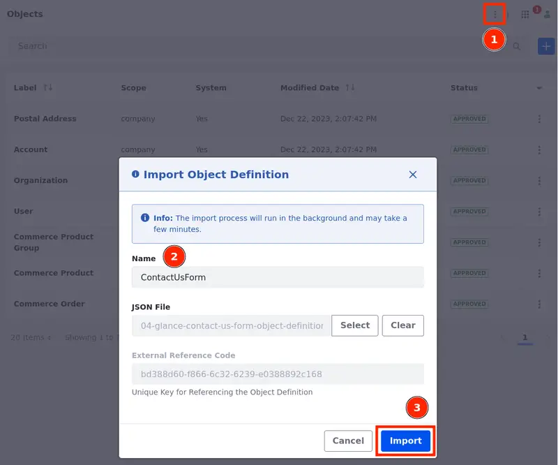
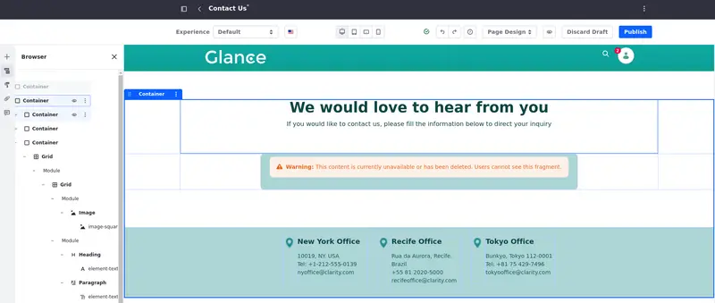
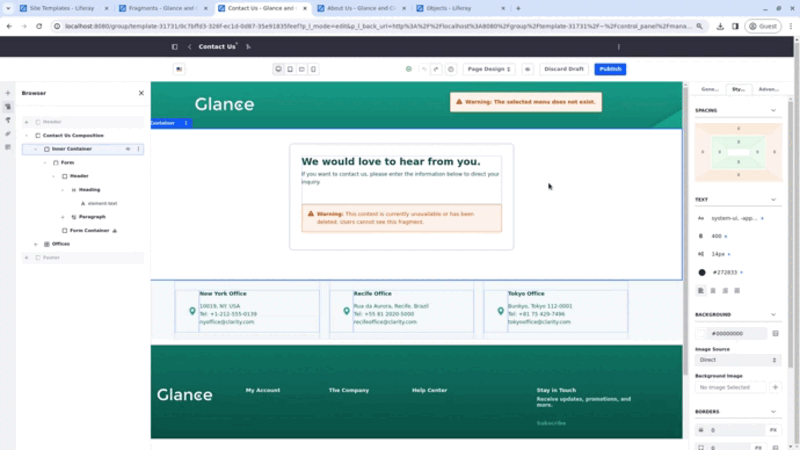
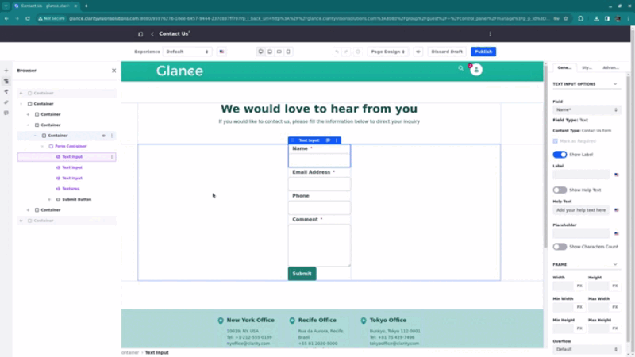
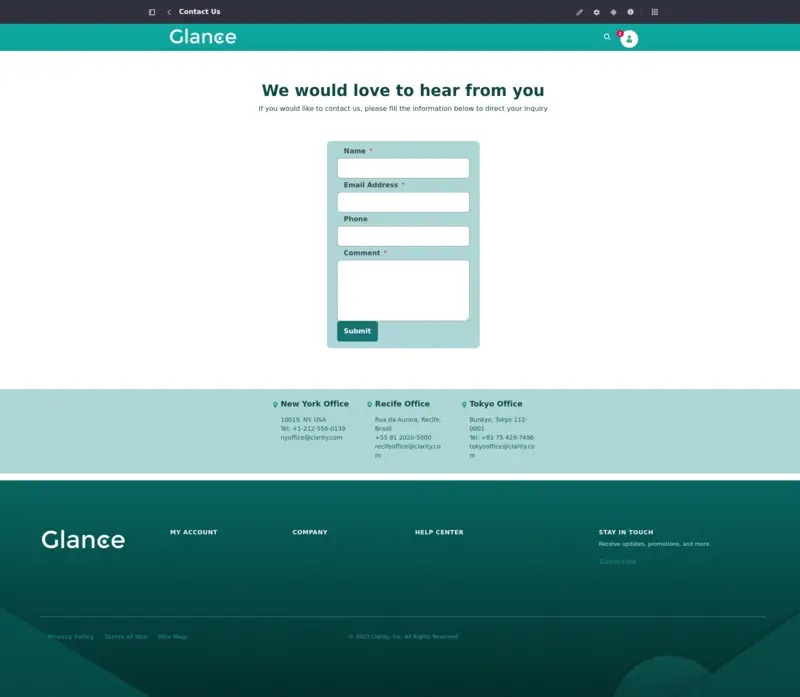

# Creating the Contact Us Page

The Contact Us page has a form which the user can fill in order to contact the company. To create this form, you'll first create an object and map it to a Form Container fragment.

## Importing the Object Definition

1. Open the Global Menu (), select the Controle Panel tab, and click *Object* under Objects.

1. Click *Options* () (1) and select *Import Object Definition*. Name the object definition "ContactUsForm" and select the `04-glance-contact-us-form-object-definition.json` file (that was included in the zip file with the resources for this module) (2), and click *Import* (3).

   

The object definition has 4 fields (Name, Email Address, Phone, and Comment) and it is located under Object in the Control Panel tab of your Product Menu.

Next, create the Contact Us Page and add a Form Container fragment to it.

## Creating the Contact Us Page

1. Open the *Site Menu* () and select *Site Builder* &rarr; *Pages*.

1. Click *New Page* &rarr; *Page* and select the Main template.

1. Name the page `Contact Us` and click *Add*.

   You are redirected to the page editor.

1. While editing the page, look at the Fragments and Widgets tab on the left of the page editor and search for "Contact Us Composition".

1. Drag and drop the "Contact Us composition in the editing area".

### Editing the Content in the Contact Us Page

Now, you can edit the Contact Us composition, add elements, and edit headings and paragraphs.

1. Alter the elements in the composition. Use the information in the table below:

| Component | Content |
| :--- | :--- |
| Main Heading | We would love to hear from you |
| Main Paragraph | If you would like to contact us, please fill the information below to direct your inquiry. |
| Left Image | `Icon-geolocation.png` |
| Left Heading | New York Office |
| Left Paragraph | 10019, NY. USA   Tel: +1-212-555-0139   nyoffice@clarity.com |
| Middle Image | `Icon-geolocation.png` |
| Middle Heading | Recife Office |
| Middle Paragraph | Rua da Aurora, Recife. Brazil   +55 81 2020-5000   recifeoffice@clarity.com |
| Right Image | `Icon-geolocation.png` |
| Right Heading | Tokyo Office |
| Right Paragraph | Bunkyo, Tokyo 112-0001   Tel: +81 75 429-7496   tokyooffice@clarity.com |

Add your Form Container to the page and map it to the Contact Us Form object definition. The form container with a warning was left in the composition just so you know where to place your form container.

1. Look at the Fragments and Widgets tab on the left of the page editor and search for "Form Container".

   The form container is only available if you have an object definition in place.

1. Drag and drop the Form Container into the editing area on top of the existing one and map your form container to the Contact Us Form object.

1. Drag and drop the fields to reorder them. The order should be Name, Email Address, Phone, and Comment.

1. Delete the old form container by clicking *Options* on top of the component and selecting *Delete* or through the Browser.

With the form mapped and in place, style the way it looks.

1. Click on the Form Container component. On the menu on the right, select the General tab and set the `Min Width` to 360 px.

1. Select the Styles tab and set the following properties:

   | Property | Value |
   | :--- | :--- |
   | Padding Top | 0.5 rem |
   | Padding Right | 1.5 rem |
   | Padding Left | 1.5 rem |
   | Padding Bottom | 1.0 rem |
   | Background Color | Color Brand Primary Lighten 4 |
   | Border Radius | 10 px |

   

1. Publish the page.

This is how the Contact Us page should look like once it is finished:

Now that the Contact Us Page is complete, let's [create the Careers page.](./creating-the-careers-page.md)