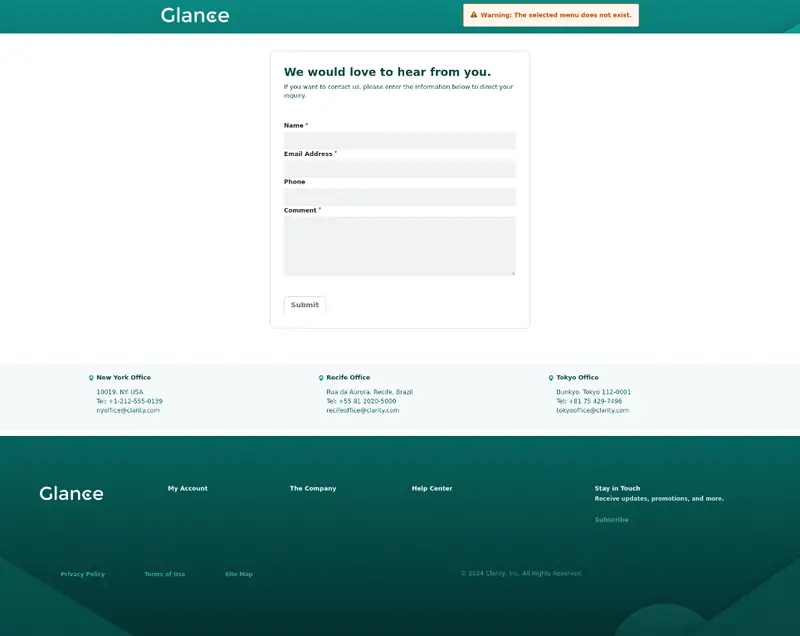

# Creating the Contact Us Page

The Contact Us page has a form users should fill out if they want to contact the company. To create this form, import an object definition and map it to a Form Container fragment.

## Importing the Object Definition

1. Navigate back to `http://glance.clarityvisionsolutions.com:8080/`.

   You have to import the object definition outside of the site template.

1. Open the Global Menu (), select the Control Panel tab, and click *Object* under Objects.

1. Click *Options* () (1) and select *Import Object Definition*. Name the object definition `ContactUsForm`, select the `04-glance-contact-us-form-object-definition.json` file (that was included in the zip file with the resources for this module) (2), and click *Import* (3).

   

   The object definition has four fields (Name, Email Address, Phone, and Comment) and it appears under Object in the Control Panel tab of your Product Menu.

1. Navigate back to your site template by opening the *Global Menu*, navigating to the Control Panel tab, clicking *Site Templates*, and clicking on the name of your site template.

Next, create the Contact Us page and add a form container fragment to it.

## Create the Page

1. Open the *Site Menu* () and select *Site Builder* &rarr; *Pages*.

1. Click *Add* () &rarr; *Add Site Template Page* and select the Main template.

1. Name the page `Contact Us` and click *Add*. The page editor appears.

1. While editing the page, look at the Fragments and Widgets tab on the left of the page editor and search for `Contact Us Composition`.

1. Drag and drop the Contact Us Composition in the editing area.

### Editing the Content in the Contact Us Page

Alter the elements in the composition. Use the information in the table below:

| Component                         | Content                                                                                |
|:----------------------------------|:---------------------------------------------------------------------------------------|
| (Header) Heading                  | We would love to hear from you.                                                        |
| (Header) Paragraph                | If you want to contact us, please enter the information below to direct your inquiry.  |
| (Offices - Left Grid) Image       | `Icon-geolocation.png`                                                                 |
| (Offices - Left Grid) Heading     | New York Office                                                                        |
| (Offices - Left Grid) Paragraph   | 10019, NY. USA   Tel: +1-212-555-0139   nyoffice@clarity.com                     |
| (Offices - Middle Grid) Image     | `Icon-geolocation.png`                                                                 |
| (Offices - Middle Grid) Heading   | Recife Office                                                                          |
| (Offices - Middle Grid) Paragraph | Rua da Aurora, Recife. Brazil   Tel: +55 81 2020-5000   recifeoffice@clarity.com |
| (Offices - Right Grid) Image      | `Icon-geolocation.png`                                                                 |
| (Offices - Right Grid) Heading    | Tokyo Office                                                                           |
| (Offices - Right Grid) Paragraph  | Bunkyo, Tokyo 112-0001   Tel: +81 75 429-7496   tokyooffice@clarity.com          |

Add your Form Container to the page and map it to the Contact Us Form object definition. The existing form container with a warning was left in the composition so you know where to place your form container.

1. Look at the Fragments and Widgets tab on the left of the page editor and search for `Form Container`.

   The form container only appears if you have an object definition in place.

1. Drag and drop the *Form Container* into the editing area on top of the existing one and map your form container to the Contact Us Form object.

1. Drag and drop the fields to reorder them. The order should be Name, Email Address, Phone, and Comment.

1. Delete the old form container by clicking *Options* on top of the component and selecting *Delete* or through the Browser.

1. With the form mapped and in place, click the *Submit button*. In the menu on the right, select the General tab and change the Style to Outline Secondary. Then, select the Styles tab and set the Padding Top to 3 rem.

1. Publish the page.

The Contact Us page should look like this when it is finished:

Next: [create the Careers page.](./creating-the-careers-page.md)

## Relevant Concepts

- [Creating and Managing Objects](https://learn.liferay.com/web/guest/w/dxp/building-applications/objects/creating-and-managing-objects)
- [Exporting and Importing Object Definitions](https://learn.liferay.com/web/guest/w/dxp/building-applications/objects/creating-and-managing-objects/exporting-and-importing-object-definitions)
- [Using Fragments to Build Forms](https://learn.liferay.com/web/guest/w/dxp/building-applications/objects/using-fragments-to-build-forms)
- [Personalizing Custom Forms Using Form Fragments](https://learn.liferay.com/web/guest/w/dxp/site-building/creating-pages/page-fragments-and-widgets/using-fragments/personalizing-custom-forms-using-form-fragments)
