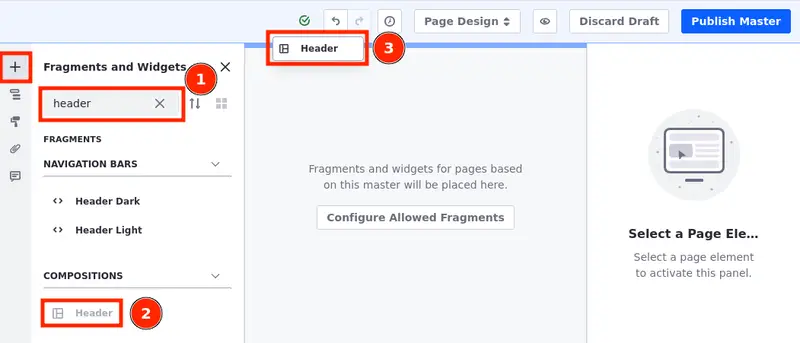
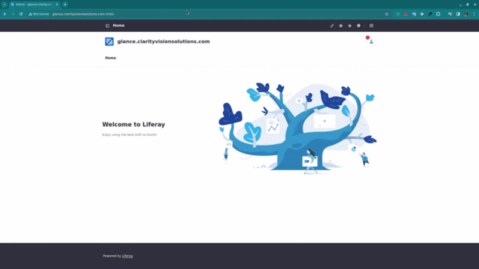
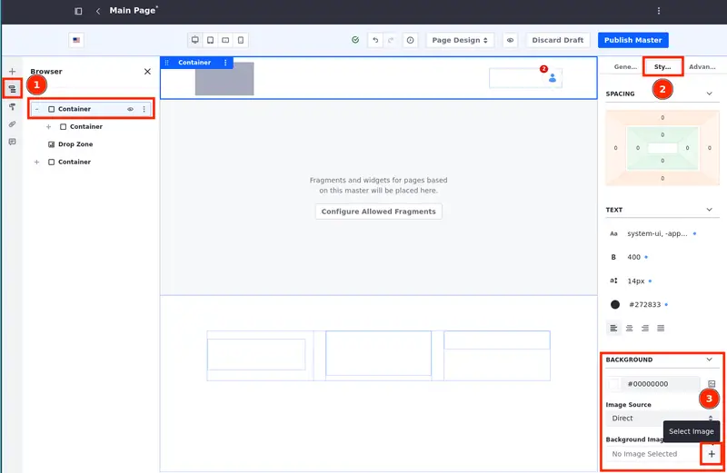
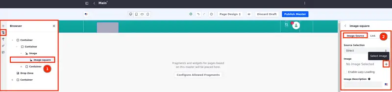
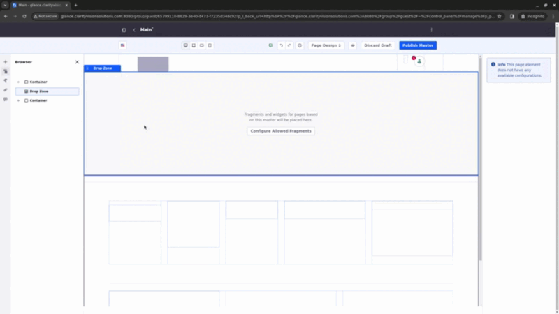
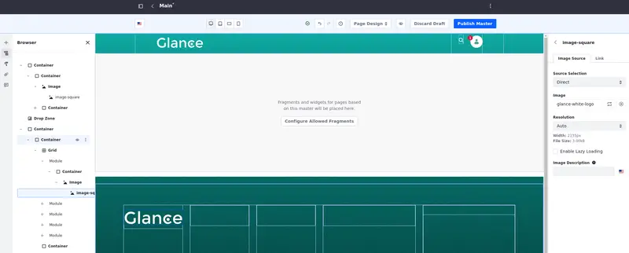
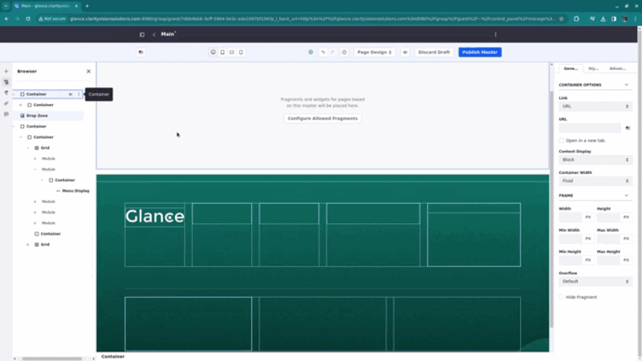
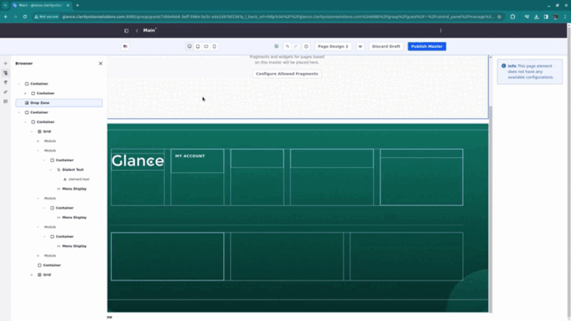
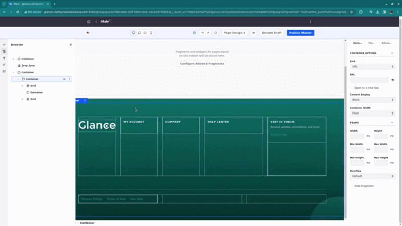

# Creating the Master Page Template

Master page templates provide a way to define elements common to every page, so you can maintain and manage them without having to deploy a plugin.

You can use the same master page template across an entire site or have unique templates for each page.

In this exercise, you are creating a master page template called Main which is used to create the pages for the site template.

## Creating and Editing the Master Page Template

1. Open the *Site Menu* () and select *Design* &rarr; *Page Templates*.

1. Under the Masters tab, click *Add* (). Name this page template "Main" &rarr; click *Save*.

   You are redirected to the page editor.

1. In the search bar under Fragments and Widgets, search for `Header` (1). The custom header composition you imported shows under Compositions (2). Drag and drop it on top of the Drop Zone (3).

   

1. Next, search for the `Footer`. The custom footer composition also shows under Compositions. Drag and drop it under the Drop Zone.

With the header and the footer in place, edit the way they look and their contents.

### Editing the Look and Feel of the Custom Header

First, add a background to the header:

1. Select the outer *Container* (1) in the header composition. On the right, select the *Styles* tab (2).

   You can also select the outer Container by using the Browser menu on the left.

1. Under Background Image, click the + icon (3), open the *Assets* folder, and select the `header-background.svg` image.

   

Then, add the logo to the Image fragment:

1. Click the *Image* fragment twice to select the image-square inside the Image fragment. On the right, select the *Image Source* tab.

   You can also select the image-square by using the Browser menu on the left (1).

   

1. Under Image, click the + icon, open the *Assets* folder and select the `glance-white-logo.svg` image.

Your custom header is ready.

### Editing the Look and Feel of the Custom Footer

To start, add a background to the footer:

1. Select the outer *Container* (1) in the footer composition. On the right, select the *Styles* tab (2).

   You can also select the outer *Container* by using the Browser menu on the left.

1. Under Background Image, click the + icon, open the *Assets* folder, and select the `footer-background.svg` image.

Now, organize the top grid. First, Add the logo to the footer:

1. In the first grid module, double-click the *Image* fragment (this selects the image-square inside the Image fragment). On the right, select the *Image Source* tab.

1. Under Image, click the + icon, open the *Assets* folder and select the `glance-white-logo.svg` image.

   You can also click the `image-square` component twice to open the modal where you select the image.

   

Second, alter the headings for the menus:

1. In the second grid module, add a *Dialect Text* fragment to the container. Double-click to edit the text &rarr; change it to `MY ACCOUNT`. Change its text type, spacing, font color and weight using the menu on the right.

   Under the General tab, alter the Text Type to *Small Caps*.

   Under the Styles tab, change the spacing and add a left padding of 1 rem.

   Change the text. Alter the font weight to *Font Weight Bold* and the font color to *Color Brand Primary Lighten 6*.

   

   <!-- do I want a gif or a png should sufice here? -->

1. Repeat the last step to add and alter the heading for the menus in the next two grids. Add a `COMPANY` and a `HELP CENTER` heading to the other grids.

   You can also duplicate the Dialect Text component (using the Browser or the options menu that shows once you click the component), reposition the duplicates in the next modules, and change their text.

   

   The menu displays are going to be set later.

Third, create a section where the user can subscribe to the company's mailing list to receive updates, offers, and other announcements directly to their inbox.

1. In the last grid module, add a *Dialect Text* fragment to be the heading for the container and change its text to `Stay in Touch`.

1. Add another *Dialect Text* fragment under it and change the following information to create a paragraph:

   Text Type: Paragraph Small.
   Spacing: Margin Top 0.5 rem, Margin Bottom 0.5 rem, and Padding Left 1 rem.
   Font-color: Color Brand Primary Lighten 5.
   Content: `Receive updates, promotions, and more.`

1. Add a *Dialect Button* to the same container.

   Under the General tab, change its type to Borderless.
   Change its text to `Subscribe`.

Now, it's time to organize the bottom grid.

1. First, add a *Dialect Button* to the container in the first module and alter it:

   Under the General tab, change the type to *Borderless* and the size to *Small*.

1. Make two duplicates and change their texts to `Privacy Policy`, `Terms of Use`, and `Site Map`.

   

1. In the second module, add a *Dialect Text* to the container and change it:

   Under the General tab, change its text type to *Paragraph Small*.
   Under the Styles tab, add a top padding of 0.75 rem, change the font color to `Color Brand Primary Lighten 1`, and click *Align Center*.
   Change its text to `© 2023 Clarity, Inc. All Rights Reserved`

   

Your custom footer is ready.

Once you are done editing the header and the footer, click *Publish Master*.

Coming up next, let's [create pages to populate your site template](./creating-pages-to-populate-the-site-template.md).