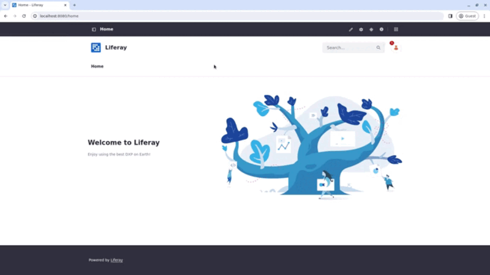
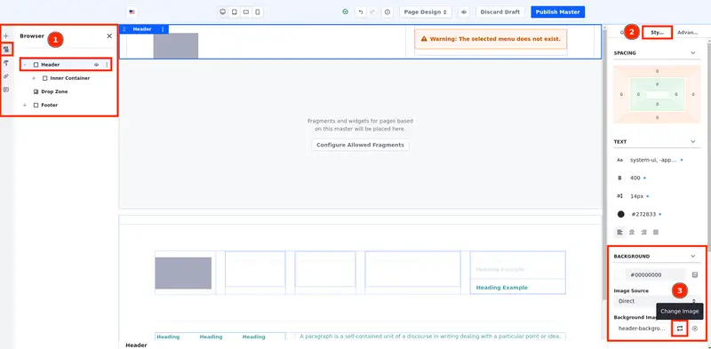
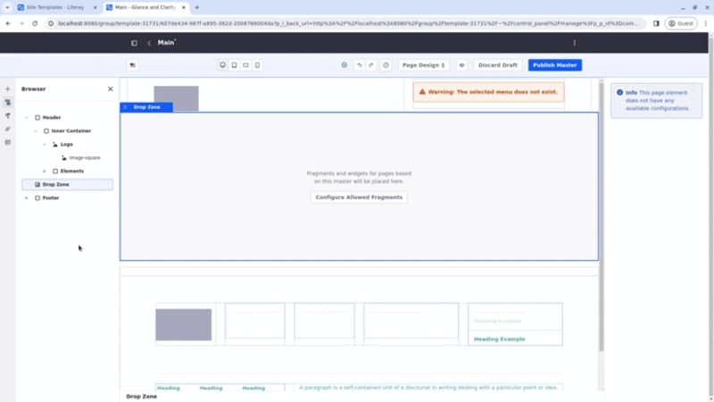
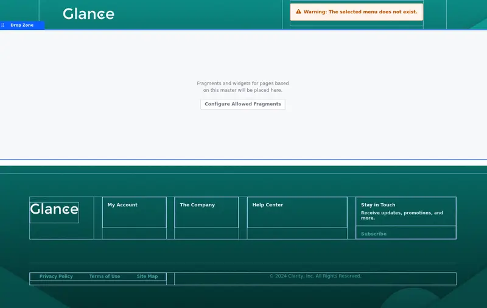

# Creating the Master Page Template

*Master page templates* provide a way to define elements common to every page, so you can focus on that page's content, rather than its chrome. You can use the same master page template across an entire site or have unique templates for each page.

In this exercise, you'll create a master page template called *Main* which in turn is used to create the site template's pages.

1. Open the *Site Menu* () and select *Design* &rarr; *Page Templates*.

1. Under the Masters tab, click *Add* (). Name this page template `Main` and click *Save*.

   The page editor appears.

1. In the search bar under Fragments and Widgets, search for `Header Composition` (1). The custom header composition you imported shows under Compositions (2). Drag and drop it on top of the Drop Zone (3).

1. Next, search for the `Footer Composition`. The custom footer composition also shows under Compositions. Drag and drop it under the Drop Zone.

With the header and the footer in place, you can edit them.

## Editing the Look and Feel of the Custom Header

The header composition is almost complete. Add the background image and the missing logo to the image fragment:

1. To add the background image, click the *Header container*. On the right, select the *Styles* tab.

1. Under Background, click Change Image/Select Image. In the Master Page Assets folder, select `header-background.svg`.

   

1. To add the logo to your header, click the *Image* fragment twice to select the image-square inside the Image fragment. On the right, select the *Image Source* tab.

   You can also select the image-square by using the Browser menu on the left or by double-clicking the *Image* fragment.

1. Under Image, click the + icon, open the *Master Page Assets* folder and select the `glance-white-logo.svg` image.

   The menu displays are going to be set later. Ignore the warning for now.

Your custom header is ready.

## Editing the Look and Feel of the Custom Footer

Add a background image, the logo, and organize the texts in your footer.

1. To add the background image, click the *Footer container*. On the right, select the *Styles* tab. Under Background, click Change Image/Select Image. In the Master Page Assets folder, select `footer-background.svg`.

Now, let's organize the top grid. First, add the logo to the footer:

1. In the first grid module, double-click the *Image* fragment (this selects the image-square inside the Image fragment). On the right, select the *Image Source* tab.

1. Under Image, click the + icon, open the *Master Page Assets* folder, and select the `glance-white-logo.svg` image.

   You can also click the `image-square` component twice to open the modal where you select the image (or click the Image fragment three times).

   

Second, alter the headings for the menu displays:

1. In the second grid module, double-click the *Heading* element to edit it and change its text to `My Account`.

1. Repeat the last step to alter the heading for the menu displays in the next two grids. Add `The Company` and `Help Center` headings to the other grids.

   The menu displays are going to be set later.

Third, create a section where the user can subscribe to the company's mailing list:

1. In the last grid module, change the Title heading to `Stay in Touch`.

1. Change the Sub-title heading under it to `Receive updates, promotions, and more.`

1. Change the Button's content to `Subscribe`.

Now, it's time to organize the bottom grid:

1. Change the Heading's contents to `Privacy Policy`, `Terms of Use`, and `Site Map`.

1. In the second module, change the Paragraph to `© 2024 Clarity, Inc. All Rights Reserved.`

   This is how the footer should look like once it's complete.

   

Your custom footer is ready.

When you're finished editing the header and the footer, click *Publish Master*.

Next: [create a page based on the Main template and populate it.](./creating-the-about-us-page.md)

## Relevant Concepts

- [Master Page Templates](https://learn.liferay.com/web/guest/w/dxp/site-building/creating-pages/defining-headers-and-footers/master-page-templates)
- [Using Fragments](https://learn.liferay.com/web/guest/w/dxp/site-building/creating-pages/page-fragments-and-widgets/using-fragments)
