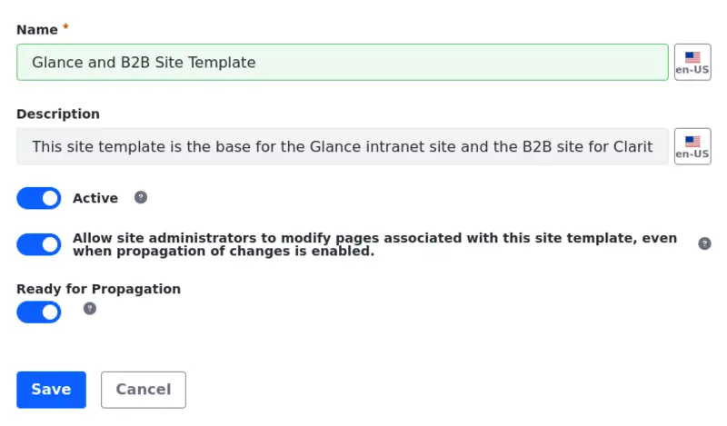

# Creating a Site Template

Before you start creating your site template, there are some steps you have to take in order to set up the environment.

## Using the Virtual Instance

1. Navigate to `http://glance.clarityvisionsolutions.com:8080/` (the virtual instance you created in the Liferay Administrator course).

   If you haven't created one yet, see [Configuring Virtual Instances](../../liferay-administrator/configuration/configuring-virtual-instances.md) in the Liferay Administrator course and follow the steps to create one.

1. Log in as Kyle Klein, the instance's administrator.

   If you have just created the virtual instance, it has no user accounts in it. Create one for Kyle Klein so he can administer this instance as well. Follow the steps in [Create an Administrator](../../liferay-administrator/users-accounts-organizations/managing-users.md#create-an-administrator) to register Kyle and make him an administrator of this instance.

## Create a Site Template

Once in the virtual instance, create the site template and use it to create other sites.

1. Open the *Global Menu* (), select the *Control Panel* tab, and click *Site Templates* under Sites.

   

1. Click *Add* ().

1. Fill the creation menu with the following information:

   | | |
   | :--- | :--- |
   | Name | Glance and B2B Site Template |
   | Description | This site template is the base for the Glance intranet site and the B2B site for Clarity. |
   | Active | Toggle On |
   | Allow site administrators to modify pages associated with this site template | Toggle On |
   | Ready for Propagation | Toggle On |

   

<!-- Are there permissions to be given to users? -->

1. Once you create the site template, click on its *Name*. The site template opens in a new tab. You can start editing the template now.

## Upload Custom Components and Files

1. Download the resources for [this exercise](./liferay-h2a2.zip).

   ```bash
   curl https://resources.learn.liferay.com/courses/latest/en/application-development/modeling-data-structures/liferay-h2a2.zip -O
   ```
1. Unzip the file.

   ```bash
   unzip liferay-h2a2.zip
   ```

   This .zip file includes elements that you are using to create your site template (e.g. images, custom fragments, and custom compositions).

### Importing Images

1. Open the *Site Menu* () and select *Content & Data* &rarr; *Documents and Media* (1).

1. At the top-right corner of the page, Click *Options* () &rarr; *Export/Import* (2).

1. In the Export/Import modal, select the *Import* tab.

   

1. Click *Select File* and select the `01-images.lar` file &rarr; click *Continue*.

   You can also drag and drop the file.

1. Use the default configurations and click *Import*. Once the process is finished, close the modal. You can use the imported images throughout the site template now.

### Import Custom Fragments and Compositions

1. Open the *Site Menu* () and select *Design* &rarr; *Fragments* (1).

1. Next to Fragment Sets, Click *Actions* () &rarr; *Import* (2).

   

1. Click *Select File* and select the `02-custom-fragments-and-compositions.zip` file &rarr; click *Import*.

1. Once the process is finished, click *Done*. You can use the custom fragments and compositions thoughout the site template now.

Next, let's [create the master page template](./creating-the-master-page-template.md).
