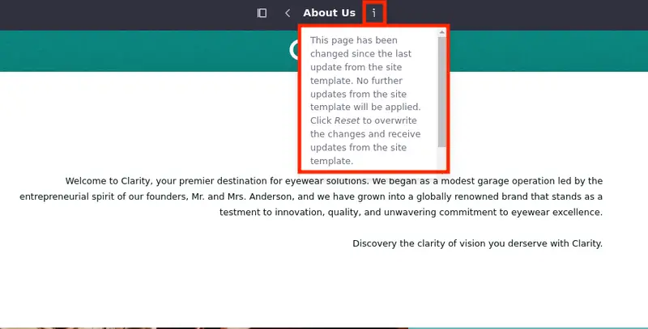
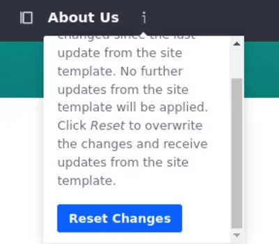

# Site Template Propagation

Now that you have a site template and a site based on that template, you can make alterations to the site template and propagate those changes to the connected sites.

Keep in mind that making changes to a page inherited from a template prevents the propagation of template changes to that page. So, you should keep the inherited pages unchanged and alter only pages created for that site specifically. If you do change them you can always revert the changes and reconnect the inherited page to its template.

## Making Alterations to the Site Template and Propagating Them

When you created the Site Template, the Ready for Propagation option was on. This means that every change you make in your template is propagated automatically to the connected sites once a user visits the site after the template is updated.

See how it works by altering the address of the Tokyo Office in the About Us and Contact Us pages.

1. Return to the Site Template. Open the *Global Menu* (), select the *Control Panel* tab, and click *Site Templates* under Sites. Select the `Glance and B2B Site Template`.

1. Open the *Site Menu* () and select *Site Builder* &rarr; *Pages*.

1. Select the *About Us* page.

1. Scroll down and double-click the *paragraph* component in the Tokyo Office card.

1. Change the address to `Mikasa Bld 1F 2-8-8, Tokyo. Japan`.

1. Publish the page.

If you visit the About Us page in the Glance site (the connected site), you will see that the address is altered there as well.

## Disconnecting and Reconnecting Propagation in a Connected Page

Make an alteration to the About Us page in the Glance site to see what happens when the propagation is disabled.

1. In the About Us page in the Glance site, click *Edit* () at the top right corner of your page.

1. Change the paragraph in the first row. Double-click the paragraph, select `Discovery the clarity of vision you deserve with Clarity.` and remove its bold formatting.

   An icon appears next to the name of the page. It means that the propagation was disconnected for that page. Any changes you make to the template are not propagated to that page anymore.

   

1. To reconnect the propagation, click on the *Additional Information* icon () and click *Reset Changes*.

   

   The propagation is re-enabled and all changes to the template are propagated again.

## Disabling Propagation in a Template Page

You can also disable the propagation in the template page for a while. It can save resources as each page modification can trigger a propagation from the site template to the connected sites.

To disable propagation in a template page,

1. Navigate back to your template and start editing the About Us page.

1. Click on the *Propagation* icon () next to the name of the page and click *Disable Propagation*.

   

   You can now make alterations to the page and they are not propagated to connected pages.

   Once you are done, click on the Propagation icon again and click *Ready for Propagation*. All the alterations are propagated to connected pages.

That's it. Congratulations, Liferay Learner! You have just completed this module.

During these lessons, you have learned how to create a site template, create pages, use compositions, create forms mapped to object definitions, use collection displays, create navigation menus, configure menu displays, create a new site based on a site template, and how to use site propagation to make the process of maintaining pages even more convenient.

Phew! That was a lot. Keep on practicing!

Next, you'll learn how to modify the [Site Look and Feel.]()