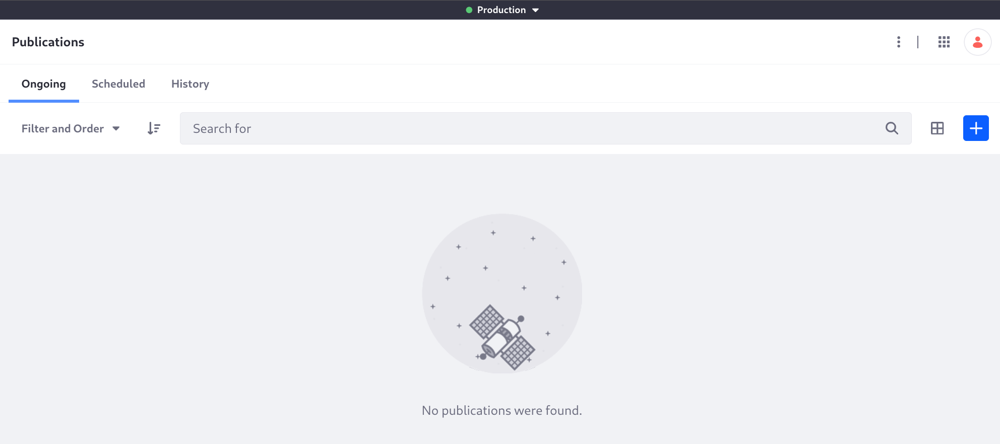
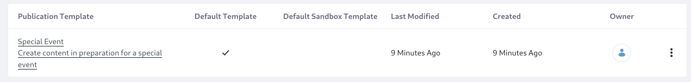

# Creating a Publication Template for Clarity's Special Events

Clarity wants to celebrate its 50th anniversary with some special frames available only for a limited time. They must prepare content across the site to announce the event and show off the frames. This will result in a one-time content push for releasing the frames and marketing materials all at once. For this kind of dedicated content push, where multiple content creators can work together until the final version is ready, use [Publications](https://learn.liferay.com/en/w/dxp/site-building/publishing-tools/publications).

Kyle Klein enables Publications, gives the users the right permissions (Content Manager Role), and then Preston Palmer creates the 50th Anniversary publication.

Within the new publication, Rex Randle creates the new event (make sure it's under workflow, which currently is for FAQs). Olivia O'Neal approves the event, makes the change to the fragment on the master page, and adds the item to the navigation menu. 

To enable publications in Liferay, 

1. Log in with the administrator Kyle Klein:

   **Email Address:** kyle@clarityvisionsolutions.com

   **Password:** learn

1. Open the *Global Menu* () &rarr; *Applications* &rarr; *Publications*.

1. Toggle *Enable Publications*. New options appear.

   

   - Do not enable *Sandbox Only*. Publication users can select the publication to work on manually when they log in.
   - Do not enable *Allow Unapproved Changes*. In this scenario users must not publish unapproved changes to production.

1. Click *Save* to save your configuration. You're redirected to the Publications application page, and the publications bar appears:

   

## Creating a Special Event Publication Template

You can jump right in and create the publication, but Clarity is likely to have more special events in the future, and these will require similar publications. To streamline this, Kyle can create a publication template:

1. Open the *Global Menu* () &rarr; *Applications* &rarr; *Publications*.

1. Click *Actions* () &rarr; *Templates*.

1. Click *New* and enter

   **Template Name:** *Special Event*

   **Description:** *Create content in preparation for a special event*

1. Click *Default Template* to set this template as the default for new publications.

1. Expand *Publication Information* and enter the Publication Name: `REPLACE THIS: ${CURRENT_USERNAME}, ${TODAY_DATE}`.

   See [Using Publication Templates](https://learn.liferay.com/en/w/dxp/site-building/publishing-tools/publications/using-publication-templates) for more information.

   

1. Expand *Publication Collaborators* and click *Add Users*.

1. In the Invite Users dialog, search for and add users to these publication roles:

   - Administrator: Preston Palmer
   - Editor: Olivia O'Neal
   - Editor: Rex Randle

   

   Importantly, publications roles only grant permission for viewing or managing the publication itself, and do not grant page and content editing permission. These permissions must be given explicitly. See [Assigning Roles to Publication Collaborators](https://learn.liferay.com/w/dxp/site-building/publishing-tools/publications/publications-permissions#assigning-roles-to-publication-collaborators) to see the permissions these roles provide their users.

1. Click *Save* and confirm that you'd like to invite these users.

1. Click *Create* to finish adding the publication template.

Clarity's special events template is in place.

Next: [create the publication and make the necessary content edits](./working-with-the-50th-anniversary-publication.md).

## Relevant Concepts

- [Enabling Publications](https://learn.liferay.com/w/dxp/site-building/publishing-tools/publications/enabling-publications)
- [Using Publication Templates](https://learn.liferay.com/w/dxp/site-building/publishing-tools/publications/using-publication-templates)
- [Collaborating on Publications](https://learn.liferay.com/w/dxp/site-building/publishing-tools/publications/collaborating-on-publications)
