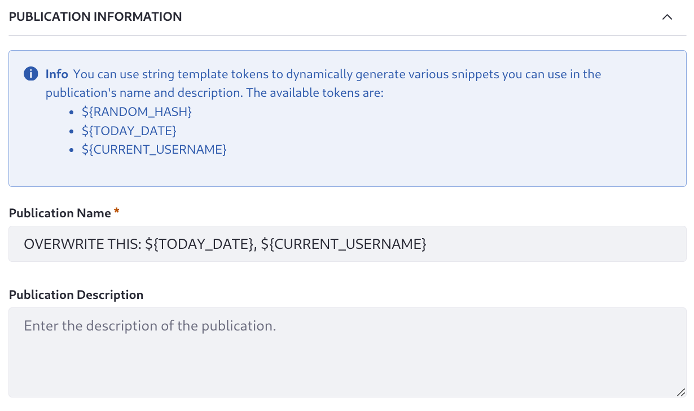

# Enabling Publications

Clarity wants to celebrate its 50th anniversary with some special frames available only for a limited time. They must prepare content across the site to announce the event and show off the frames. This will result in a one-time content push releasing the frames and marketing materials all at once. For this kind of dedicated content push, where multiple content creators can work together until the final version is ready, use [Publications](https://learn.liferay.com/en/w/dxp/site-building/publishing-tools/publications).

To enable publications in Liferay, log in with the administrator Kyle Klein (`kyle@clarityvisionsolutions.com`, password `learn`), then

1. Open the *Global Menu* () &rarr; *Applications* &rarr; *Publications*.

1. Toggle *Enable Publications*. New options appear.

   

1. Toggle *Sandbox Only* mode so users are directed automatically to their last working publication when they log in. 

   <!-- From the docs: If they don't have one, a new publication is generated for them using the `screen.name - date` naming pattern. You can use publication templates to set default values for these auto-generated publications. See [Using Publication Templates](./using-publication-templates.md) for more information. -->

1. Do not enable *Allow Unapproved Changes*. In this scenario users must not publish unapproved changes to production.

1. Click *Save* to save your configuration. You're redirected to the Publications application page, and the publications bar appears:

   

You can jump right in and create the publication, but Clarity is likely to have more special events in the future, and these will require similar publications. To streamline this, create a publication template:

1. Open the *Global Menu* () &rarr; *Applications* &rarr; *Publications*.

1. Click *Actions* () &rarr; *Templates*.

1. Click *Add* ().

1. Enter _Special Event_ as the template name, and add the description _This template is for publishing time-boxed look and feel changes and special content in support of a real-world event_.

1. Click _Default Template_ to set this template as the default for new publications.
   <!-- Decide what to do about the Default Sandbox Template option -->

1. Expand _Publication Information_ and enter the Publication Name: _REPLACE THIS: ${CURRENT_USERNAME}, ${TOODAY_DATE}_.

   See [Using Publication Templates](https://learn.liferay.com/en/w/dxp/site-building/publishing-tools/publications/using-publication-templates) for more information.

   

1. Click *Invite Users* to specify the default users and role assignments for publications created with the template.

   <!--Which users do we need for this exercise? 


   Preston Palmer, the site administrator, and maybe the Publication User role?
   Olivia O'Neal, the content manager, also gave a content creator role in the site, which is a custom role we'd need to document if we use

   The Publications permissions do not grant page and content editing permission. These must already be given in other roles.

   -->

   

   To add contributors, search for users and select a role. See [Collaborating on Publications](./collaborating-on-publications.md) for more information.

   

   ```{note}
   If you invite users without permission to access the Publications application, Liferay automatically assigns them the [Publications User](./publications-permissions.md#publications-user-role) role.
   ```

1. Click *Save*.

The new template appears in the Publication Templates page.


Next, create a publication for the 50th anniversary event:

1. In the publications application or from the publications bar, click ().

1. 


## Publication Template:

Name, Default Template, Default Sandbox Template, 

Publication Information: Publication Name, Publication Description

From the UI: Info--You can use string template tokens to dynamically generate various snippets you can use in the publication's name and description. The available tokens are:
${RANDOM_HASH}
${TODAY_DATE}
${CURRENT_USERNAME}


   <!-- From the docs, I don't know what automatically created publications are 
   **Default Template**: Manually created publications use this template by default, but you can select an alternative template during publication creation. When [Sandbox Only mode](./enabling-publications.md#how-to-enable-publications) is enabled, automatically created publications use the template if a Default Sandbox Template isn't set.

   **Default Sandbox Template**: Automatically created publications use this template when [Sandbox Only mode](./enabling-publications.md#how-to-enable-publications) is enabled. You can still create publications manually using an alternative template.
   -->

