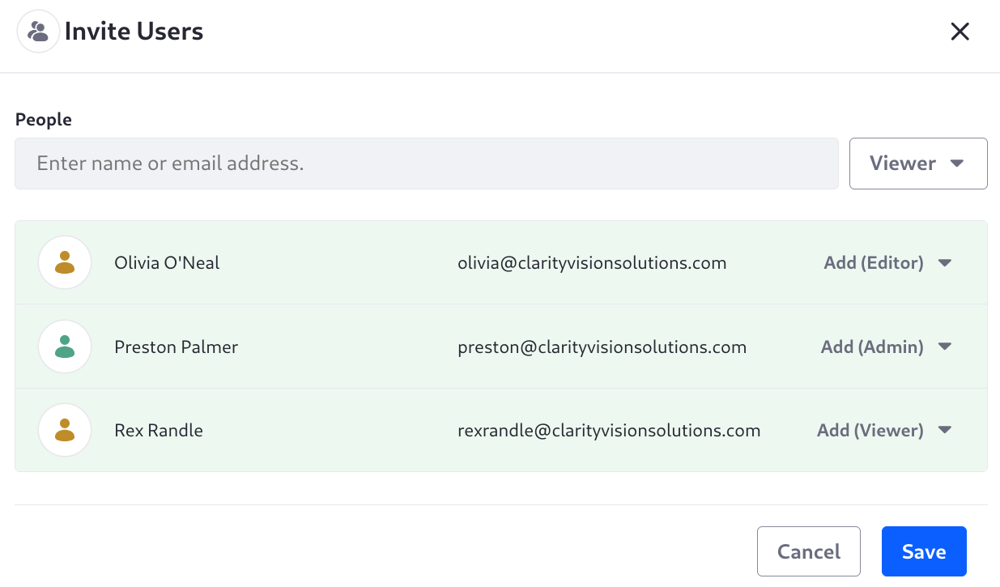
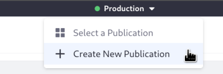
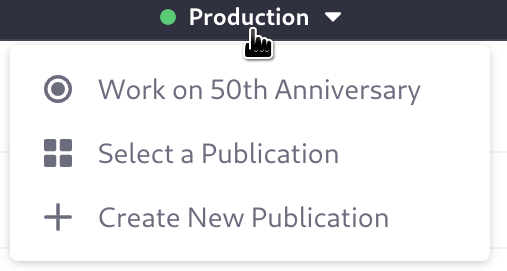
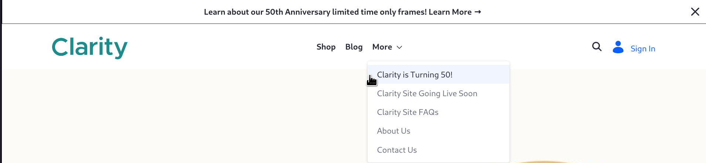

# Creating Publications for Clarity's Special Events

<!-- Duplicates the reference doc title, so make this more specific, like Creating Publications for Clarity's Special Events -->

Clarity wants to celebrate its 50th anniversary with some special frames available only for a limited time. They must prepare content across the site to announce the event and show off the frames. This will result in a one-time content push for releasing the frames and marketing materials all at once. For this kind of dedicated content push, where multiple content creators can work together until the final version is ready, use [Publications](https://learn.liferay.com/en/w/dxp/site-building/publishing-tools/publications).

To enable publications in Liferay, first log in with the administrator Kyle Klein: email `kyle@clarityvisionsolutions.com`, password `learn`. Then,
<!-- Would Kyle represent a real user type that might be doing this lesson? -->

1. Open the *Global Menu* () &rarr; *Applications* &rarr; *Publications*.

1. Toggle *Enable Publications*. New options appear.

   

1. Toggle *Sandbox Only* mode so users are directed automatically to their last working publication when they log in. 

   <!-- I don't think we want sandbox only mode enabled, because we don't need publications automatically appearing for each users first login -->
   <!-- From the docs: If they don't have one, a new publication is generated for them using the `screen.name - date` naming pattern. You can use publication templates to set default values for these auto-generated publications. See [Using Publication Templates](./using-publication-templates.md) for more information. -->

1. Do not enable *Allow Unapproved Changes*. In this scenario users must not publish unapproved changes to production.

1. Click *Save* to save your configuration. You're redirected to the Publications application page, and the publications bar appears:

   

## Creating a Special Event Publication Template

You can jump right in and create the publication, but Clarity is likely to have more special events in the future, and these will require similar publications. To streamline this, Kyle can create a publication template:

1. Open the *Global Menu* () &rarr; *Applications* &rarr; *Publications*.

1. Click *Actions* () &rarr; *Templates*.

1. Click *Add* () and enter:

   **Template Name:** _Special Event_

   **Description:** _Create content in preparation for a special event_

1. Click _Default Template_ to set this template as the default for new publications.
   <!-- Decide what to do about the Default Sandbox Template option -->

1. Expand _Publication Information_ and enter the Publication Name: _REPLACE THIS: ${CURRENT_USERNAME}, ${TODAY_DATE}_.

   See [Using Publication Templates](https://learn.liferay.com/en/w/dxp/site-building/publishing-tools/publications/using-publication-templates) for more information.

   

1. Expand _Publication Collaborators_ and click _Add Users_.

1. In the Invite Users dialog, search for and add users to these publication roles:
<!-- To take this a step further we could create a custom role for working on the publications. It takes a Regular Role to gather these permissions, according to the docs -->

   - Administrator: Preston Palmer
   - Editor: Olivia O'Neal
   - Viewer: Rex Randle

   

   Importantly, publications roles only grant permission for viewing or managing the publication itself, and do not grant page and content editing permission. These permissions must be given explicitly. See [Assigning Roles to Publication Collaborators](https://learn.liferay.com/w/dxp/site-building/publishing-tools/publications/publications-permissions#assigning-roles-to-publication-collaborators) to see the permissions these roles provide their users.

1. Click _Save_ and confirm that you'd like to invite these users.

1. Click _Create_ to finish adding the publication template.

## Creating the 50th Anniversary Publication

Preston Palmer is a publication administrator in the template, so log in with this user to create the 50th anniversary event's publication:

1. In the publications bar, click _Create New Publication_.

   

1. Replace the name with _50th Anniversary_.

1. Click _Create_.

   Preston is automatically working in the new publication after it's created.

   

## Working on the 50th Anniversary Changes

Next sign in as Olivia O'Neal, a publication editor as configured in the template. Then, 

1. Open the publications bar and click _Select a Publication_. 

1. Click _50th Anniversary_.

   

1. Open the site's master page, _Clarity MP_.

1. In the header, delete the _J2B6 Announcement_. In its place add _K3C7 50th Anniversary Announcement_.

1. Publish the master page, then open the publications bar and click _Review Changes_. The new fragment being added to the master page is tracked.

   

1. Go to _Site Menu_ () &rarr; _Content & Data_ &rarr; _Web Content_.

1. Click _Add_ () &rarr; _Event_ and specify

   * Title: Clarity is Turning 50!
   * Summary: Clarity is turning 50, so let's celebrate!
   * Body: Check out our limited time only frames! Clarity turned 50, and we're excited to offer these frames while they last.
   * Banner Image: <!-- We need one -->

1. Go to _Site Menu_ () &rarr; _Site Builder_ &rarr; _Navigation Menus_ and click _Clarity Navigation Menu_.

   <!-- Note, right now Olivia O'Neal can't get to Navigaiton Menus, need to make sure she has the right role -->

1. Add an item to the More submenu for the event you just created by clicking _Add Child_ &rarr; _Web Content Article_ &rarr; Clarity is Turning 50!_.

   

   <!-- Note, this is not in the publication apparently. Or at least I can't see it in Review Changes. But I also cannot see it in production. So perhaps because the web content article isn't there the menu item doesn't show--makes sense and it works to show it -->

Now the content is ready for the 50th anniversary!

<!-- We could have Rex Randle go in and comment on the change list? He's just a viewer so can't actually work on the publication -->

## Publishing the 50th Anniversary Content

Log in as Preston Palmer again. He's the publication administrator and the one who can publish the content.

1. From the publications bar, click _50th Anniversary_ &rarr; _Review Changes_.

   

1. Click _Schedule_ and choose today's date, and a time 2-5 minutes in the future.

   

1. Click _Schedule_ and wait until the time.

1. Go to the home page and verify the content is updated:

   
